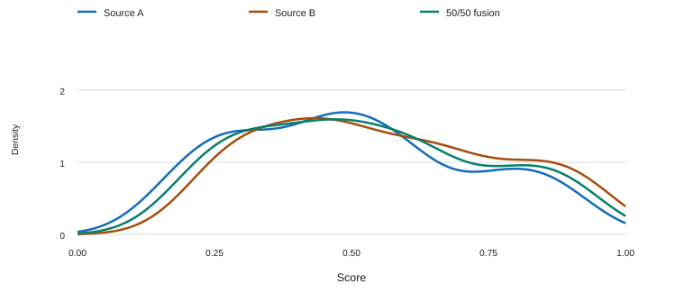
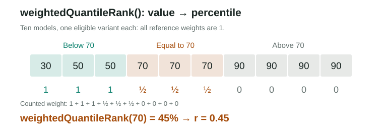
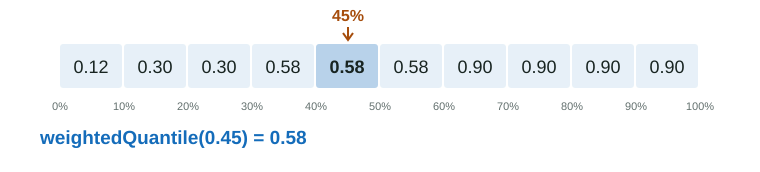
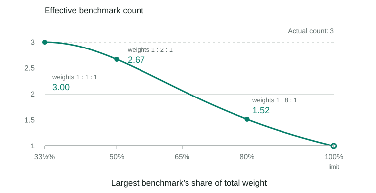
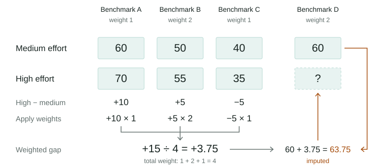

# Missing Data and Imputation

## Benchmark Imputation

Imputation uses observed results from related sources, benchmarks, or reasoning efforts to fill missing values. Observations take precedence, and imputed values never become direct evidence or inputs to further imputation.

| Imputation path | Role in scoring |
| --- | --- |
| Across sources | An accepted source crosswalk supplies a combined benchmark score that can enter the capability mean, with discounted evidence support. |
| From other observed benchmarks | Supplies quality estimates for resource comparisons and discounted evidence support; does not enter the capability mean. |
| Across reasoning efforts | Fills missing benchmark contributions in the capability mean; adds no evidence support by itself. |
| Cost, time, or tokens | Supplies resource estimates with evidence discounts; does not enter the reference population. |

Source crosswalks take priority over predictions from other observed benchmarks; both require held-out validation. Predictions from other benchmarks require at least three distinct observed benchmarks. Imputation across reasoning efforts separately fills missing capability contributions without adding evidence support. The final capability mean uses at most one contribution per benchmark, with observed results and accepted source crosswalks taking precedence over estimates from another effort. Higher effort is not assumed to perform better.

Imputation never satisfies direct-evidence requirements for dashboard inclusion or resource score availability. Each method's support and validation rules are described below.

### Source Crosswalk Imputation

Sources can report the same benchmark with different methodologies and model coverage. For sources selected for quality fusion, Model Atlas takes the equally weighted mean of their quality scores, without assuming either is better.

A **crosswalk** learns their typical score difference from shared models to impute a missing source result before calculating the mean. This preserves the same comparison target despite coverage gaps; validation on withheld models checks whether the imputation is reliable enough to use.

**Fit the offset**

Use results paired by model and reasoning effort:

| Symbol | Meaning and purpose |
| --- | --- |
| $A_i$, $B_i$ | Source A and B results for the same model-effort pair $i$. |
| $a_i$ | Reference weight: each base model shares one unit across its paired efforts, so reporting more efforts gives it no extra influence. |
| $\delta$ | Typical difference $B-A$: positive when B scores higher, negative when A scores higher. |

$$
\delta=\operatorname{weightedMedian}_i(B_i-A_i;a_i).
$$

The weighted median limits the influence of outliers.

**Validate on withheld models**

For each paired result $i$, fit $\delta_{\text{others},i}$ using other models, excluding every effort of its base model. Use that offset to predict the withheld source result and compare it with the observation. This prevents a model’s own results from helping predict it.

The absolute prediction error is $|B_i-A_i-\delta_{\text{others},i}|$. Only half the combined result is imputed, so its error is half as large before clipping. The weighted median gives validation error $\epsilon$ in the benchmark’s score units:

$$
\epsilon=\operatorname{weightedMedian}_i\left(\frac{\left|B_i-A_i-\delta_{\text{others},i}\right|}{2};a_i\right).
$$

**Accept, then impute**

Accept the crosswalk only if both the paired observations and usable validation predictions cover the required number of independent models, currently six, and $\epsilon\le\epsilon_{\max}$, the configured error limit. If it fails, try imputation from other observed benchmarks; without a supported prediction, leave the combined result missing. For sources selected for quality fusion, the mean of two observed quality scores can be calculated without imputation.

For an accepted crosswalk, use $\delta$ fitted from all paired observations. A hat marks an imputed result:

| Available results | Missing result | Combined result |
| --- | --- | --- |
| Both sources | None | $(A+B)/2$ |
| A only | $\hat B=A+\delta$ | $(A+\hat B)/2$ |
| B only | $\hat A=B-\delta$ | $(\hat A+B)/2$ |

Clip the combined value to the benchmark’s permitted score range. Raw source results remain separate.

**Set the evidence factor**

The validation error sets the evidence factor $r$ for the imputed half:

$$
r=\operatorname{clamp}\left(1-\frac{\epsilon}{\epsilon_{\max}},0,1\right).
$$

The factor falls from 1 at zero error to 0 at the error limit. The combined result’s evidence factor $f^{\text{cross}}$ also includes its observed half:

| Evidence | Combined evidence factor $f^{\text{cross}}$ |
| --- | --- |
| Both sources observed | $1$ |
| One source imputed; observed value within that source’s paired calibration range | $(1+r)/2$ |
| One source imputed; observed value outside that range | $0.5$ (only the observed half counts) |

The error controls acceptance and the evidence factor; it is not subtracted from the score. A result containing imputation never counts as direct evidence, even when its evidence factor reaches 1.

**Quality and resources are assessed separately**

A valid quality crosswalk does not establish comparable cost, runtime, or token use. Each resource must independently pass the [absolute resource agreement rule](speed-value.md#resource-comparability-across-sources) before the mean of its raw amounts can be calculated. Similar quality scores or a predictable score offset do not satisfy that rule.

When resource amounts are not comparable, each source is scored against its own quality observations and reference population. Each retains half of the benchmark’s resource base weight, even when the other source is missing. Quality scores can still be combined, but resources cannot be imputed across those sources. [Resource Comparability Across Sources](speed-value.md#resource-comparability-across-sources) gives the resource calculations; two sources still count as one benchmark for direct-evidence requirements.

**Source comparison diagnostics**

Compare the same observed models across sources to see how their score distributions differ and how fusion changes them. Look for a horizontal shift, suggesting an offset, or different spreads, peaks, and tails that one offset may not capture. The fusion curve shows how taking the mean reshapes the distribution.

**Jensen–Shannon divergence (JSD)** measures overall distribution difference, treating both sources equally: A–B equals B–A. Use it to compare source disagreement and how far the fused distribution sits from each source.

**Kullback–Leibler divergence (KL)** measures mismatch in a chosen direction. A → B is large when A places substantial weight in score regions where B places little; B → A checks the reverse. Unequal values reveal this asymmetry, not which source is better.

For both metrics, zero means identical distributions and smaller values mean greater similarity. Use the same models and smoothing settings when comparing values. Neither metric checks whether individual models agree; held-out prediction error still determines crosswalk acceptance.

In this illustration, JSD is 0.015 between sources and 0.004 from either source to fusion. Directional KL divergence is 0.068 bits from A to B and 0.058 bits from B to A. These values use base-2 logarithms and depend on the smoothing bandwidth.

### Imputation from Other Observed Benchmarks

Use a model’s performance on other observed benchmarks to impute a missing result: calculate its weighted mean, find its percentile among peers, then read the target benchmark’s value at that percentile. Repeat separately for Intelligence and Agentic.

**Calculate the weighted mean**

The weighted mean summarizes the same model-effort variant’s measured performance for comparison with peers. Each benchmark contributes according to its existing importance and allocation to Intelligence or Agentic.

Reuse the [benchmark normalization and weights](intelligence-agentic.md#benchmark-scores-and-dimension-weights), separately for Intelligence and Agentic. For each other observed benchmark $k$ with positive weight, $z_k$ is its normalized score and $\omega_k$ its weight:

$$
\mu=\frac{\sum_k\omega_k z_k}{\sum_k\omega_k}.
$$

The missing benchmark and all imputed values are excluded. At least three other observed benchmarks are required. This policy prevents one or two results from determining the prediction.

**weightedQuantileRank(): value → percentile**

Convert the weighted mean into a percentile so its relative standing can be used on a benchmark with different score units. Use peers with both an observed target result and a weighted mean calculated the same way, covering at least three distinct base models. These peers also supply the target distribution in the next step.

An ordinary rank counts every model-effort variant equally, so five eligible efforts give a model five times the influence of one. The weighted rank gives each base model equal total influence by dividing its weight of 1 across its eligible variants.

Each peer variant $j$ has weighted mean $\mu_j$ and reference weight $a_j>0$. Count all weight below $\mu$ and half the tied weight:

$$
r=\frac{\sum_{\mu_j<\mu}a_j+\tfrac12\sum_{\mu_j=\mu}a_j}{\sum_j a_j}.
$$

Counting half the tied weight assigns equal values the midpoint of their shared percentile range. The formula gives $r$ on 0–1; $\operatorname{weightedQuantileRank}$ returns $100r$.

**weightedQuantile(): percentile → value**

Convert the percentile back into a score using the target benchmark’s observed distribution. Using the same peers and reference weights on both sides keeps the comparison population consistent.

Sort those same peers’ observed target results as $x_1\le\cdots\le x_n$, keeping each reference weight attached. The cumulative weight share through result $k$ is:

$$
C_k=\frac{\sum_{j=1}^{k}a_j}{\sum_{j=1}^{n}a_j}.
$$

Find the first $k$ with $C_k\ge r$. Select its value, or take the mean of adjacent values at an exact boundary:

$$
\hat x=\operatorname{weightedQuantile}(r)=
\begin{cases}
\dfrac{x_k+x_{k+1}}{2}, & r=C_k\text{ and }k<n,\\[6pt]
x_k, & \text{otherwise}.
\end{cases}
$$

At $r=0$ or $r=1$, return its smallest or largest observed value; $r=0.5$ gives the weighted median.

**Combine and validate**

If both capability dimensions produce predictions, take their weighted mean using the benchmark’s dimension allocations. If only one predicts, use that prediction.

The key assumption is that relative standing on other benchmarks predicts standing on the missing one. Test this by withholding every effort of one base model at a time and comparing predictions with its observed target results.

Accept the method only when at least four distinct held-out models yield valid predictions and their model-balanced median absolute error is at most 25 points on the normalized target scale. Accepted predictions remain separate from the observed capability mean; prediction error and observed benchmark coverage determine their evidence factor for regularization and resource scoring.

### Imputation Across Reasoning Efforts

Fill a missing benchmark score using an observed result from another reasoning effort of the same model. The **target effort** has the missing result; the **reference effort** supplies the observed result. Their performance gap on shared benchmarks adjusts the estimate. Run the calculation separately for Intelligence and [token-adjusted Agentic](intelligence-agentic.md#agentic-token-efficiency). A missing result can be filled even when the effort already has enough evidence to avoid regularization.

Each benchmark’s overall score is one input, regardless of how many questions or test cases it contains. Aggregate indexes are excluded. Throughout this section, $w_b$ is benchmark $b$’s [portfolio weight](intelligence-agentic.md#benchmark-scores-and-dimension-weights): importance × allocation to the capability being calculated. Only positive weights participate.

**Choose the reference effort**

For each missing benchmark, consider other efforts with an observed result for it and at least three benchmarks observed at both the target and reference efforts. Imputed results cannot establish this overlap. If several efforts qualify, choose the one with the largest **effective benchmark count** $n_{\text{eff}}$. This selects the reference for that estimate; it does not change the portfolio weights. Ties prefer the reasoning setting closest to the target, then a stable label order. If none qualifies, leave the result missing.

The effective count measures how broadly the shared benchmarks influence the comparison. Equal weights give each benchmark an equal say; weights 1, 8, and 1 give one benchmark 80% of the influence. For $N$ shared benchmarks, the count equals $N$ with equal weights and approaches 1 as one benchmark dominates:

$$
n_{\text{eff}}=\frac{(\sum_b w_b)^2}{\sum_b w_b^2}.
$$

Squaring the weights makes concentration reduce the count. Scaling every weight by the same factor leaves it unchanged, so weights 0.25, 0.50, and 0.25 give the same count as 1, 2, and 1. The illustration keeps three shared benchmarks: one takes a growing share of the weight while the other two split the remainder equally. This count measures weight distribution, not prediction accuracy or correlation between benchmarks.

**Estimate the missing score**

Measure the target’s performance relative to the chosen reference on their shared benchmarks. For each shared benchmark $b$, $t_b$ and $a_b$ are the normalized target and reference scores. Their weighted mean difference is the gap $\Delta$. For the missing benchmark, add this gap to its observed reference score $a$, then bound the estimate $\widehat t$ to 0–100:

$$
\begin{aligned}
\Delta&=\frac{\sum_b w_b(t_b-a_b)}{\sum_b w_b},\\
\widehat t&=\operatorname{clamp}(a+\Delta,0,100).
\end{aligned}
$$

A positive gap raises the estimate; a negative gap lowers it. The direction follows observed performance, without assuming that higher effort performs better. The estimate assumes the measured gap transfers to the missing benchmark.

These estimates do not increase evidence support by themselves. The evidence factor from separately validated imputation using other benchmarks is retained. Updated-release replacement rows are excluded from this imputation path.

## Resource Imputation Across Reasoning Efforts

Impute a missing resource amount from another effort of the same model using a ratio learned from shared benchmarks. Cost, runtime, total tokens, and output tokens each have separate ratios. Exclude unlabelled rows representing the source’s default effort and means reported across benchmarks; benchmark-specific measurements remain eligible.

**Estimate the effort ratio**

For resource $r$ on benchmark $k$ measured at both efforts, $A^{r,\text{target}}_k$ and $A^{r,\text{source}}_k$ are the observed amounts at the target and source efforts. Their log difference $\ell^r_k$ represents the target-to-source ratio:

$$
\ell^r_k=\log A^{r,\text{target}}_k-\log A^{r,\text{source}}_k.
$$

At least three benchmarks with paired measurements are required. To validate the ratio, withhold benchmark $k$ and calculate the median log difference $\widehat\ell^r_{-k}=\operatorname{median}_{j\ne k}(\ell^r_j)$ from the other benchmarks; the subscript $-k$ means benchmark $k$ is excluded. Exponentiating that difference gives the ratio used to predict the withheld target amount:

$$
\widehat A^{r,\text{target}}_k=A^{r,\text{source}}_k\exp(\widehat\ell^r_{-k}).
$$

**Check prediction and score errors**

Validation measures both the resource error and its effect on the component score. For the withheld target, $A^r_k$ is the observed amount and $\widehat A^r_k$ its prediction; $S^{\text{res},r}_k$ and $\widehat S^{\text{res},r}_k$ are their resource scores. Their median absolute errors are:

$$
e^r_{\mathrm{log}}=\operatorname{median}_k\left|\log\frac{\widehat A^r_k}{A^r_k}\right|,
\qquad
e^r_{\text{score}}=\operatorname{median}_k\left|\widehat S^{\text{res},r}_k-S^{\text{res},r}_k\right|.
$$

Reject the ratio if log error reaches $\log 2$ (a factor of two), score error reaches 25 points, or fewer than three held-out score comparisons are usable. Otherwise, the evidence factor $f^r$ uses the lower of the two error discounts:

$$
f^r=\min\left(1-\frac{e^r_{\mathrm{log}}}{\log2},1-\frac{e^r_{\text{score}}}{25}\right).
$$

Both terms are clipped to $[0,1]$. The final ratio uses the median log difference across all benchmarks with paired measurements. If several efforts of the same model can fill the gap, the nearest effort is preferred, with validation quality breaking ties.

If target quality is also imputed, its evidence factor multiplies the resource evidence factor: $f^{\text{quality}}f^r$. Imputed values remain outside reference peers, reference score limits, stored observations, and direct-evidence counts.

## Resource Imputation from Broader Evidence

When benchmarks with paired measurements cannot support an effort ratio, start with other models and refine the estimate using progressively narrower groups of observations:

> [!FLOW]
>
> 1. **Other models**
>
>    Start with the median log resource ratio for the exact benchmark and effort transition across at least two other base models. Exclude every effort of the target model.
>
> 2. **Same lab**
>
>    Adjust for how models from this lab differ from the ratios across other models. Use their median deviations, excluding each model from the reference used to calculate its deviation.
>
> 3. **Nearby releases in that lab**
>
>    Give more weight to those deviations when release dates are closer to the target model’s. Use $\exp[-\tfrac12(\Delta t/60)^2]$, where $\Delta t$ is the release-date difference in days.
>
> 4. **Target model**
>
>    Adjust using this model’s effort ratios on other benchmarks with paired measurements, after subtracting the corresponding ratios across other models.

Date weighting and correction limits are policy choices; release proximity alone does not establish predictive accuracy.

[Release proximity](matching.md#release-proximity-for-resource-estimation) uses dates, not product-name categories. Missing dates retain the lab correction; missing lab identity prevents both lab and release corrections.

Multiply each correction by $n/(n+n_{50})$, where $n$ is its supporting observation count or weight and $n_{50}$ is the amount needed to apply half the correction. With little evidence, the estimate stays close to the broader result; this is called shrinkage:

| Scope | Supporting observations $n$ | Half-correction threshold $n_{50}$ |
| --- | --- | --- |
| Same lab | Number of distinct other models from the lab | 16 |
| Nearby releases | Sum of the release-date weights above; correction uses the weighted median deviation | 4 |
| Target model | Number of other benchmarks measured at both efforts | 4 |

Without supporting observations, apply no correction. Parameters are fixed, not fitted per model. Only observations for the same effort transition are used, such as low to high.

Apply the ratio to the observed amount at the closest effort for which that transition can be estimated. Use the same benchmark and resource. Direct measurements and validated same-model ratios take precedence.

The evidence factor $f_b$ increases with the number of independent other models $n^{\text{models}}_b$ and decreases with disagreement $d_b$, the median absolute difference between their log ratios and the final estimated log ratio:

$$
f_b=\frac{n^{\text{models}}_b}{n^{\text{models}}_b+4}\max\left(0,1-\frac{d_b}{\log 2}\right).
$$

This factor measures support and agreement, not the probability of an accurate prediction. A zero factor or a non-finite amount leaves the value missing.

Broader-evidence imputation affects scoring only, with the existing discount for imputed target quality. It cannot supply evidence for further imputation, overwrite measurements, or satisfy resource availability requirements.

Cost, runtime, total tokens, and output tokens each use their own observations and ratios. Aggregate-index tokens stay attached to their own index. Runtime imputation requires reported seconds paired with observed quality; cost and throughput-derived time cannot supply that evidence.

## Parameter Choices

These values are scoring-policy choices, not fitted claims about model behavior.

| Parameter | Value | Why it exists |
| --- | ---: | --- |
| Other observed benchmarks required | 3 | Requires a broader basis than one or two benchmark results. |
| Held-out models for imputation from other benchmarks | 4 | Requires independent evidence beyond the minimum calibration set. |
| Maximum normalized imputation error | 25 points | Refuses predictors whose typical held-out error is too large to be useful; the evidence factor falls to zero at this boundary. |
| Quality imputation across efforts: common benchmarks | 3 | Requires directly shared benchmarks from the same base model; indexes and estimates do not count. |
| Broader resource evidence: minimum other models | 2 base models | Requires same-benchmark effort ratios from more than one model outside the target. |
| Broader resource evidence: release width | 60 days | Gives nearby releases more influence without a hard date cutoff. |
| Broader resource evidence: lab shrinkage | 16 | Limits the influence of a noisy lab correction. |
| Broader resource evidence: release/model shrinkage | 4 | Discounts sparse corrections without per-model tuning. |
| Resource ratios across efforts: benchmarks with paired measurements | 3 | Prevents ratios from one or two benchmarks from defining an effort conversion. |
| Resource ratios across efforts: log-error ceiling | $\log 2$ | Rejects ratios when typical held-out multiplicative error reaches a factor of two. |
| Resource ratios across efforts: score-error ceiling | 25 points | Rejects ratios with large typical errors in resource component scores. |
