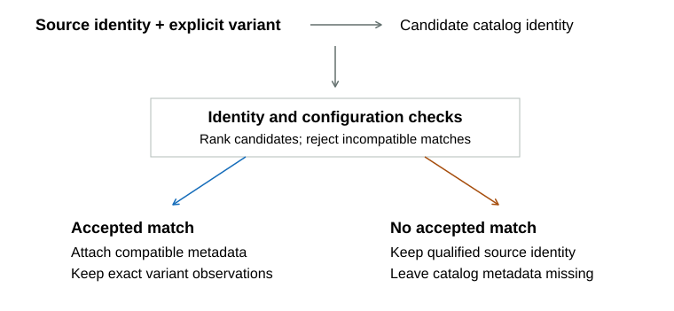
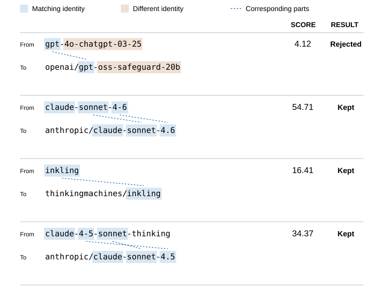

# Model Matching

The same model can appear under different names on benchmark pages, catalogs, and serving platforms. Model Atlas joins those records so its scores, specifications, prices, and speed measurements describe the same underlying model and reasoning configuration.

A mistaken join can give one model another model's evidence. The matcher therefore leaves uncertain associations unmatched. A rejected catalog match does not erase a separately identified benchmark model; it leaves catalog metadata unavailable.

## Identity Sources

A benchmark identity can exist before a public catalog entry. A qualified Artificial Analysis provider/model ID, a nonempty name, and confirmed text output can keep that model in the pipeline even when no catalog candidate is accepted. It retains only source-reported metadata, and other benchmark results can attach through the same identity and effort checks.

Keeping the identity does not guarantee dashboard inclusion. Models meeting the observed-benchmark and quality requirements receive numeric ranks even with incomplete metadata; missing specifications remain null.

An OpenRouter route is the preferred public identity when it wins the match, because route IDs connect directly to pricing and serving measurements. `models.dev` supplies candidate pools and catalog metadata. Trusted direct OpenAI, Google, Anthropic, and Vercel identities can win when they provide a stronger exact match.

Candidate scoring uses only identity-bearing fields:

- the source model slug
- candidate provider and model IDs
- candidate provider and display names

Benchmark scores and prices do not influence matching. Publisher identity and explicit release labels constrain which candidates are eligible before name scoring. A generic model launch date does not identify the evaluated snapshot or authorize replacing it with a later version.

## Normalization

Normalization removes spelling differences so equivalent names can be compared without erasing version or size distinctions. Names are lowercased and hyphenated: dots, spaces, colons, and underscores become separators, unusual characters are removed, repeated separators collapse, and leading or trailing separators are trimmed.

The normalized name is then split into tokens. Mixed alphanumeric pieces are separated so versions and parameter scales can be compared directly. Route and serving labels that usually do not define the underlying model are ignored: `free`, `extended`, `exacto`, `instruct`, `thinking`, `reasoning`, `preview`, `online`, and `nitro`. Preview spelling alone does not establish a separate identity, but conflicting releases and model versions remain distinct. Full and abbreviated month labels normalize together, while `+` is preserved as `plus`.

Three token classes receive special treatment:

- plain versions such as `3` or `5`
- parameter scales such as `70b`
- active-parameter scales such as `a22b`

Versions and parameter scales can identify different models even when the surrounding name is nearly identical. A conflict in these fields can therefore reject a candidate outright.

## Candidate Pool

Candidate eligibility is checked before name similarity, so a convincing name cannot override a conflicting publisher or release. For each source slug, the matcher collects candidates from the preferred `models.dev` provider pools. OpenRouter routes and trusted direct-provider identities enter the same ranked pool, allowing an exact direct identity to beat a weak OpenRouter alias.

Qualified source and catalog IDs establish publisher ownership, with organization aliases such as Alibaba/Qwen reconciled first. A conflicting publisher excludes the candidate even if its name closely resembles the source; a serving platform name alone does not establish model ownership.

An explicit year-bearing version or named release month must agree with the candidate’s dated version, release label, or catalog release metadata. An undated catalog alias cannot establish a specifically dated source release. Month labels compare at month precision, while daily dates allow the adjacent calendar date used by some sources for the same launch. These checks run before candidate ranking and truncation, and the Intelligence Index uses the same release and publisher rules.

The first token is an early family guardrail. A source and candidate that begin with different model-family tokens are not compared further.

## Candidate Score

The match score orders plausible identity candidates. It is a heuristic, not the probability that a match is correct: agreement raises it, while missing or conflicting identity information lowers it.

The strongest rewards are:

- matching token prefixes, weighted toward earlier tokens
- exact numeric and version agreement
- small numeric distance when an exact version is unavailable
- matching family or edition suffixes
- complete source-token coverage
- exact parameter-scale and active-parameter-scale agreement
- normalized character-prefix similarity

The strongest penalties are:

- source tokens missing from the candidate
- conflicting parameter scales
- a source scale that is absent from the candidate
- conflicting active-parameter scales
- a large difference in normalized name length

A candidate is rejected when it has no normalized character-prefix overlap, conflicts on a hard parameter scale, conflicts on a leading numeric identity, receives a non-positive score, or fails the first-token family guardrail. Version-prefix conflicts are also hard failures: a source version `3` does not match `3.5`, and `3.5` does not match `3`.

## Variant Guardrail

Similar names can identify different variants. After ranking and before the batch cutoff, the matcher checks distinguishing labels, including `flash-lite`, `flash`, `pro`, `nano`, `mini`, `lite`, `max`, `image`, `vl`, `coder`, `small`, `micro`, `codex`, `omni`, `multi-agent`, and `latest`.

If the source has one of these labels and the candidate does not, or the candidate has one and the source does not, the candidate is rejected. Multi-token labels remain distinct, so `flash-lite` does not count as plain `flash`.

Reasoning effort is a configuration of the base model, so its suffix is removed before the variant-label check. The matcher tries ranked candidates until one survives. This keeps distinctions such as `flash` versus `flash-lite` or text versus image routes from being erased by a superficially similar name.

Benchmark-update health uses the same ranking and variant boundary with stricter full-token coverage. A source row therefore remains explicitly unrepresented when only a weak family-prefix candidate exists.

## Relative Cutoff

The best candidate can still be a poor match. After selecting a compatible winner for each source row, the matcher rejects unusually weak winners relative to the batch. Its minimum and maximum winning scores set the cutoff:

$$
s_{\text{cutoff}}=s_{\min}+0.35(s_{\max}-s_{\min}).
$$

The factor $0.35$ places the cutoff 35% of the way from the lowest winning score to the highest. It is a fixed heuristic, not a confidence level or a rule to reject 35% of rows. Exact normalized identities are exempt; rows without a compatible winner do not enter the range.

The illustration uses a historical cached replay of **643 source rows** against **572 catalog candidates**, recorded before the publisher and release eligibility checks were added. It demonstrates the cutoff, not the current matcher's accuracy.

The shared `gpt` prefix does not establish identity. The Sonnet examples agree on family, tier, and version, including when the name reorders those parts; `thinking` describes the configuration.

Of the 643 rows, **370** have compatible winners with scores from **4.12** to **54.71**, producing a cutoff of **21.83**. The other 273 rows contribute no score. The cutoff removes **47** winners and retains **323**; the exact `inkling` identity survives despite scoring **16.41**. The graph's examples are selected after the full replay and do not determine its bounds.

Changing the source batch or catalog can change the range and cutoff. Recognizing a structural alias is different from establishing an exact normalized identity, so not every alias receives the exemption. An accepted match still depends on the quality of the identity evidence.

## Claude Identity

Claude tier and version are structural identity fields even though Anthropic has changed their order over time. Historical forms such as `Claude 3 Opus` and `claude-3-opus` normalize with `Claude Opus 3`, while the compact `claude-35-sonnet` form resolves to Claude Sonnet 3.5. Current route names can also match reordered dated permaslugs when the tier and version agree.

The tiers `haiku`, `sonnet`, `opus`, and `fable` are mutually exclusive. When the correct tier is unavailable, the source row remains unmatched rather than borrowing another Claude tier.

Reordered names still have to satisfy the publisher, release, and variant checks. Reasoning configurations retain separate observations. A missing source `reasoning_effort` stays null; the matcher does not infer an effort from a display name or select an unlabelled observation by benchmark score.

## Release Proximity for Resource Estimation

Release proximity helps estimate missing resources; it does not establish model identity. The [tiered resource fallback](methodology/imputation.md#resource-imputation-from-broader-evidence) starts with broad evidence, then applies supported corrections from the same lab, nearby releases, and the target model's own effort measurements. Sparse local evidence retains the broader estimate instead of defining an unstable correction.

Release proximity uses a Gaussian weight centered on the target model's release date, with a standard deviation of 60 days. Both earlier and later releases can contribute; the weight depends on their distance from the target date, not their age today. There is no hard date cutoff or model-name classification. Missing or invalid dates leave the broader lab correction intact. Missing lab identity prevents both lab and release-neighborhood corrections.

The target model's entire family is excluded from external donors. Exact model and reasoning-effort identity still determine which measurements form an effort ratio; release proximity does not relax those matching requirements.

## Selected Identity

An accepted catalog match uses the winning provider and model ID as its public identity and attaches catalog metadata from `models.dev`. An unmatched qualified Artificial Analysis identity instead retains only source-reported metadata, leaving genuinely missing prices, limits, and serving measurements unknown.

Resource fallback works field by field. Catalog input/output prices take precedence over Artificial Analysis prices, and effective OpenRouter prices take precedence for Value scoring. Exact-effort Artificial Analysis throughput and latency can fill serving fields only when primary measurements are unavailable. Each refresh recomputes these choices, so primary data takes over when it arrives without a stale override.

Artificial Analysis token prices are USD per million tokens, throughput is output tokens per second, and latency is seconds; total benchmark evaluation costs are never treated as token prices.

Both paths attach benchmark evidence before applying the dashboard inclusion rules described in [Methodology](methodology/leaderboard-rules.md#dashboard-inclusion).

Serving aliases such as fast, free, latest, preview, high-effort, or dated routes do not automatically become separate public models. Aliases that point to the same underlying model share one canonical identity. Explicit reasoning-effort observations remain separate scored configurations.

An unlabelled observation represents the source-default configuration. If all observations name an effort, the highest reported effort supplies the default. Storage preserves every reported effort. Missing quality tasks can later use a sibling's direct result plus their measured gap on common tasks. These scoring-only estimates preserve exact source observations and never force effort order to be monotonic.

Expanded views keep exact-effort results. Compact views use the highest-Intelligence representative and can fill its missing benchmark fields from the highest available direct effort, while retaining the distinction between a model-level display and an exact-effort observation.
