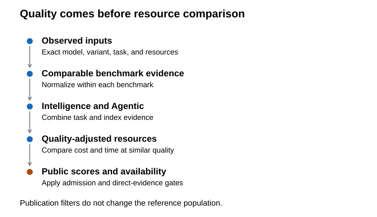
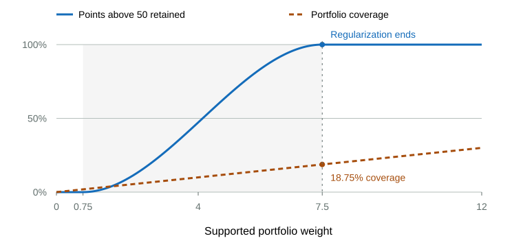
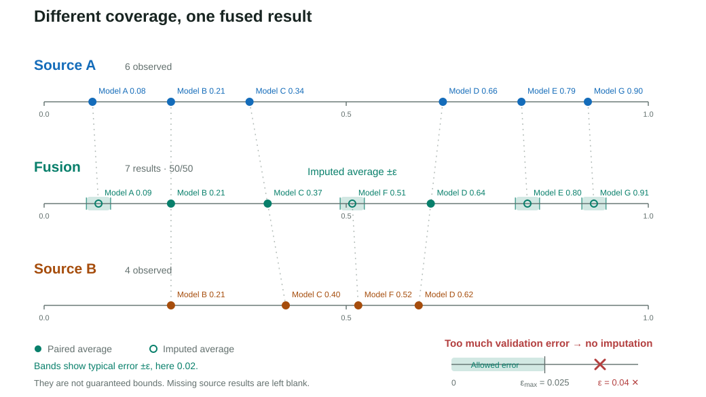
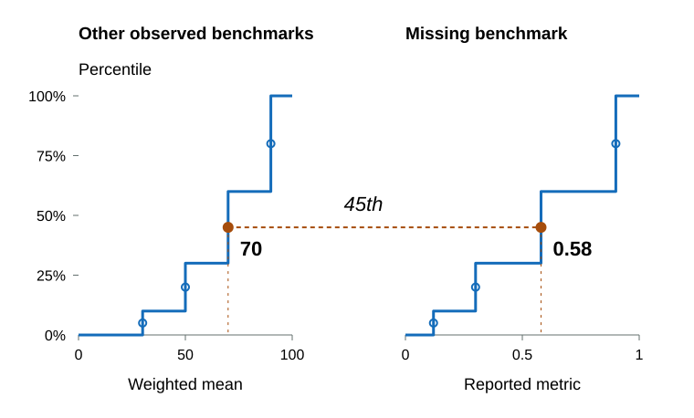
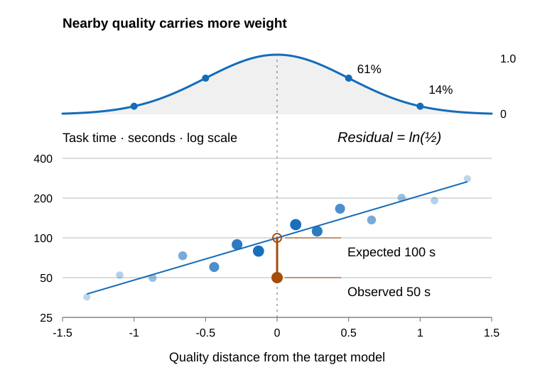
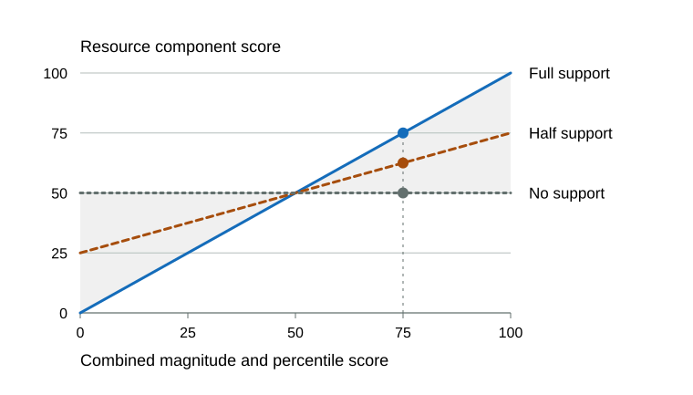

# Methodology

## Scope

This document specifies how benchmark, price, and runtime observations become four independent 0-100 scores: Intelligence, Agentic, Speed, and Value. It defines the mathematical pipeline without depending on the current portfolio. Selected inputs and source policies live in [Benchmarks](benchmarks.md); admission criteria live in [Standards](standards.md).

Intelligence and Agentic measure capability. Speed and Value measure practical delivery constraints without feeding cost or latency back into capability. Reasoning-effort variants remain separate scored configurations, while model-balanced calibration prevents a model with many variants from dominating empirical reference distributions.

## Pipeline Overview

The calculation proceeds in one direction:

1. **Observed inputs**
2. **Normalized benchmark evidence**
3. **Quality scores** $(I_m,A_m)$
4. **Quality-adjusted resources**
5. **Public outputs** $(\text{Speed}_m,\text{Value}_m)$

| Score | Main inputs | Main adjustment | What the score answers |
| --- | --- | --- | --- |
| Intelligence | Selected benchmark results | Importance, dimension loading, evidence support, and score coverage | How strong is the model on knowledge and reasoning? |
| Agentic | Selected benchmark results | Importance, dimension loading, evidence support, and score coverage | How strong is the model in tool-mediated workflows? |
| Speed | Provider throughput, latency, end-to-end latency, and benchmark task time | Log scaling, quality-local comparison, and evidence-weighted aggregation | How quickly does the model deliver comparable work? |
| Value | Blended price, benchmark task cost | Log scaling, quality-local comparison, and evidence-weighted aggregation | How much useful capability does the model deliver for its cost? |

## Shared Scales and Evidence

Quality aggregation uses the 0-100 scale. A source crosswalk may operate on a native or 0-1 scale when its formula states that scale explicitly. Resource comparisons use the logarithm of positive cost or time.

The shared score coverage curve uses smoothstep so evidence can gain influence gradually instead of crossing a hard cutoff. Clamping keeps the multiplier at $0$ below its floor and $1$ above its full-coverage point:

$$
\operatorname{smoothstep}(t)=u^2(3-2u),
\qquad
u=\operatorname{clamp}(t,0,1).
$$

Weighted quantiles, ranks, medians, and percentiles use model-balanced observations unless a formula states otherwise.

## Intelligence and Agentic

### Model-Balanced Reference Weight

Reasoning-effort variants remain separate scored configurations, but they do not multiply a base model's influence on empirical reference distributions. Model identity uses the normalized public name, with route ID as a fallback when no name is available. A base model $m$ with $n_m$ included variants gives each variant $v$ the calibration weight

$$
a_{m,v}=\frac{1}{n_m}
$$

so every represented model contributes one total unit of mass. The included-variant count is recomputed for each distribution because a variant can have one metric and lack another. These weights prevent reasoning-effort variants from manufacturing calibration support while preserving every scored configuration. They apply to percentile and quantile mappings, imputation validation errors, quality-local expectations, residual percentiles, and winsorized min-max anchors.

### Benchmark Scores and Dimension Weights

Source-specific transforms run before shared normalization when a native metric needs a canonical scale. For an Elo input $x$, the declared transform $e(x)$ maps $500$ to $0$, $2500$ to $1$, and clamps values outside that interval:

$$
e(x)=\operatorname{clamp}\left(\frac{x-500}{2000},0,1\right).
$$

The raw observation $x_{m,b}$ for configuration $m$ on benchmark $b$ is then normalized against that benchmark's frozen observed anchors. The score $z_{m,b}$ maps the observed minimum to $0$ and maximum to $100$ while preserving the relative gaps between them:

$$
z_{m,b}=
\begin{cases}
100 & x_{\max,b}=x_{\min,b}\\
100\cdot\operatorname{clamp}\left(\dfrac{x_{m,b}-x_{\min,b}}{x_{\max,b}-x_{\min,b}},0,1\right) & x_{\max,b}>x_{\min,b}.
\end{cases}
$$

When every observed value is equal, the input provides no ordering evidence, so every observed row receives the same full normalized score instead of causing division by zero. Imputed values use the frozen observed anchors and cannot redefine the scale. Linear normalization is used instead of percentile rank because it preserves uneven performance gaps rather than turning them into evenly spaced positions.

The selected set $\mathcal{B}_d$ contains every benchmark admitted to dimension $d$. Benchmark importance $i_b$ controls total influence, while dimension loading $\lambda_{b,d}$ directs that influence into Intelligence or Agentic without counting a mixed benchmark twice. Their product is the effective dimension weight $\omega_{b,d}=i_b\lambda_{b,d}$. The evidence credit $\eta_{m,b}$ is one for an observation, validation confidence for an accepted estimate, and zero for missing evidence. The weighted benchmark mean $\bar z_{m,d}$ is

$$
\bar z_{m,d}=\frac{\sum_{b\in\mathcal{B}_d,z_{m,b}\text{ available or imputed}}\omega_{b,d}\eta_{m,b}z_{m,b}}{\sum_{b\in\mathcal{B}_d,z_{m,b}\text{ available or imputed}}\omega_{b,d}\eta_{m,b}}.
$$

Replacement inference activates only when Artificial Analysis benchmark resources and Vals independently identify the same dated release suffix for an older source identity, and the matched catalog route realizes that release. Semantic model versions remain distinct identities and cannot replace one another through this rule. It then compares each observation with the prior published identity before scoring. An observation is retained when its value changed, its source explicitly identifies the new release, its source observation date is newer than the prior value and no earlier than the model release, or the replacement already accepted it on an earlier refresh. A missing prior value and source reputation alone do not prove freshness. These replacement rows use direct accepted evidence without contextual benchmark imputation, and retained Artificial Analysis and Vals observations receive twice their ordinary effective weight so the designated freshness authorities govern the transition. The rule continues on later refreshes, preventing ambiguous old-name evidence from being reattached after the replacement is published.

### Evidence Support and Score Coverage

Evidence support uses the same dimension weights as the benchmark mean. The evidence credit $\eta_{m,b}$ distinguishes observations, validated source crosswalks, contextual imputations, and missing values, and it also scales each imputed value's contribution to the benchmark mean:

$$
\eta_{m,b}=
\begin{cases}
1 & \text{observed}\\
\eta^{\text{cross}}_{m,b} & \text{validated source crosswalk}\\
r_{m,b}\operatorname{clamp}(1-\tilde e_{m,b}/25,0,1) & \text{validated contextual imputation}\\
0 & \text{missing}.
\end{cases}
$$

The normalized validation error $\tilde e_{m,b}$ comes from the contextual predictor used for that row. The row-specific context support $r_{m,b}$ is the weighted share of the predictor's other benchmark inputs that the model actually observes, combined through the target benchmark's dimension loadings when both dimensions predict. A globally reliable imputer therefore cannot turn three observations into a full portfolio of equally trusted estimates. Missing a low-weight benchmark costs less evidence support than missing a high-weight benchmark. Direct observations retain their full score weight, while an imputed value's score weight is multiplied by $\eta_{m,b}$.

The available evidence mass $E_{m,d}$ and the portfolio's total possible mass $\Omega_d$ are

$$
E_{m,d}=\sum_{b\in\mathcal{B}_d}\omega_{b,d}\eta_{m,b},
\qquad
\Omega_d=\sum_{b\in\mathcal{B}_d}\omega_{b,d}.
$$

The public evidence support $h_{m,d}$ is the literal weighted evidence share:

$$
h_{m,d}=E_{m,d}/\Omega_d.
$$

The separate score coverage multiplier $c_{m,d}$ is zero through 10% of possible evidence and reaches one at 60%:

$$
c_{m,d}=\operatorname{smoothstep}\left(\frac{E_{m,d}-0.1\Omega_d}{0.5\Omega_d}\right).
$$

Because $\Omega_d$ comes from the selected portfolio, these thresholds update with the portfolio instead of becoming separate calibration literals. Once the score coverage multiplier reaches one, additional missing benchmarks incur no further score penalty, while the displayed evidence support continues to report the actual weighted share. This separates the ranking penalty from evidence disclosure and prevents 60% support from being presented as complete coverage.

The provisional capability score $Q_{m,d}$ multiplies performance on available evidence by the score coverage multiplier. This prevents an isolated strong result from defining a standalone model score; a later sibling calibration can replace this provisional value only for a sparse effort variant backed by a broadly observed sibling and at least three directly shared benchmarks:

$$
Q_{m,d}=\bar z_{m,d}c_{m,d}.
$$

$$
\begin{aligned}
I_m&=Q_{m,\text{Intelligence}}\\
A_m&=Q_{m,\text{Agentic}}.
\end{aligned}
$$

Intelligence and Agentic evidence support are reported separately as the percentage values of $h_{m,d}$. Each value describes the weighted support behind its dimension's benchmark mean; the two dimensions are not combined. Because their total possible masses $\Omega_d$ can differ, the same displayed percentage can represent different absolute evidence mass. The public field remains named `confidence` for all four dimensions, but its value is the literal effective evidence share for consistent interpretation across Intelligence, Agentic, Speed, and Value.

## Missing Benchmark Evidence

Missing values have two validated estimation paths: a configured source crosswalk runs first, then the contextual quantile imputer runs when no crosswalk exists or its validation fails. Same-model effort evidence calibrates only the aggregate capability score and does not manufacture missing benchmark observations.

### Imputation Invariants

Canonical storage keeps every result on its reported effort, and direct observations are never replaced by estimates. A higher reasoning effort is not assumed to beat a lower effort on every task. Sparse effort calibration uses the measured direction of directly shared benchmarks and can place either effort higher. Expanded views remain exact-effort only.

Imputation can estimate a missing score, but it cannot create new independent model evidence. Every model-benchmark pair receives at most one imputed value, only observations can predict another benchmark, and imputed values never satisfy public admission or appear as observed source results.

The minimum context requirement counts distinct observed benchmarks rather than weight, so one heavily weighted observation cannot make an imputer look well supported by itself.

### Validated Additive Source Crosswalk

A configured source crosswalk requires primary and fallback measurements on a compatible scale. The overlap set $S$ contains rows matched to the same model and effort. Its primary value $P_i$ and fallback value $F_i$ receive weight $w_i$, which divides one unit of mass across each model's effort variants. Their fitted source offset is

$$
\delta=\operatorname{weightedMedian}_{i\in S}(F_i-P_i;w_i)
$$

Validation withholds every effort variant of each overlap model. For model $q$, Model Atlas refits $\delta_{-q}$ without any of its variants. If $V\subseteq S$ is the set of rows with valid held-out predictions, the model-balanced held-out error is:

$$
e=\operatorname{weightedMedian}_{i\in V}\left(\left|F_i-\delta_{-q(i)}-P_i\right|;w_i\right)
$$

The additive offset preserves performance gaps within each source, while the weighted median limits the influence of outliers. Holding out an entire model prevents its effort variants from validating one another.

The crosswalk is accepted only when its effective-model count reaches $K_{\min}$, its effective held-out model count also reaches $K_{\min}$, and its held-out error does not exceed $\epsilon_{\max}$ on the primary scale $[L,U]$:

$$
N_{\mathrm{eff}}(S)\ge K_{\min},
\qquad
N_{\mathrm{eff}}(V)\ge K_{\min},
\qquad
e\le\epsilon_{\max}.
$$

When it passes, a row with a fallback value but no primary value receives:

$$
\hat P_m=\operatorname{clamp}(F_m-\delta,L,U),\qquad
\eta^{\text{cross}}_m=\operatorname{clamp}\left(1-\frac{e}{\epsilon_{\max}},0,1\right).
$$

$\eta^{\text{cross}}_m$ is the imputed row's evidence credit before the ordinary dimension score-coverage curve. Primary values are never replaced, fallback values do not change observed normalization anchors, and crosswalk-derived values never satisfy public admission or become evidence for another imputation. If the overlap gate fails, the benchmark falls through to contextual quantile imputation.

### Same-Dimension Quantile Imputation

When no validated source crosswalk supplies the value, the contextual imputer asks where the model sits among peers on related benchmarks, then maps that position into the missing benchmark's observed distribution. For target benchmark $b$ in dimension $d$, the context score $g_{m,b,d}$ is the weighted mean of the model's other observed normalized scores:

$$
g_{m,b,d}=\frac{\sum_{k\in\mathcal B_d,k\neq b,z_{m,k}\text{ observed}}\omega_{k,d}z_{m,k}}{\sum_{k\in\mathcal B_d,k\neq b,z_{m,k}\text{ observed}}\omega_{k,d}}.
$$

Among calibration models $j$ that have both the target observation $x_{j,b}$ and a context score $g_{j,b,d}$, the percentile $\pi_{m,b,d}$ locates model $m$ in the context distribution:

$$
\pi_{m,b,d}=
\frac{
\operatorname{weightedQuantileRank}
\left(\{(g_{j,b,d},a_j):x_{j,b}\text{ and }g_{j,b,d}\text{ available}\},g_{m,b,d}\right)
}{100}
$$

The prediction $\hat x_{m,b,d}$ uses that percentile in the target benchmark's paired observed distribution:

$$
\hat{x}_{m,b,d}=
\operatorname{weightedQuantile}
\left(\{(x_{j,b},a_j):x_{j,b}\text{ and }g_{j,b,d}\text{ available}\},\pi_{m,b,d}\right).
$$

The target and context distributions use the same paired calibration rows. Quantile mapping preserves the target distribution without assuming that different benchmarks share units or a linear relationship.

When benchmark $b$ contributes to both dimensions, the direct prediction $\hat x^{\mathrm{direct}}_{m,b}$ combines the available dimension predictions using the benchmark's configured loadings:

$$
\hat x^{\mathrm{direct}}_{m,b}=
\frac{\sum_{d:\hat x_{m,b,d}\text{ available}}\lambda_{b,d}\hat x_{m,b,d}}
{\sum_{d:\hat x_{m,b,d}\text{ available}}\lambda_{b,d}}.
$$

Available loadings are renormalized when only one dimension can predict. Each imputer is validated by withholding every variant of one base model at a time. It is refused unless at least four effective held-out models produce valid predictions and the model-balanced normalized median absolute error is at most 25 points.

### Sparse Effort Calibration

Benchmark-level imputation deliberately ignores sibling effort values. After provisional Intelligence and Agentic scores are assembled, each base model and dimension selects the effort variant with the greatest directly observed effective benchmark weight as its anchor; an equal-weight tie selects the higher effort. The anchor must itself reach the ordinary 60% full-evidence point.

For a sparse target effort $t$, anchor effort $a$, dimension $d$, and directly observed common benchmark set $C_{t,a,d}$, the family-relative gap is

$$
\Delta_{t\leftarrow a,d}=
\frac{\sum_{b\in C_{t,a,d}}\omega_{b,d}(z_{t,b}-z_{a,b})}
{\sum_{b\in C_{t,a,d}}\omega_{b,d}}.
$$

At least three positively weighted common benchmarks are required. The sparse variant's public capability score is then anchored to the broadly observed sibling:

$$
Q^{\mathrm{sibling}}_{t,d}=\operatorname{clamp}(Q_{a,d}+\Delta_{t\leftarrow a,d},0,100).
$$

The diagram shows a negative shared-benchmark gap; a positive gap places the sparse target to the right of its anchor score instead.

This rule transfers only the within-family relative position supported by common selected benchmarks. It does not fill benchmark fields, increase evidence support, satisfy admission, or assume that effort order is monotonic. A sparse variant can rank above its anchor when their shared direct results support a positive gap. A variant that already reaches the full-evidence point keeps its independently assembled score.

### Validated Imputed Point Estimate

The accepted prediction $\hat x^{\mathrm{used}}_{m,b}$ is used as the imputed point estimate:

$$
x_{m,b}^{\text{imputed}}=\hat x^{\mathrm{used}}_{m,b}.
$$

Held-out normalized error determines whether the predictor is accepted and how much score influence its estimate receives; row-specific context support further reduces that influence when the prediction rests on sparse inputs. It does not systematically lower the point estimate. Imputations remain ineligible for public admission regardless of their evidence credit.

## Effective Pricing

### Blended Token Price

All price terms in this block are USD per 1M tokens.

$$
\begin{aligned}
\text{blended price}&=0.50\cdot\text{effective input price}+0.50\cdot\text{effective output price}
\end{aligned}
$$

Effective input and output prices use current provider prices weighted by each provider's reported token volume. Both sides must have complete provider price and token-volume evidence; otherwise the blended price remains missing. OpenRouter's opaque aggregate and historical pricing series do not affect the final price. Cache pricing is not part of this blend. Published input, output, and cache prices remain raw route metadata.

## Provider Speed

The public Speed score gives one equal slot to output throughput, latency, end-to-end latency, and each active task-time input. The provider heading is only a presentation group; it does not collapse the three serving measurements into one component.

Provider throughput, latency, and end-to-end latency use every historical OpenRouter provider series with matching positive token-volume evidence; an unweighted or temporarily missing endpoint no longer invalidates the matched provider evidence. When no matched weighted history remains, throughput falls back to OpenRouter's highest endpoint P50 and latency falls back to its lowest endpoint P50, matching the aggregate cards on the model page. End-to-end latency remains missing only when no matched weighted series is available because OpenRouter does not publish an equivalent aggregate card.

$$
\begin{aligned}
S^{\text{throughput}}_m&=\operatorname{MinMax}(\log \tau_m)\\
S^{\text{latency}}_m&=\operatorname{MinMax}_{\text{lower}}(\log \ell_m)\\
S^{\text{e2e}}_m&=\operatorname{MinMax}_{\text{lower}}(\log \text{end-to-end latency}_m)
\end{aligned}
$$

Higher throughput ranks higher, while lower latency and end-to-end latency rank higher. Logging makes proportional gaps comparable and prevents extreme raw values from defining most of the normalized range. Each available provider statistic contributes independently; a missing statistic reduces Speed evidence support instead of redistributing its weight across the remaining inputs.

## Quality-Adjusted Task Resources

Speed's benchmark task-time component and Value's benchmark task-cost component share the same neighborhood method. The only difference is the resource amount:

$$
\begin{aligned}
A^{\text{time}}_{m,b}&=\text{effective task seconds}_{m,b}\\
A^{\text{cost}}_{m,b}&=\text{task cost}_{m,b}
\end{aligned}
$$

Task resources can come from direct benchmark telemetry or from a source-level per-task metric when the portfolio declares that source eligible. If a benchmark reports output tokens but not wall time, effective task seconds fall back to output tokens divided by served throughput. Speed and Value may also use validated sibling-effort runtime and cost estimates.

### Comparable-Quality Peers

For each active task-resource signal, portfolio metadata transforms the stored quality score $x_{m,b}$ into the local coordinate $q_{m,b}$:

$$
q_{m,b}=T_b(x_{m,b}),\qquad
T_b(x)=
\begin{cases}
x & \text{linear}\\
\operatorname{logit}(x) & \text{logit}
\end{cases}
$$

`linear` means that no nonlinear benchmark-specific transform is applied: the stored score and its gaps pass directly into the shared neighborhood standardization. It is appropriate for partial-credit, performance, Elo-derived, rubric, composite, human-baselined, and average-precision metrics that do not have a direct remaining-error interpretation.

`logit` is reserved for pass rates, accuracies, completion rates, and other probability-like metrics whose endpoints give remaining error a meaningful interpretation. Logit-configured values must be finite and lie in $[0,1]$; exact endpoints are clamped to $[0.001,0.999]$ only when calculating finite log odds.

The benchmark-specific decisions are listed in [Benchmarks](benchmarks.md#resource-quality-coordinates). Aggregate price comparisons are not benchmark success rates; they use the linear mean of the two public quality scores described below.

For logit-configured benchmarks, a one-point gap near the ceiling is more meaningful than a one-point gap near the middle: moving from 95% to 96% reduces remaining error by 20%, while moving from 50% to 51% is a much smaller frontier-quality distinction.

Either coordinate is then median-centered and divided by a robust benchmark-local spread:

$$
\begin{aligned}
\operatorname{deviation}_b&=\max\left(\frac{Q^{a}_{75}(\{q_{j,b}\})-Q^{a}_{25}(\{q_{j,b}\})}{1.349},0.35\right)\\
Z_{m,b}&=\frac{q_{m,b}-\operatorname{weightedMedian}_j(q_{j,b},a_{j,b})}{\operatorname{deviation}_b}
\end{aligned}
$$

The $1.349$ factor converts interquartile range into a standard-deviation-like spread for a roughly normal distribution, and the $0.35$ floor prevents a nearly tied benchmark from making small quality differences dominate the neighborhood comparison.

Models compare resource use mostly against nearby-quality models. The neighborhood weight uses $\sigma=0.5$, which is tight enough to keep comparisons quality-local but wide enough that a benchmark does not require exact score ties. Every variant of the focal model is excluded from its expectation so its own effort variants cannot manufacture support:

$$
w_{m,j,b}=\mathbf{1}[\operatorname{model}(m)\ne\operatorname{model}(j)]a_{j,b}\exp\left(-\frac{1}{2}\left(\frac{Z_{m,b}-Z_{j,b}}{0.5}\right)^2\right)
$$

The calibration weight $a_{j,b}$ divides one model's unit mass across its variants that have both quality and resource evidence for benchmark $b$.

### Expected Resource Use

For resource type $r\in\{\text{time},\text{cost}\}$, the expected log resource use $\mu^r_{m,b}$ is the comparison-weighted mean among nearby-quality peers. The residual $\epsilon^r_{m,b}$ is the model's actual log resource use minus that expectation:

$$
\mu^{r}_{m,b}=\frac{\sum_j w_{m,j,b}\log A^{r}_{j,b}}{\sum_j w_{m,j,b}},\qquad
\epsilon^{r}_{m,b}=\log A^{r}_{m,b}-\mu^{r}_{m,b}
$$

A negative residual means the model uses less time or money than expected for its quality. Logging makes proportional resource differences comparable and prevents large raw values from dominating the expectation.

### Comparison Support

Comparison weights are first combined by model so multiple variants cannot manufacture peer support:

$$
W_{m,k,b}=\sum_{j:\operatorname{model}(j)=k}w_{m,j,b}.
$$

The supported peer mass is

$$
s_{m,b}=\min\left(\sum_k W_{m,k,b},\frac{(\sum_k W_{m,k,b})^2}{\sum_k W_{m,k,b}^2}\right)
$$

and its support confidence is $h_{m,b}=\operatorname{smoothstep}((s_{m,b}-1)/2)$. The first term prevents many distant, near-zero neighbors from appearing well supported; the second is the effective independent-model count. Support of one or less gives no comparative confidence, while support of three gives full confidence. An observed resource with no supported comparison remains neutral at $50$ rather than becoming missing or receiving self-credit.

### Resource Efficiency Score

The model-balanced 2.5th percentile $L$ and largest value $U$ bound the supported residuals for each resource signal. Only the favorable low-residual tail is winsorized. The magnitude-preserving score is

$$
M^{r}_{m,b}=100\cdot\frac{U-\operatorname{clamp}(\epsilon^{r}_{m,b},L,U)}{U-L}.
$$

The model-balanced percentile $P^{r}_{m,b}$ ranks $-\epsilon^{r}_{m,b}$ among supported residuals, so lower resource use receives the higher percentile. The mapped resource score averages magnitude and distribution position:

$$
H^{r}_{m,b}=\frac{M^{r}_{m,b}+P^{r}_{m,b}}{2},
\qquad
R^{r}_{m,b}=50+h_{m,b}(H^{r}_{m,b}-50).
$$

The equal mean retains half of the residual's logged magnitude information and half of its model-balanced distribution position. One-sided winsorization prevents one exceptionally cheap or fast model from setting the entire magnitude scale. Unsupported quality extremes shrink to neutral instead of being expanded by either mapping. If the supported residuals have no meaningful spread, every observed residual receives the neutral score of $50$.

### Missing Task Resources Across Efforts

When one explicit reasoning effort has a task cost or effective runtime that another effort of the same model lacks, Value or Speed can estimate the missing resource from directly paired tasks. Cost and runtime ratios are fitted and validated separately. Unlabelled source-default rows and shared-resource fallbacks are excluded. For resource kind $r$ and paired task $k$, the directed log-resource difference is

$$
d^r_k=\log A^{r,\text{target}}_k-\log A^{r,\text{source}}_k.
$$

At least three paired tasks are required. Each task is held out in turn, the remaining differences provide $\hat d^r_{-k}=\operatorname{median}_{j\ne k}(d^r_j)$, and the held-out target resource is predicted as

$$
\widehat A^{r,\text{target}}_k=A^{r,\text{source}}_k\exp(\hat d^r_{-k}).
$$

The predictor must pass two checks. Its typical multiplicative error is measured by median absolute log error, while its downstream error is measured after the actual and predicted resources pass through the quality-adjusted 0-100 resource scorer:

$$
e^r_{\log}=\operatorname{median}_k\left|\log\frac{\widehat A^r_k}{A^r_k}\right|,
\qquad
e^r_{\text{score}}=\operatorname{median}_k\left|\widehat R^r_k-R^r_k\right|.
$$

The ratio is refused if $e^r_{\log}\ge\log 2$, $e^r_{\text{score}}\ge25$, or fewer than three held-out score comparisons are usable. Otherwise its confidence is

$$
\eta^r=\min\left(1-\frac{e^r_{\log}}{\log2},1-\frac{e^r_{\text{score}}}{25}\right),
$$

with each term clamped to $[0,1]$. The final directed ratio is the median of all paired $d^r_k$. If more than one sibling can supply a missing task, the nearest effort is preferred, then the better-validated ratio. Benchmark quality may itself be an existing validated imputation; its confidence $\eta^{\text{quality}}$ multiplies the resource confidence. Predicted costs, runtimes, and benchmark quality can receive a score, but they never enter the quality neighborhood, expected-resource peers, residual range, percentile anchors, persistence tables, or public admission evidence.

## Final Speed and Value

Provider throughput, latency, and end-to-end latency use $\log x$ as their inputs to ordinary min-max normalization. Value's absolute price component uses $\log_{10}(1+\text{blended price})$ with model-balanced 2.5% favorable-tail winsorized min-max. Its quality-adjusted log blended price component subtracts the locally expected log blended price at the model's aggregate quality, then uses the residual percentile/min-max mean above.

Aggregate price comparisons use the linear mean of the public Intelligence and Agentic scores:

$$
q_m^{\text{aggregate}}=\operatorname{mean}(\text{Intelligence}_m,\text{Agentic}_m).
$$

This composite is not a success probability, so it is not transformed into log odds. The public scores already include their dimension-specific score coverage multiplier; aggregate neighborhoods do not reconstruct an undisclosed pre-coverage estimate or apply a second coverage weight to peers. Benchmark task-time and task-cost components remain separate: each uses its own observed benchmark quality and the benchmark-specific linear or logit coordinate declared in the portfolio.

The higher-is-better score $S_{\uparrow}(x)$ maps the completed signal $g(x)$ between its finite minimum $y_{\min}$ and maximum $y_{\max}$. Raw provider inputs use $g(x)=\log x$:

$$
S_{\uparrow}(x)=100\operatorname{clamp}\left(\frac{g(x)-y_{\min}}{y_{\max}-y_{\min}},0,1\right)
$$

The lower-is-better score $S_{\downarrow}(x)$ uses the same anchors in reverse:

$$
S_{\downarrow}(x)=100\operatorname{clamp}\left(\frac{y_{\max}-g(x)}{y_{\max}-y_{\min}},0,1\right)
$$

The observed minimum maps to $0$ and the observed maximum maps to $100$ before any lower-is-better reversal. The two forms therefore share the same anchors; direction changes the ordering, not the scale. Absolute-price inputs instead use one-sided winsorized anchors. Quality-conditioned residual inputs average their one-sided winsorized min-max score with their model-balanced percentile score.

Each provider or task-resource input receives one slot. A direct input has evidence weight $1$; a task resource with imputed benchmark quality has weight $\eta^{\text{quality}}$; and a task whose resource and quality are both imputed has weight $\eta^r\eta^{\text{quality}}$. This separates a component's estimated score from the confidence placed in that estimate.

The task-time component $s^{\text{task}}_{m,b}$ is the quality-adjusted runtime score already derived above:

$$
s^{\text{task}}_{m,b}=R^{\text{time}}_{m,b}.
$$

The global slot counts $K_{\text{speed}}$ and $K_{\text{value}}$ include every active component for their score. For public score $p\in\{\text{speed},\text{value}\}$, the source-default configuration $m_q^{\text{default}}$ of model $q$ has coverage

$$
\gamma_q^p=\frac{\sum_i\eta^p_{m_q^{\text{default}},i}}{K_p},
\qquad
C_q^p=\operatorname{smoothstep}\left(\frac{\gamma_q^p-0.1}{0.5}\right).
$$

An unlabelled configuration is the model default; when every configuration is labelled, the highest reported effort is the default. Coverage is zero through 10% of active evidence and reaches a multiplier of $1$ at 60%. Every effort variant of the model receives the same multiplier $C_q^p$, so non-default variants cannot create or remove model coverage.

The component score $s_{m,i}$ contributes to Speed and $v_{m,i}$ contributes to Value. Their evidence-weighted means produce the final scores, while the corresponding evidence support remains the literal effective share of active slots:

$$
\begin{aligned}
\text{Speed}_m&=C^{\text{speed}}_{q(m)}\frac{\sum_i\eta^{\text{speed}}_{m,i}s_{m,i}}{\sum_i\eta^{\text{speed}}_{m,i}}\\
\text{SpeedConfidence}_m&=\frac{\sum_i\eta^{\text{speed}}_{m,i}}{K_{\text{speed}}}\\
\text{Value}_m&=C^{\text{value}}_{q(m)}\frac{\sum_i\eta^{\text{value}}_{m,i}v_{m,i}}{\sum_i\eta^{\text{value}}_{m,i}}\\
\text{ValueConfidence}_m&=\frac{\sum_i\eta^{\text{value}}_{m,i}}{K_{\text{value}}}.
\end{aligned}
$$

Speed components cover provider throughput, latency, end-to-end latency, and active task-time scores. Value components cover absolute log blended price, quality-adjusted log blended price, and active task-cost scores. The shared model multiplier prevents one sparse non-default effort from being penalized relative to its siblings while retaining the source-default observation as the model coverage authority. Individual effort evidence support remains separate and reports that effort's own effective evidence share.

Keeping absolute and quality-conditioned price separate answers two different questions: what the model costs and whether that cost is efficient for the quality delivered.

## Public Admission

Public admission requires a complete basic profile: release date, text output, input and output prices, context and output limits, throughput, and latency or end-to-end latency. A model variant must have at least seven observed selected benchmarks, including at least one Intelligence benchmark, one Agentic benchmark, and one portfolio-designated aggregate index.

Imputed values do not satisfy admission. After rescoring, a variant must reach at least 10 in Intelligence, Agentic, Speed, or Value. These gates remove public rows only after reference scoring, so they do not recalibrate the reference population.

## Why These Parameters

The fixed values below are robustness rules and usage priors rather than fitted claims about universal model behavior.

| Parameter | Value | Why it exists |
| --- | ---: | --- |
| Score coverage floor / full point | 10% / 60% of effective dimension weight | Suppresses scores built from isolated evidence while reporting the unsaturated evidence share separately. |
| Context benchmarks required | 3 | Prevents one or two correlated observations from defining an imputation context. |
| Contextual held-out validation models | 4 | Requires independent evidence beyond the minimum calibration set. |
| Maximum normalized imputation error | 25 points | Refuses predictors whose typical held-out error is too large to be useful; evidence credit falls to zero at this boundary. |
| Sparse-effort common benchmarks | 3 | Requires a family-relative score calibration to rest on several directly shared selected benchmarks. |
| Sibling-resource paired tasks | 3 | Prevents one or two task-resource ratios from defining an effort conversion. |
| Sibling-resource log-error ceiling | $\log 2$ | Refuses a cost or runtime ratio when its typical held-out multiplicative error reaches a factor of two. |
| Sibling-resource score-error ceiling | 25 points | Refuses a ratio whose typical downstream Speed or Value component error is too large. |
| Favorable-tail winsorization | 2.5% | Stops one exceptionally cheap or fast model from defining the useful score range. |
| Resource neighborhood width | $\sigma=0.5$ | Keeps comparisons quality-local without requiring exact benchmark-score ties. |
| Minimum quality-coordinate deviation | 0.35 | Prevents nearly tied benchmarks from exaggerating small quality differences after their declared transform. |
| Full comparison support | 3 effective models | Shrinks unsupported comparisons toward neutral while allowing a small independent peer set to earn full confidence. |
