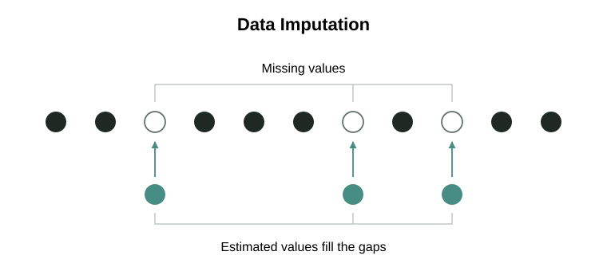

# Methodology

## What Model Atlas Measures

Model Atlas turns benchmark results, token use, prices, and runtimes into four separate 0-100 scores. Intelligence and Agentic describe capability; Speed and Value describe the resources used to deliver it. This article follows the calculation from a reported result to a public score, including what happens when evidence is missing.

Benchmark, reasoning-effort, and resource coverage is uneven. **Imputation** fills supported gaps using relationships across observed results; [source crosswalks](#source-crosswalk-imputation) combine comparable sources without assuming either is better.

The equations describe the current method. [Benchmarks](benchmarks.md) records the selected inputs and their source policies, while [Standards](standards.md) explains how those inputs earn a place. The [dashboard inclusion rules](#dashboard-inclusion) determine which scored models appear on the leaderboard.

| Score | What it measures |
| --- | --- |
| **Intelligence** | Knowledge, perception, understanding, abstract reasoning, and judgment. |
| **Agentic** | Turning goals into working results through coding, instruction following, tool use, verification, and recovery. |
| **Speed** | Task completion time versus models of similar quality, plus token generation rate, first-token latency, and total response time. |
| **Value** | Task cost versus models of similar quality, plus token prices evaluated for affordability and efficiency at comparable capability. |

- **Capability can overlap.** Implementing a specification is primarily Agentic; deriving a difficult algorithm or scientific solution can also contribute to Intelligence.
- **Efficiency accounts for quality.** Speed and Value compare resource use at similar quality, so a cheaper but much less capable model does not automatically score well on Value.
- **Resource effects are limited.** Agentic includes a bounded token-use adjustment based on measured and imputed token use. Price and latency do not affect either capability score.

## How to Read the Scores

The leaderboard uses the current benchmark population, so scores can change when that population changes. The separate [Intelligence Index](timeline.md) keeps a saved reference and connects benchmark generations through shared results. It supports historical comparison, uses provisional display units, and does not affect leaderboard scoring or inclusion.

Capability scores reflect relative performance while preserving proportional gaps within each benchmark during normalization. The final scores combine these contributions with weighting and evidence adjustments. A final score of 80 does not mean 80% task accuracy or twice the capability of a model scoring 40.

### Collapsed and Expanded Models

Reasoning-effort labels include `none`, `low`, `medium`, `high`, `xhigh`, and `max`. An unspecified effort is stored as `null`; it is distinct from an explicit `none`. Available settings depend on the model and source.

Each reasoning-effort variant has its own scores. The collapsed leaderboard selects the variant with the **highest Intelligence score** and shows that variant's headline scores. It does not average scores across efforts or select a separate maximum for each score. Expanding a model reveals its individual variants.

Individual benchmark cells can use separate source-fusion or missing-cell fallback rules; they do not recalculate the representative variant's headline scores.

## Calculation Overview

The scoring order matters: benchmark quality establishes the context for resource comparisons. Dashboard inclusion filters are applied after reference scoring, so hiding a row does not change the scale used to score the others.

> [!FLOW]
>
> 1. **Observed inputs**
>
>    Exact model, variant, task, and resources.
>
> 2. **Comparable benchmark evidence**
>
>    Normalize within each benchmark.
>
> 3. **Intelligence and Agentic**
>
>    Combine task and index evidence, using validated imputation to fill supported gaps in benchmark results and reasoning-effort variants.
>
> 4. **Quality-adjusted resources**
>
>    Compare cost and time at similar quality, using measured resources and supported imputation for missing cost, time, and token use.
>
> 5. **Dashboard inclusion and score availability**
>
>    Apply inclusion and direct-evidence checks after scoring, preserving the reference population.

**Imputed values help estimate scores; they never count as direct evidence.** Observations alone establish reference scales and satisfy inclusion and resource-availability requirements. [Benchmark imputation](#benchmark-imputation) and [resource imputation](#resource-imputation-across-reasoning-efforts) explain how estimates enter scoring and how their support is assessed.

## How Intelligence and Agentic Are Calculated

Start with normalized benchmark results and their weighted mean. Imputation fills supported gaps, evidence adjustments account for incomplete coverage, and aggregate indexes contribute to the final scores. The token-efficiency adjustment is explained afterward.

### Benchmark Scores and Dimension Weights

Read results in their declared units, normalize them to 0–100, then calculate a weighted mean separately for Intelligence and Agentic.

**Reported scores**

| Form | Interpretation |
| --- | --- |
| Fraction | A result on a 0–1 scale. |
| Percentage or points | Use the declared units; points need not represent accuracy. |
| Elo rating | A relative rating converted using configured endpoints. |

For Elo rating $x$, $E(x)$ maps the configured range $[L,U]$ to 0–1:

$$
E(x)=\operatorname{clamp}\left(\frac{x-L}{U-L},0,1\right).
$$

The current endpoints are $L=500$ and $U=2500$. These are parameters, not universal Elo constants; clamp bounds the output to the stated range.

**Normalize benchmark results**

Min–max scaling preserves proportional gaps between results. For model configuration $m$ (including reasoning effort) and benchmark $b$, $x_{m,b}$ is the result after any declared conversion. Its observed minimum and maximum define the normalized result $z_{m,b}$:

$$
z_{m,b}=100\cdot\operatorname{clamp}\left(\frac{x_{m,b}-x_{\min,b}}{x_{\max,b}-x_{\min,b}},0,1\right).
$$

If all observed results are equal, each receives 100. Imputed values cannot change the observed endpoints; new observations in later runs can.

**Calculate the weighted mean**

| Setting | Role |
| --- | --- |
| Importance | Standard policy: 1 for task benchmarks; 0.5 for aggregate indexes used for regularization. |
| Allocation | Intelligence/Agentic split: 100/0, 75/25, 50/50, 25/75, or 0/100. |
| Effective weight $\omega_{b,d}$ | Importance × allocation to dimension $d$, expressed as a fraction. |

For dimension $d$ (Intelligence or Agentic), the model's initial score $z_{m,d}$ is the weighted mean of its observed normalized results:

$$
z_{m,d}=\frac{\sum_b\omega_{b,d}z_{m,b}}{\sum_b\omega_{b,d}}.
$$

Both sums include only observed results with positive weight for that dimension. Missing results are excluded, not counted as zeros. This is the observed mean, before imputation, index blending, and evidence adjustments.

[Benchmarks](benchmarks.md#portfolio-settings) records allocations and current importance exceptions. [Imputation across reasoning efforts](#imputation-across-reasoning-efforts) explains how supported estimates enter the later task mean.

### Balancing the Reference Population

The [collapsed row](#collapsed-and-expanded-models) selects one variant for display. Reference calculations instead use the available observed variants to estimate missing results and compare resource efficiency. Each base model receives one total reference weight, shared across its included variants, so reporting more effort settings does not give it more influence.

For base model $m$ with $n_m$ included variants, each variant $v$ receives weight $a_{m,v}=1/n_m$.

| Used for | What the weight affects |
| --- | --- |
| Resource comparisons | Expected cost, time, and token use at similar quality, plus efficiency ranks and statistical cutoffs. |
| Imputation | Reference distributions and typical prediction errors. |
| Source conversion | The typical difference between paired source results. |

Only variants with the required observations are counted in each calculation. This weights their influence on the reference; it does not divide their scores or combine them into a collapsed score. Weighted statistics use these reference weights unless stated otherwise. A weighted median is the halfway point of cumulative weight in sorted order; at an exact boundary, the two adjacent values are averaged.

### Benchmark Imputation

Imputation uses observed results from related sources, benchmarks, or reasoning efforts to fill missing values. Observations take precedence, and imputed values never become direct evidence or inputs to further imputation.

| Imputation path | Role in scoring |
| --- | --- |
| Across sources or other observed benchmarks | Adds discounted evidence credit and supplies quality estimates for resource comparisons; does not enter the observed capability mean. |
| Across reasoning efforts | Fills missing task contributions in the capability mean; adds no evidence credit by itself. |
| Cost, time, or tokens | Supplies resource estimates with evidence discounts; does not enter the reference population. |

Each missing model-benchmark pair receives at most one imputed value. Source conversion takes priority over prediction from other observed benchmarks; both require held-out validation. Prediction from other observed benchmarks requires at least three distinct observed benchmarks. Results remain attached to their reported effort, and higher effort is not assumed to perform better.

Imputation never satisfies direct-evidence requirements for dashboard inclusion or resource score availability. Each method's support and validation rules are described below.

### Source Crosswalk Imputation

Sources can report the same benchmark with slightly different methodologies and model coverage. For comparable sources, Model Atlas averages their results with equal weight, without assuming either is better.

A **crosswalk** learns their typical score difference from shared models to impute a missing source result before averaging. This preserves the same comparison target despite coverage gaps; validation on withheld models checks whether the imputation is reliable enough to use.

**Fit the offset**

Use results paired by model and reasoning effort:

| Symbol | Meaning and purpose |
| --- | --- |
| $A_i$, $B_i$ | Source A and B results for the same model-effort pair $i$. |
| $a_i$ | Reference weight: each base model shares one unit across its paired efforts, so reporting more efforts gives it no extra influence. |
| $\delta$ | Typical difference $B-A$: positive when B scores higher, negative when A scores higher. |

$$
\delta=\operatorname{weightedMedian}_i(B_i-A_i;a_i).
$$

The weighted median limits the influence of outliers.

**Validate on withheld models**

For each paired result $i$, fit $\delta_{\text{others},i}$ using other models, excluding every effort of its base model. Use that offset to predict the withheld source result and compare it with the observation. This prevents a model’s own results from helping predict it.

The absolute prediction error is $|B_i-A_i-\delta_{\text{others},i}|$. Only half the combined result is imputed, so its error is half as large before clipping. The weighted median gives validation error $\epsilon$ in the benchmark’s score units:

$$
\epsilon=\operatorname{weightedMedian}_i\left(\frac{\left|B_i-A_i-\delta_{\text{others},i}\right|}{2};a_i\right).
$$

**Accept, then impute**

Accept the crosswalk only if both the paired observations and usable validation predictions cover the required number of independent models, currently six, and $\epsilon\le\epsilon_{\max}$, the configured error limit. If it fails, try imputation from other observed benchmarks; without a supported prediction, leave the combined result missing. Two observed source results can always be averaged without imputation.

For an accepted crosswalk, use $\delta$ fitted from all paired observations. A hat marks an imputed result:

| Available results | Missing result | Combined result |
| --- | --- | --- |
| Both sources | None | $(A+B)/2$ |
| A only | $\hat B=A+\delta$ | $(A+\hat B)/2$ |
| B only | $\hat A=B-\delta$ | $(\hat A+B)/2$ |

Clip the combined value to the benchmark’s permitted score range. Raw source results remain separate.

**Discount the evidence credit**

The validation error sets credit $r$ for the imputed half:

$$
r=\operatorname{clamp}\left(1-\frac{\epsilon}{\epsilon_{\max}},0,1\right).
$$

Credit falls from 1 at zero error to 0 at the error limit. The combined result’s evidence credit $\eta^{\text{cross}}$ also includes its observed half:

| Evidence | Combined credit $\eta^{\text{cross}}$ |
| --- | --- |
| Both sources observed | $1$ |
| One source imputed; observed value within that source’s paired calibration range | $(1+r)/2$ |
| One source imputed; observed value outside that range | $0.5$ — credit for the observed half only |

The error controls acceptance and evidence credit; it is not subtracted from the score. A result containing imputation never counts as direct evidence, even when its credit reaches 1.

**Source comparison diagnostics**

Compare the same observed models across sources to see how their score distributions differ and how fusion changes them. Look for a horizontal shift, suggesting an offset, or different spreads, peaks, and tails that one offset may not capture. The fusion curve shows how averaging reshapes the distribution.

**Jensen–Shannon divergence (JSD)** measures overall distribution difference, treating both sources equally: A–B equals B–A. Use it to compare source disagreement and how far the fused distribution sits from each source.

**Kullback–Leibler divergence (KL)** measures mismatch in a chosen direction. A → B is large when A places substantial weight in score regions where B places little; B → A checks the reverse. Unequal values reveal this asymmetry, not which source is better.

For both metrics, zero means identical distributions and smaller values mean greater similarity. Use the same models and smoothing settings when comparing values. Neither metric checks whether individual models agree; held-out prediction error still determines crosswalk acceptance.

### Imputation from Other Observed Benchmarks

Use a model’s performance on other observed benchmarks to impute a missing result: calculate its weighted mean, find its percentile among peers, then read the target benchmark’s value at that percentile. Repeat separately for Intelligence and Agentic.

**Calculate the weighted mean**

The weighted mean summarizes the same model-effort variant’s measured performance for comparison with peers. Each benchmark contributes according to its existing importance and allocation to Intelligence or Agentic.

Reuse the [normalization and weights defined above](#benchmark-scores-and-dimension-weights), separately for Intelligence and Agentic. For each other observed benchmark $k$ with positive weight, $z_k$ is its normalized score and $\omega_k$ its weight:

$$
\mu=\frac{\sum_k\omega_k z_k}{\sum_k\omega_k}.
$$

The missing benchmark and all imputed values are excluded. At least three other observed benchmarks are required—a minimum-evidence policy that prevents one or two results from determining the prediction.

**weightedQuantileRank(): value → percentile**

Convert the weighted mean into a percentile so its relative standing can be used on a benchmark with different score units. Use peers with both an observed target result and a weighted mean calculated the same way, covering at least three distinct base models. These peers also supply the target distribution in the next step.

An ordinary rank counts every model-effort variant equally, so five eligible efforts give a model five times the influence of one. The weighted rank gives each base model equal total influence by dividing its weight of 1 across its eligible variants.

Each peer variant $j$ has weighted mean $\mu_j$ and reference weight $a_j>0$. Count all weight below $\mu$ and half the tied weight:

$$
r=\frac{\sum_{\mu_j<\mu}a_j+\tfrac12\sum_{\mu_j=\mu}a_j}{\sum_j a_j}.
$$

Counting half the tied weight assigns equal values the midpoint of their shared percentile range. The formula gives $r$ on 0–1; $\operatorname{weightedQuantileRank}$ returns $100r$.

**weightedQuantile(): percentile → value**

Convert the percentile back into a score using the target benchmark’s observed distribution. Using the same peers and reference weights on both sides keeps the comparison population consistent.

Sort those same peers’ observed target results as $x_1\le\cdots\le x_n$, keeping each reference weight attached. The cumulative weight share through result $k$ is:

$$
C_k=\frac{\sum_{j=1}^{k}a_j}{\sum_{j=1}^{n}a_j}.
$$

Find the first $k$ with $C_k\ge r$. Select its value, or take the mean of adjacent values at an exact boundary:

$$
\hat x=\operatorname{weightedQuantile}(r)=
\begin{cases}
\dfrac{x_k+x_{k+1}}{2}, & r=C_k\text{ and }k<n,\\[6pt]
x_k, & \text{otherwise}.
\end{cases}
$$

At $r=0$ or $r=1$, return its smallest or largest observed value; $r=0.5$ gives the weighted median.

**Combine and validate**

If both capability dimensions produce predictions, take their weighted mean using the benchmark’s dimension allocations. If only one predicts, use that prediction.

The key assumption is that relative standing on other benchmarks predicts standing on the missing one. Test this by withholding every effort of one base model at a time and comparing predictions with its observed target results.

Accept the method only when at least four distinct held-out models yield valid predictions and their model-balanced median absolute error is at most 25 points on the normalized target scale. Accepted predictions remain separate from the observed capability mean; prediction error and observed benchmark coverage determine their evidence credit for regularization and resource scoring.

### Imputation Across Reasoning Efforts

Impute a missing task result from another effort of the same model, adjusted by their measured score gap on shared tasks. This applies even when both variants already meet the coverage threshold.

For target variant $t$ and donor variant $a$, the directly observed common tasks $C_{t,a,d}$ determine their weighted normalized score gap:

$$
\Delta_{t\leftarrow a,d}=\frac{\sum_{b\in C_{t,a,d}}\omega_{b,d}(z_{t,b}-z_{a,b})}{\sum_{b\in C_{t,a,d}}\omega_{b,d}}.
$$

At least three positively weighted common tasks are required. Aggregate indexes are excluded from this comparison. The donor must directly observe the missing task; an estimated result cannot become a donor. The missing normalized result is:

$$
\widehat z_{t,b}=\operatorname{clamp}(z_{a,b}+\Delta_{t\leftarrow a,d},0,100).
$$

Among eligible donors, the largest effective common-task count wins, using $(\sum\omega)^2/\sum\omega^2$. Ties prefer the closest reasoning setting, then a stable label order. No donor is preferred merely for having higher effort. Intelligence and token-adjusted Agentic use separate normalized observations and gaps.

The task mean combines direct results and supported sibling estimates at the benchmark's normal dimension weight:

$$
T_{t,d}=\frac{\sum_{b\in\mathcal O_{t,d}}\omega_{b,d}z_{t,b}+\sum_{b\in\mathcal H_{t,d}}\omega_{b,d}\widehat z_{t,b}}{\sum_{b\in\mathcal O_{t,d}\cup\mathcal H_{t,d}}\omega_{b,d}}.
$$

Here $\mathcal O$ contains observed tasks and $\mathcal H$ contains imputed tasks. Unsupported gaps stay missing; observed results are preserved.

These imputed values enter the task mean before index blending. They add no evidence credit by themselves; credit from separately validated imputation using other benchmarks is retained. Updated-release replacement rows are excluded from this path.

The shared-task gap assumes transferable differences across tasks. Validate that assumption against missing results; do not enforce increasing scores with effort.

### Checking Imputation Accuracy

Validate imputation against withheld observations and practical alternatives: leaving a contribution unavailable or neutral, or copying another effort without adjustment.

Check prediction error, downstream score error, availability, and failures across models, efforts, and benchmarks. State the units and evaluation population for each error measure. Higher scores or smoother curves do not establish accuracy.

Systematic validation failures require revising or withdrawing the method. Evidence discounts limit reliance on accepted imputation; they do not guarantee accuracy.

### Evidence Support and Quality Regularization

Evidence support measures how much benchmark evidence is available. Regularization reduces high task-only scores when that evidence is sparse.

**Assign evidence credit**

Each benchmark input receives credit $\eta_{m,b}$. Observations receive 1; validated source crosswalks receive the [combined credit defined above](#source-crosswalk-imputation). Imputation from other benchmarks receives credit based on its normalized validation error $\tilde e_{m,b}$ and observed share $r_{m,b}$ of the other benchmarks’ total weight:

$$
\eta_{m,b}=
\begin{cases}
1 & \text{observed}\\
\eta^{\text{cross}}_{m,b} & \text{validated source crosswalk}\\
r_{m,b}\operatorname{clamp}(1-\tilde e_{m,b}/25,0,1) & \text{validated imputation from other benchmarks}\\
0 & \text{missing}.
\end{cases}
$$

For imputation from other benchmarks, credit reaches zero at 25 error points. When both dimensions predict, their allocation shares combine the observed shares $r_{m,b}$. Imputation across reasoning efforts adds no credit by itself; separately validated credit is retained.

**Calculate evidence support**

For dimension $d$, $\mathcal{B}_d$ contains the selected benchmarks and $\omega_{b,d}$ is each benchmark’s effective weight. Their credited weights sum to available evidence mass $E_{m,d}$; their full weights sum to possible mass $\Omega_d$:

$$
E_{m,d}=\sum_{b\in\mathcal{B}_d}\omega_{b,d}\eta_{m,b},
\qquad
\Omega_d=\sum_{b\in\mathcal{B}_d}\omega_{b,d}.
$$

The displayed evidence support $h_{m,d}$ is their ratio:

$$
h_{m,d}=E_{m,d}/\Omega_d.
$$

**Regularize sparse task scores**

Cubic smoothstep makes the adjustment gradual, with zero slope at both endpoints. Its input $t$ is clipped to $u\in[0,1]$:

$$
\operatorname{smoothstep}(t)=u^2(3-2u),
\qquad
u=\operatorname{clamp}(t,0,1).
$$

The polynomial follows from those endpoint conditions; the transition thresholds are scoring-policy choices.

The coefficient $c_{m,d}$ controls how much of an above-50 task score is retained. The full-evidence threshold $F$ is the median benchmark count represented by the aggregate indexes, currently 7.5. The coefficient is zero through $0.1F$ and reaches one at $F$:

$$
c_{m,d}=\operatorname{smoothstep}\left(\frac{E_{m,d}-0.1F}{0.9F}\right).
$$

The threshold uses absolute evidence mass, so adding benchmarks to the portfolio does not automatically strengthen regularization. Displayed coverage still uses the full portfolio denominator.

Without an eligible observed index, regularization reduces an above-50 task mean toward 50 as evidence becomes sparse. The task mean $T_{m,d}$ includes supported imputation across reasoning efforts. Its regularized score $R_{m,d}$ is:

$$
R_{m,d}=T_{m,d}-(1-c_{m,d})\max(T_{m,d}-50,0).
$$

A mean at or below 50 is unchanged, so missing evidence cannot improve an already low score.

### Combining Tasks and Aggregate Indexes

Aggregate indexes provide broad fallback evidence. As direct task coverage grows, task results receive more weight. The blend weights the task and index means, not individual inputs.

Effort-labelled variants use only indexes reporting that effort; unlabelled models use the ordinary index pool. Other indexes remain available for display and inclusion checks. Count only observed tasks with positive allocation to the dimension; indexes and imputation do not count.

**Set the task share**

The direct task count $n$ determines the task share $t$. The full-task threshold $N$ is the median represented index breadth, currently 7.5. Progress $p$ runs from zero at one observed task to one at that threshold:

$$
p=\operatorname{clamp}\left(\frac{n-1}{N-1},0,1\right),\qquad
t=0.20+0.60\left(3p^2-2p^3\right).
$$

The 20% and 80% endpoints are policy choices. This count is independent of evidence mass and inclusion rules; unlike Timeline, portfolio coverage does not cap it. Adding unobserved tasks cannot delay the endpoint.

**Combine the means**

The task mean $T$ includes supported imputation across reasoning efforts and uses importance × dimension allocation. The observed index mean $J$ uses represented benchmark breadth × importance × dimension allocation. Their blend is:

$$
Q=tT+(1-t)J.
$$

ECI's fitted benchmark count sets its relative index weight; fixed-portfolio indexes use their declared breadth. Directly observed CAIS components reduce only CAIS's remaining breadth to limit double counting.

With no observed tasks, indexes carry 100%. With no eligible observed index, the regularized task-only calculation applies. The 80% endpoint is the maximum task share, not full portfolio coverage.

The blend does not add evidence credit or satisfy inclusion requirements. Imputed task results affect the task mean but not the direct-task count; no further whole-score effort adjustment follows.

### Final Intelligence and Agentic Scores

For variant $m$ and dimension $d$, $Q_{m,d}$ is the task/index blend when an eligible observed index exists, otherwise the regularized task-only result $R_{m,d}$. Both paths include supported imputation across reasoning efforts. The final scores are:

$$
\begin{aligned}
I_m&=Q_{m,\text{Intelligence}}\\
A_m&=Q_{m,\text{Agentic}}.
\end{aligned}
$$

Intelligence and Agentic each show an evidence share. Equal shares can represent different evidence amounts because portfolio weights differ. The API calls these fields `confidence`; they are coverage measures, not confidence intervals or probabilities of a correct rank.

### Agentic Token Efficiency

Agentic rewards lower token use at comparable quality, with a multiplier capped at 0.85–1.15 before renormalization. Intelligence and raw benchmark results are unchanged. This adjustment is applied to benchmark contributions **before** they enter the Agentic mean.

The reference uses observed quality and token counts from independent models before dashboard filtering. [Nearby-quality peers](#comparable-quality-peers) and [comparison support](#comparison-support) determine the expected token use and adjustment strength. Imputed quality cannot activate the adjustment; imputed tokens receive a discounted adjustment and never enter the reference.

Token counts must match the benchmark and effort. Use one measure supported by at least three independent models: complete input plus output counts first, reported totals next, or output-only counts separately. Aggregate-index token counts belong only to that index and use a linear quality coordinate.

Compare token count $T_{m,b}$ with expected log token use $\mu^T_{m,b}$ from the peer method below. The residual $r^T_{m,b}$ is negative for lower-than-expected use. The spread $s^T_b$ is measured across original paired log-token observations:

$$
r^T_{m,b}=\ln T_{m,b}-\mu^T_{m,b},\qquad
s^T_b=1.4826\operatorname{weightedMedian}\left(|\ln T-\operatorname{weightedMedian}(\ln T)|\right).
$$

The factor 1.4826 puts median absolute deviation on a standard-deviation-like scale. This spread is measured before subtracting peer expectations. The cap $c=0.15$ and peer support $h_{m,b}$ then determine the multiplier:

$$
m_{m,b}=1-c\,h_{m,b}\operatorname{clamp}\left(\frac{r^T_{m,b}}{2s^T_b},-1,1\right).
$$

The multiplier reaches its limits at two spread units; weaker peer support brings it toward 1.

The multiplier stays at 1 when tokens are neither measured nor imputable, measured token variation is zero, quality is flat, or comparison support is insufficient. Imputed tokens with credit $\eta^T$ use $1+\eta^T(m-1)$. Token imputation uses the same validated effort ratios and broader-evidence fallback as cost and time, separately for total and output-only tokens.

The multiplier acts on the zero-based benchmark contribution $z_{m,b}$. The adjusted contribution $\widetilde z_{m,b}$ is then remapped using the adjusted observed cohort:

$$
\widetilde z_{m,b}=z_{m,b}m_{m,b},\qquad
z^A_{m,b}=100\frac{\widetilde z_{m,b}-\min_j\widetilde z_{j,b}}{\max_j\widetilde z_{j,b}-\min_j\widetilde z_{j,b}}.
$$

The adjusted $z^A$ enters the Agentic mean, index blend, and effort comparisons. Do not clip at 100 before remapping. The ±15% limit bounds the multiplier, not final score changes; new anchors can also move variants with a neutral multiplier.

Token use changes neither evidence weights nor inclusion requirements. It can indirectly change Value through the Agentic score. Aggregate token counts do not distinguish successful completion from early termination or prove that an effort setting caused an efficiency gain.

## How Speed and Value Are Calculated

Speed and Value combine task efficiency with provider speed and token prices. First establish the available measurements, then compare resource use at similar quality, estimate supported gaps, and combine the components. Display requirements are applied separately under [Dashboard Inclusion](#dashboard-inclusion).

### Blended Token Price

Blended price gives equal weight to input and output prices, in USD per million tokens:

$$
\begin{aligned}
\text{blended price}&=0.50\cdot\text{effective input price}+0.50\cdot\text{effective output price}
\end{aligned}
$$

Effective input and output prices are weighted means of provider prices, using reported token volumes as weights. The blend is a comparison convention, not a workload bill estimate.

Both sides need complete provider-price and token-volume evidence; otherwise the effective blend is missing. OpenRouter's aggregate and historical price series do not determine it, and cache pricing is excluded.

Published input, output, and cache prices remain raw route metadata. Listed catalog or Artificial Analysis prices can provide the fallback described in [Model Matching](matching.md#selected-identity).

### Provider Speed

Provider speed contributes 30% of Speed’s base weight, split equally between throughput, time to first token, and end-to-end response time. Benchmark task time supplies the other 70%.

OpenRouter serving estimates combine endpoint history with matching positive token-volume weights. Endpoint IDs join directly to pricing data; provider-name guesses and request-count allocation are not used. Missing or unweighted endpoints leave the matched evidence usable.

If no weighted history remains, throughput falls back to the highest endpoint median (P50) and first-token latency to the lowest, following OpenRouter's model-page aggregate cards. End-to-end latency has no aggregate fallback.

The measured throughput $\tau_m$, first-token latency $\ell_m$, and end-to-end latency enter log-scaled min-max comparisons. The subscript “lower” reverses the scale so lower latency scores better:

$$
\begin{aligned}
S^{\text{throughput}}_m&=\operatorname{MinMax}(\log \tau_m)\\
S^{\text{latency}}_m&=\operatorname{MinMax}_{\text{lower}}(\log \ell_m)\\
S^{\text{e2e}}_m&=\operatorname{MinMax}_{\text{lower}}(\log \text{end-to-end latency}_m)
\end{aligned}
$$

Higher throughput and lower latency score better. Logarithms preserve proportional differences. Missing statistics reduce evidence support and receive no transferred weight from available statistics.

### Quality-Adjusted Task Resources

Speed and Value compare resource use among independent models at similar benchmark quality. For variant $m$ and benchmark $b$, $A^{\text{time}}_{m,b}$ is task time in seconds and $A^{\text{cost}}_{m,b}$ is task cost:

$$
\begin{aligned}
A^{\text{time}}_{m,b}&=\text{effective task seconds}_{m,b}\\
A^{\text{cost}}_{m,b}&=\text{task cost}_{m,b}
\end{aligned}
$$

Use resources from the same benchmark and effort. If wall time is missing, output tokens divided by served throughput can estimate it; total tokens cannot substitute for output tokens. Validated effort imputation and broader-evidence fallback can fill other gaps. Source-wide averages cannot replace task measurements.

Use per-task resources. Totals are comparable only for identical task sets and run counts; otherwise normalize them. Retain source totals and task counts for audit.

### Comparable-Quality Peers

Nearby-quality models receive more comparison weight. The declared transform $T_b$ maps result $x_{m,b}$ to quality coordinate $q_{m,b}$:

$$
q_{m,b}=T_b(x_{m,b}),\qquad
T_b(x)=
\begin{cases}
x & \text{linear}\\
\operatorname{logit}(x) & \text{logit}
\end{cases}
$$

A linear coordinate preserves the stored score gaps. It suits partial credit, Elo-derived scores, rubrics, composites, human-relative performance, and other metrics whose endpoints do not represent a success probability.

A logit coordinate uses $\operatorname{logit}(x)=\log(x/(1-x))$ for probability-like pass, accuracy, and completion rates. Inputs must lie in $[0,1]$ and are clipped to 0.001–0.999 before conversion, keeping the transformed values finite near the endpoints.

The benchmark-specific decisions are listed in [Benchmarks](benchmarks.md#resource-quality-coordinates). Aggregate price comparisons are not benchmark success rates; they use the linear mean of the two public quality scores described below.

Logit gives equal percentage-point gains more separation near the ceiling, where they remove a larger share of remaining errors.

After this transform, center quality on the weighted median and divide by a robust spread to obtain $Z_{m,b}$. This makes quality distances comparable across benchmarks. Each observed peer $j$ has reference weight $a_{j,b}$: one unit per base model, shared across variants with paired quality and resource observations. $Q^a_{25}$ and $Q^a_{75}$ are the weighted 25th and 75th percentiles; $f_b$ is the minimum spread:

$$
\begin{aligned}
\operatorname{deviation}_b&=\max\left(\frac{Q^{a}_{75}(\{q_{j,b}\})-Q^{a}_{25}(\{q_{j,b}\})}{1.349},f_b\right)\\
Z_{m,b}&=\frac{q_{m,b}-\operatorname{weightedMedian}_j(q_{j,b},a_{j,b})}{\operatorname{deviation}_b}
\end{aligned}
$$

The interquartile range covers the middle half of observations; 1.349 converts it to a standard-deviation-like scale. The minimum spread is $f_b=0.35$ for logit coordinates and $f_b=0.35(q_{\mathrm{max},b}-q_{\mathrm{min},b})$ for linear coordinates. This prevents small score differences in tightly clustered results from appearing too large and keeps linear comparisons unchanged by unit conversions.

Only observed paired results set the range. The spread describes the reference distribution, not measurement uncertainty. With flat reference quality, only equal-quality rows receive support.

Gaussian weights $w_{m,j,b}$ favor peers near the target quality, with width $\sigma=0.5$. The indicator $\mathbf{1}[\cdot]$ is 1 for a different base model and 0 for the same base model, excluding all efforts of the target model:

$$
w_{m,j,b}=\mathbf{1}[\operatorname{model}(m)\ne\operatorname{model}(j)]a_{j,b}\exp\left(-\frac{1}{2}\left(\frac{Z_{m,b}-Z_{j,b}}{0.5}\right)^2\right)
$$

### Comparison Support

Count independent models, not effort variants. First combine peer weights by base model $k$:

$$
W_{m,k,b}=\sum_{j:\operatorname{model}(j)=k}w_{m,j,b}.
$$

The supported peer mass $s_{m,b}$ takes the smaller of the total nearby weight and the effective independent-model count:

$$
s_{m,b}=\min\left(\sum_k W_{m,k,b},\frac{(\sum_k W_{m,k,b})^2}{\sum_k W_{m,k,b}^2}\right)
$$

The coefficient $h_{m,b}=\operatorname{smoothstep}((s_{m,b}-1)/2)$ rises from zero at one supported model unit to one at three. Total nearby weight limits weak, distant peers; effective model count limits a single dominant peer.

Without supported peers, an observed resource receives a neutral component score of 50. Peer support is separate from the model’s displayed input coverage.

### Expected Resource Use

Estimate expected resource use at the target quality. Start with a local weighted mean; with sufficient peer support, fit a local trend. Compare resources logarithmically so proportional cost and time differences are comparable.

**Calculate the local mean and trend**

For resource $r$ (cost, time, or tokens), $A^r_{j,b}$ is peer $j$’s amount on benchmark $b$. The peer weights give mean log resource use $\bar y^r_{m,b}$. A fitted line has intercept $\hat\alpha$ at the target quality and slope $\hat\beta$; weighted squared errors determine both:

$$
\begin{aligned}
\bar y^r_{m,b}&=\frac{\sum_jw_{m,j,b}\log A^r_{j,b}}{\sum_jw_{m,j,b}}\\
(\hat\alpha,\hat\beta)&=\arg\min_{\alpha,\beta}\sum_jw_{m,j,b}\left[\log A^r_{j,b}-\alpha-\beta(Z_{j,b}-Z_{m,b})\right]^2.
\end{aligned}
$$

**Bound the prediction and apply support**

Evaluate the line at $Z^*_{m,b}$, the target quality clipped to the independent observed peers’ range. Clip its prediction $\tilde y^r_{m,b}$ to their observed log-resource range as well. Comparison support $h_{m,b}$ blends the local mean and bounded trend into expected log resource use $\mu^r_{m,b}$:

$$
\begin{aligned}
Z^*_{m,b}&=\operatorname{clamp}(Z_{m,b},Z_{\min,b},Z_{\max,b})\\
\tilde y^r_{m,b}&=\operatorname{clamp}\left(\hat\alpha+\hat\beta(Z^*_{m,b}-Z_{m,b}),\min_j\log A^r_{j,b},\max_j\log A^r_{j,b}\right)\\
\mu^r_{m,b}&=\bar y^r_{m,b}+h_{m,b}(\tilde y^r_{m,b}-\bar y^r_{m,b})
\end{aligned}
$$

Use the local mean through one supported model unit and the full trend at three. Flat quality or unstable slopes retain the mean; the slope can be positive or negative. These bounds prevent extrapolation beyond observed quality and resource use. Weak support also reduces the final efficiency score toward 50.

**Compare observed and expected use**

The residual $\epsilon^r_{m,b}$ is observed minus expected log resource use:

$$
\epsilon^{r}_{m,b}=\log A^{r}_{m,b}-\mu^{r}_{m,b}
$$

A negative residual means less resource use than expected at that quality; a positive residual means more.

### Resource Efficiency Score

Take the mean of two scores: the size of the resource advantage and its percentile rank. Then pull the result toward 50 when peer support is weak.

Clip exceptionally favorable residuals at the model-balanced 2.5th percentile $L$ so they cannot stretch the magnitude scale. This clipping is called winsorization. With upper anchor $U$ equal to the largest supported residual, the magnitude score is:

$$
M^{r}_{m,b}=100\cdot\frac{U-\operatorname{clamp}(\epsilon^{r}_{m,b},L,U)}{U-L}.
$$

The percentile score $P^r_{m,b}$ ranks the negative residual, so lower resource use scores higher. It counts all tied weight; benchmark imputation counts half. Both reference distributions give each base model equal total weight.

The mean $H^r_{m,b}$ combines magnitude $M^r_{m,b}$ and percentile $P^r_{m,b}$ equally. Comparison support $h_{m,b}$ then pulls the component score $R^r_{m,b}$ toward 50:

$$
H^{r}_{m,b}=\frac{M^{r}_{m,b}+P^{r}_{m,b}}{2},
\qquad
R^{r}_{m,b}=50+h_{m,b}(H^{r}_{m,b}-50).
$$

If supported residuals have no meaningful spread, every observed residual receives 50. Estimated resources can be scored against the observed reference, but cannot move its anchors.

### Resource Imputation Across Reasoning Efforts

Impute a missing resource amount from another effort of the same model using a ratio learned from shared tasks. Cost, runtime, total tokens, and output tokens each have separate ratios. Exclude unlabelled source-default rows and source-wide averages; benchmark-specific measurements remain eligible.

**Estimate the effort ratio**

For resource $r$ on paired task $k$, $A^{r,\text{target}}_k$ and $A^{r,\text{source}}_k$ are the observed amounts at the target and source efforts. Their log difference $d^r_k$ represents the target-to-source ratio:

$$
d^r_k=\log A^{r,\text{target}}_k-\log A^{r,\text{source}}_k.
$$

At least three paired tasks are required. To validate the ratio, withhold task $k$ and calculate the median log difference $\hat d^r_{\text{others},k}=\operatorname{median}_{j\ne k}(d^r_j)$ from the other tasks. Exponentiating that difference gives the ratio used to predict the withheld target amount:

$$
\widehat A^{r,\text{target}}_k=A^{r,\text{source}}_k\exp(\hat d^r_{\text{others},k}).
$$

**Check prediction and score errors**

Validation measures both the resource error and its effect on the component score. For the withheld target, $A^r_k$ is the observed amount and $\widehat A^r_k$ its prediction; $R^r_k$ and $\widehat R^r_k$ are their resource scores. Their median absolute errors are:

$$
e^r_{\mathrm{log}}=\operatorname{median}_k\left|\log\frac{\widehat A^r_k}{A^r_k}\right|,
\qquad
e^r_{\text{score}}=\operatorname{median}_k\left|\widehat R^r_k-R^r_k\right|.
$$

Reject the ratio if log error reaches $\log 2$ (a factor of two), score error reaches 25 points, or fewer than three held-out score comparisons are usable. Otherwise, evidence credit $\eta^r$ uses the lower of the two error discounts:

$$
\eta^r=\min\left(1-\frac{e^r_{\mathrm{log}}}{\log2},1-\frac{e^r_{\text{score}}}{25}\right).
$$

Both terms are clipped to $[0,1]$. The final ratio uses the median log difference across all paired tasks. If several siblings can fill the gap, the nearest effort is preferred, followed by the better-validated ratio.

If target quality is also imputed, its credit multiplies the resource credit: $\eta^{\text{quality}}\eta^r$. Imputed values remain outside reference peers, score anchors, stored observations, and direct-evidence counts.

### Resource Imputation from Broader Evidence

When paired tasks cannot support an effort ratio, begin with ratios from other models. Refine that estimate with evidence from the same lab, nearby releases, and the target model. Evidence support limits each correction.

Date weighting and correction limits are policy choices; release proximity alone does not establish predictive accuracy.

The starting estimate is the median log resource ratio for the exact benchmark and effort transition across at least two other base models. Exclude every effort of the target model. Corrections then use:

| Scope | Correction evidence |
| --- | --- |
| Same lab | Donor models’ median deviations from global task ratios, excluding each donor from its own reference. |
| Nearby releases | The same deviations, weighted by $\exp[-\tfrac12(\Delta t/60)^2]$, where $\Delta t$ is the release-date difference in days. |
| Target model | Its effort ratios on other paired tasks, after subtracting their global task ratios. |

[Release proximity](matching.md#release-proximity-for-resource-estimation) uses dates, not product-name categories. Missing dates retain the lab correction; missing lab identity prevents both lab and release corrections.

Each correction receives weight $n/(n+k)$, so sparse evidence produces a smaller correction. Support $n$ measures the available evidence; shrinkage $k$ controls how quickly the correction gains influence:

| Scope | Support $n$ | Shrinkage $k$ |
| --- | --- | --- |
| Same lab | Number of distinct donor models | 16 |
| Nearby releases | Sum of Gaussian donor weights; correction uses their weighted median | 4 |
| Target model | Number of paired tasks on other benchmarks | 4 |

Missing support retains the broader estimate. Parameters are fixed, not fitted per model. Evidence from one effort transition cannot predict a different transition.

Apply the ratio to the nearest supported effort’s observed amount of the same resource. Direct measurements and validated same-model ratios take precedence.

Evidence credit $\eta_b$ increases with independent donor count $n_b$ and decreases with disagreement $d_b$, the median absolute difference between donor log ratios and the final estimated log ratio:

$$
\eta_b=\frac{n_b}{n_b+4}\max\left(0,1-\frac{d_b}{\log 2}\right).
$$

This credit measures support and agreement, not the probability of an accurate prediction. Zero credit or a non-finite amount leaves the value missing.

Broader-evidence imputation affects scoring only, with the existing discount for imputed target quality. It cannot become donor evidence, overwrite measurements, or satisfy resource availability requirements.

Cost, runtime, total tokens, and output tokens use separate donor pools and ratios. Aggregate-index tokens stay attached to their own index. Runtime donors require reported seconds paired with observed quality; cost and throughput-derived time cannot supply runtime donor evidence.

### Combining Speed and Value Components

Combine task efficiency with provider measurements, discount imputed inputs, then apply a model-level coverage multiplier.

The components first enter a higher-is-better 0-100 scale. Provider statistics use ordinary min-max scores of $\log x$. Absolute price uses $\log_{10}(1+\text{blended price})$ with the favorable tail clipped at 2.5%. Quality-adjusted price uses the same local residual method as task resources. Keeping absolute and quality-adjusted price separate retains both affordability and efficiency at comparable capability.

Price comparisons use the mean of the public Intelligence and Agentic scores as their aggregate quality coordinate:

$$
q_m^{\text{aggregate}}=\operatorname{mean}(\text{Intelligence}_m,\text{Agentic}_m).
$$

Use the public, regularized capability scores on a linear scale. Task time and cost instead use their own benchmark quality and declared transform.

For transformed measurement $g(x)$, $y_{\mathrm{min}}$ and $y_{\mathrm{max}}$ are its finite reference minimum and maximum. Min–max scaling maps this range to 0–100. When higher values are better, the score is:

$$
S_{\uparrow}(x)=100\operatorname{clamp}\left(\frac{g(x)-y_{\mathrm{min}}}{y_{\mathrm{max}}-y_{\mathrm{min}}},0,1\right)
$$

The lower-is-better score $S_{\downarrow}(x)$ reverses the same scale:

$$
S_{\downarrow}(x)=100\operatorname{clamp}\left(\frac{y_{\mathrm{max}}-g(x)}{y_{\mathrm{max}}-y_{\mathrm{min}}},0,1\right)
$$

Equal-value populations follow the [normalization rule above](#benchmark-scores-and-dimension-weights). Absolute price clips its favorable tail; quality-adjusted resource scores combine magnitude and percentile.

Ordinary Speed and Value reserve 70% of their base weight for task resources and 30% for provider or price measurements. Active task inputs split their bucket equally:

| Score | Task resources: 70% | Other measurements: 30% |
| --- | --- | --- |
| Speed | Quality-adjusted task time | Throughput, latency, and end-to-end latency: 10% each |
| Value | Quality-adjusted task cost | Absolute and quality-adjusted price: 15% each |

The base weight $a_i$ records this policy. Evidence credit $\eta_{m,i}$ records how much support a row has for that component, giving the effective weight $w_{m,i}=a_i\eta_{m,i}$. Direct evidence has credit 1. Estimated quality contributes its discount $\eta^{\text{quality}}$; estimated resources multiply it by their own credit $\eta^r$.

The 70/30 split describes the full set of base weights. Missing or discounted inputs can change the proportions in an individual row's available weighted mean; they also lower its displayed evidence share.

**Apply shared coverage**

All efforts of a base model share one coverage multiplier, so different observation counts alone do not create different penalties. The source-default configuration is the unlabelled variant, or the highest reported effort if all are labelled.

For base model $q$ and resource dimension $p$ (Speed or Value), $m_q^{\text{default}}$ is that configuration and $K_p$ is the total active base weight. Its evidence share $\gamma_q^p$ determines the shared multiplier $C_q^p$:

$$
\gamma_q^p=\frac{\sum_iw^p_{m_q^{\text{default}},i}}{K_p},
\qquad
C_q^p=\operatorname{smoothstep}\left(\frac{\gamma_q^p-0.1}{0.5}\right).
$$

The multiplier is zero through 10% coverage and reaches one at 60%. Each effort retains its own component mean and displayed evidence share.

For variant $m$, $q(m)$ identifies its base model. Its Speed components $s_{m,i}$ and Value components $v_{m,i}$ form weighted means, which receive the shared multiplier. The displayed evidence shares, written below as $\text{SpeedConfidence}$ and $\text{ValueConfidence}$, use that variant’s own effective weights:

$$
\begin{aligned}
\text{Speed}_m&=C^{\text{speed}}_{q(m)}\frac{\sum_iw^{\text{speed}}_{m,i}s_{m,i}}{\sum_iw^{\text{speed}}_{m,i}}\\
\text{SpeedConfidence}_m&=\frac{\sum_iw^{\text{speed}}_{m,i}}{K_{\text{speed}}}\\
\text{Value}_m&=C^{\text{value}}_{q(m)}\frac{\sum_iw^{\text{value}}_{m,i}v_{m,i}}{\sum_iw^{\text{value}}_{m,i}}\\
\text{ValueConfidence}_m&=\frac{\sum_iw^{\text{value}}_{m,i}}{K_{\text{value}}}.
\end{aligned}
$$

The Price vs Cost Efficiency graph compares observed benchmark task-cost efficiency separately from the full Value score. It also shares the source-default effort's coverage across ordinary efforts, so different observation counts alone do not create different penalties within one model.

Peer support pulls individual efficiency comparisons toward 50. Model coverage multiplies the final resource score. These are separate adjustments.

## Dashboard Inclusion

A model appears on the dashboard only when it meets all of these requirements:

- A qualified model identity, a name, and confirmed text output.
- Observed benchmark breadth reaching the inclusion threshold, currently seven, as counted below.
- At least one observed selected input in each of Intelligence and Agentic.
- At least two distinct observed eligible indexes, or one observed Artificial Analysis Intelligence Index or Epoch Capabilities Index.
- Finite relative Intelligence and Agentic scores strictly greater than 10 each.

**Count observed benchmark breadth**

Standalone benchmarks contribute their configured importance once across both dimensions. An observed aggregate index contributes its represented benchmark breadth, without the half-importance discount used in quality scoring.

Count each known component once across indexes and standalone observations, using the larger of its standalone importance and the one unit represented within an observed index. Add each index’s remaining unnamed breadth separately. This avoids double counting known overlap and prevents a half-importance standalone observation from reducing existing index coverage.

AA’s main Intelligence Index represents ten benchmarks. Its Agentic, Coding, and Omniscience indexes add no inclusion credit. Only observed results count, including observed zeros.

ECI supplies a model-specific fitted benchmark count, falling back to four when unavailable. Its component overlap is unknown, so this count is an estimate added alongside standalone evidence. Inclusion uses observations matched to the exact configuration; imputation supplies no direct coverage.

The breadth threshold is the smallest known index breadth among AA, CAIS, Surge, and Vals, currently seven. ECI’s publication minimum is excluded because it is not a fixed benchmark basket.

| Inclusion rule | Detail |
| --- | --- |
| Eligible indexes | AA’s main Intelligence Index, CAIS, ECI, Surge, and Vals. Secondary AA indexes and imputed results do not count. |
| Single-index exception | One observed AA main index or ECI satisfies the index-count rule only. Breadth, dimension, and quality requirements still apply. |
| Breadth versus index count | Standalone results can supply breadth but cannot replace the index requirement. ECI’s fallback count of four does not meet the seven-benchmark breadth threshold alone. |
| Timing and source | No specific index, release age, or prior publication is required. |

Scoring regularization and the task/index blend use median index breadth; inclusion uses the minimum described above.

**Apply display rules**

The default leaderboard follows the Timeline chart's display policy: OpenAI Pro configurations, Gemini Deep Think, and Claude Mythos are hidden because of their specialized resourcing, operating policies, or assets. Ordinary Gemini Pro and other high-reasoning configurations remain eligible. This display filter leaves source evidence, scores, and the scoring reference population unchanged.

All included models receive numeric ranks in compact views. Missing specifications remain null; Speed and Value have separate resource requirements. The exact-variant `all` JSON view has no rank field.

Benchmark results can be published before a model appears in public catalogs. Catalog absence alone does not invalidate sufficiently evidenced results. A model below the represented-evidence threshold is excluded, regardless of release age.

These gates remove public rows only after reference scoring, so dashboard inclusion itself does not recalibrate the reference population.

### Resource Score Availability

A listed token price or serving speed alone does not show the resources needed to complete useful work. Value and Speed therefore require observed quality paired with task-resource measurements before those scores can be displayed, with cost and time qualifying independently.

A dashboard variant needs observed quality-and-resource coverage representing at least four distinct benchmarks to display Value or Speed. Each selected standalone task contributes one when it has observed quality paired with positive cost or directly reported seconds.

The selected Artificial Analysis Intelligence Index contributes its catalogued breadth, currently 10, when its observed score is paired with its own positive aggregate cost or runtime. Deduct separately counted AA components for each resource so overlapping evidence counts once. AA cost coverage does not establish runtime coverage.

Imputed quality, estimated resources, output-token runtime proxies, provider token prices, throughput, and latency do not satisfy this threshold. AA telemetry remains attached to its own index and never fills missing standalone task measurements.

A variant that qualifies on quality remains in the table with unavailable resource scores left blank. Raw prices and provider speed measurements remain available. Insufficient runtime coverage suppresses Speed independently of Value.

Without Value, a variant is excluded from every graph, including quality-only graphs and the model signature. Collapsed graphs choose among eligible variants. The benchmark graph’s combined Speed-and-Value axis requires both scores; unavailable scores are never replaced with zero.

This is an output eligibility rule, not another score penalty. All model observations remain in scoring calibration, and eligible Speed and Value scores keep their existing calculation.

## Dashboard Comparisons

The dashboard uses the calculated scores to highlight trade-offs and compare reasoning efforts. These display rules do not change the headline scoring method.

### Selecting Highlighted Models

Highlighted models represent different Intelligence–Value trade-offs. Intelligence and Pareto roles use the highest-Intelligence variant; Best Agentic searches all efforts of visible models. Labels omit effort suffixes, but scores remain those of the selected variant.

The Pareto frontier contains models for which no other candidate is at least as good in both Intelligence and Value and strictly better in one. Its two highlighted roles apply explicit selection rules:

| Role | Selection rule |
| --- | --- |
| Pareto Balance | Largest Intelligence × Value product on the frontier, equivalent to the largest equal-weight geometric mean. This favors strength in both scores. Ties prefer higher Intelligence. |
| Pareto Value | Highest Value on the frontier among models strictly above the full published population’s median Intelligence. This focuses the role on more capable candidates. Ties prefer higher Intelligence. |

The median counts each base model with finite Intelligence and Value once, before dashboard filters. A model exactly at the median does not qualify for Pareto Value.

Pareto candidates follow model, provider, and price filters before rank and release-recency limits. The other signature roles use the displayed population.

Pareto Balance has no Intelligence cutoff. Token price does not select either Pareto role or represent measured task cost. A model may fill multiple roles; a role is omitted if no candidate qualifies.

### Comparing Reasoning-Effort Curves

Compare reasoning efforts using measurements shared by the selected variants of each model. Build separate common task sets for cost, time, and tokens so changing task coverage does not masquerade as an effort effect.

The benchmark selector includes tasks with broad reasoning-effort coverage, selected standalone AA components, and labelled aggregate index proxies. This selection does not change the scoring portfolio or remove other benchmarks from the table.

Each index proxy uses its own quality result. Artificial Analysis pairs its Intelligence Index with its reported aggregate cost, runtime, and output-token measurements per task. Those resources stay attached to that index. Index-only views show native index points, not percentages.

Cost, Time, and Tokens each require their own paired observations. Token comparisons use the declared total or output-only measure; an incomplete input/output breakdown is not a total-token observation. Imputed resources affect scoring but do not appear as direct graph measurements. Effort-labelled rows use only indexes reporting that effort, currently AA.

Build each model’s comparison independently for cost, time, and tokens:

| Step | Rule |
| --- | --- |
| Baseline | Use selected indexes with paired quality and resource observations. |
| Task inclusion | Include a task only when every selected variant of that model has both its quality and resource measurement. |
| Axis calculation | Normalize each axis against the full reference population; calculate weighted means for both axes using the same observations and weights. |
| Weights | One per task; represented benchmark count per index, currently ten for AA. |
| Overlap | Subtract one from AA’s weight for each matching component actually included as a task. Excluded components and unrelated tasks do not reduce it. |
| No common tasks | Retain common index evidence alone; sparse tasks cannot remove variants from the index baseline. |

The remaining index weights apply to both axes and the displayed index share; the index values stay unchanged. Headline capability scores use their separate [task/index blend](#combining-tasks-and-aggregate-indexes), with task weight rising to 80%.

Variants missing the selected index resource evidence are counted in the legend and can be compared by deselecting the index proxies. Without paired index evidence, the graph uses common tasks across that model’s variants with selected resource observations. If no evidence is common, the comparison is empty.

Explicitly selecting one entry retains native units. A single common entry within a multi-entry selection stays on the normalized aggregate scale.

**Common within model** summarizes variant coverage and index-weight ranges. **Details** lists each model’s variants, common/selected counts, index share, included evidence, and excluded observations.

Each model has its own task set, so distances between models are not comparisons on identical tasks. Changing models or selections can change these sets, but not normalization references. Overlapping tasks and indexes are not independent evidence; adding tasks does not guarantee better estimates.

The graphs preserve observed plateaus, regressions, and direction changes; no monotonicity or smoothing is imposed. Resource availability thresholds remain independent of common-task counts. Observed index/resource pairs can qualify through residual benchmark breadth. Graph selection does not change leaderboard scores.

Expanded graphs connect consecutive displayed efforts within each model, even when an axis reverses direction. The separate Pareto frontier line appears only in collapsed mode.

## Reference Notes

### Evidence for Updated Releases

A dated model replacement needs fresh evidence before results from the previous identity can be reused. Artificial Analysis and Vals must independently identify the same dated release suffix, and the matched catalog route must serve that release. Semantic versions remain separate identities.

Retain an observation only when at least one condition holds:

- Its value changed.
- Its source identifies the new release.
- Its observation date is newer than the previous result and no earlier than release.
- An earlier refresh already accepted it for the replacement.

A missing old value or a reputable source alone does not establish freshness. Replacement rows use accepted direct evidence without imputation from other benchmarks. Retained Artificial Analysis and Vals observations receive twice their ordinary weight, giving the sources that establish freshness more influence during the transition. Later refreshes apply the same checks.

## Parameter Choices

These values are scoring-policy choices, not fitted claims about model behavior.

| Parameter | Value | Why it exists |
| --- | ---: | --- |
| Dashboard inclusion breadth | Minimum known index breadth, excluding Epoch | Allows sufficient standalone or aggregate evidence to qualify, deducting known overlap without requiring a particular publisher. |
| Dashboard Intelligence and Agentic floor | Greater than 10 each | Excludes models whose quality scores are too low to be decision-relevant even when resource scores are high. |
| Quality regularization floor / full point | 10% / 100% of aggregate-index median evidence breadth | Reduces sparse high scores without increasing the penalty whenever the portfolio expands. |
| Other observed benchmarks required | 3 | Requires a broader basis than one or two benchmark results. |
| Held-out models for imputation from other benchmarks | 4 | Requires independent evidence beyond the minimum calibration set. |
| Maximum normalized imputation error | 25 points | Refuses predictors whose typical held-out error is too large to be useful; evidence credit falls to zero at this boundary. |
| Quality imputation across efforts: common tasks | 3 | Requires directly shared tasks from the same base model; indexes and estimates do not count. |
| Broader resource evidence: minimum donors | 2 base models | Requires same-benchmark effort ratios from more than one model outside the target. |
| Broader resource evidence: release width | 60 days | Gives nearby releases more influence without a hard date cutoff. |
| Broader resource evidence: lab shrinkage | 16 | Limits the influence of a noisy lab correction. |
| Broader resource evidence: release/model shrinkage | 4 | Discounts sparse corrections without per-model tuning. |
| Resource ratios across efforts: paired tasks | 3 | Prevents one or two task ratios from defining an effort conversion. |
| Resource ratios across efforts: log-error ceiling | $\log 2$ | Rejects ratios when typical held-out multiplicative error reaches a factor of two. |
| Resource ratios across efforts: score-error ceiling | 25 points | Rejects ratios with large typical errors in resource component scores. |
| Favorable-tail winsorization | 2.5% | Stops one exceptionally cheap or fast model from defining the useful score range. |
| Resource neighborhood width | $\sigma=0.5$ | Keeps comparisons quality-local without requiring exact benchmark-score ties. |
| Minimum quality-coordinate deviation | 0.35 log-odds units, or 35% of the observed linear range | Prevents small gaps in clustered results from being magnified; linear comparisons remain unchanged by unit conversions. |
| Local resource trend | Full peer support and interpolation only | Accounts for nearby quality differences while avoiding sparse fits and unsupported extrapolation. |
| Capability task/index endpoint | 80% / 20% at the configured direct-task threshold (currently 7.5) | Gives well-observed tasks more influence while retaining an index contribution. |
| Aggregate-index proxy taper | Cubic smoothstep from one to the configured threshold of 7.5 direct tasks | Avoids an abrupt change in task weight when another observation arrives; no tasks means indexes alone. |
| Full comparison support | 3 effective models | Pulls weak peer comparisons toward neutral; three effective models end this adjustment without implying statistical certainty. |
| Agentic token modifier | ±15%, capped at two robust log-token spread units | Limits how much token efficiency can alter benchmark quality before remapping; the cap is a policy choice. |
