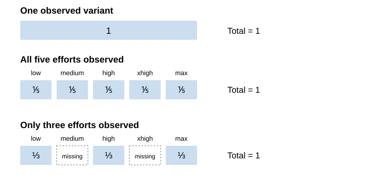
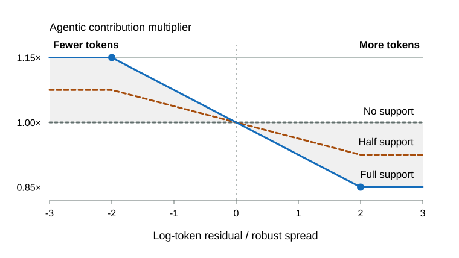
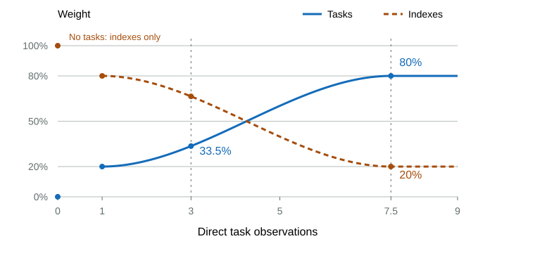
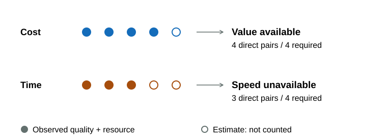
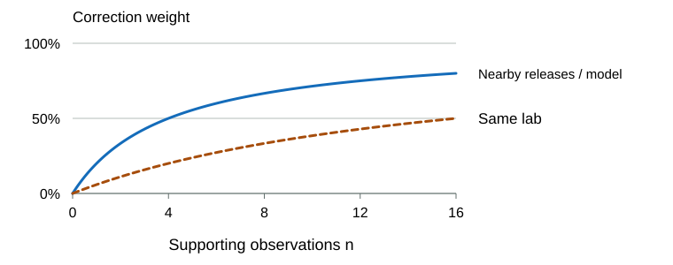
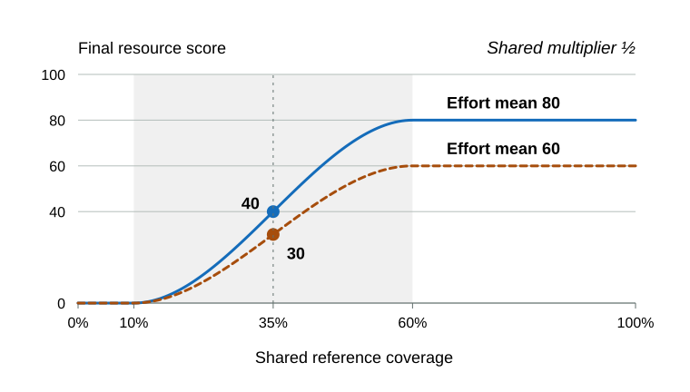
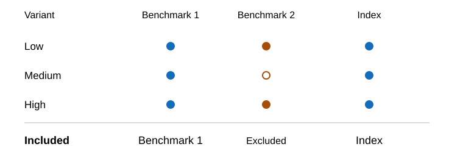

# Methodology

## Scope

Model Atlas turns benchmark results, token use, prices, and runtimes into four separate 0-100 scores. Intelligence and Agentic describe capability; Speed and Value describe the resources used to deliver it. This article follows the calculation from a reported result to a public score, including what happens when evidence is missing.

The equations describe the current method. [Benchmarks](benchmarks.md) records the selected inputs and their source policies, while [Standards](standards.md) explains how those inputs earn a place. The [public-admission rules](#public-admission) determine which scored models appear on the leaderboard.

Intelligence covers knowledge, perception, understanding, abstract reasoning, and judgment. Agentic covers turning goals into working results through coding, instruction following, tool use, verification, and recovery. A difficult coding task can test both: implementing a specification is primarily Agentic, while deriving a difficult algorithm or scientific solution can earn Intelligence weight.

Speed and Value compare resource use at similar quality, so an inexpensive but much less capable model does not automatically look efficient. Agentic also has a bounded adjustment for measured token use and supported token estimates. Price and latency do not feed back into either capability score.

## Pipeline Overview

The scoring order matters: benchmark quality establishes the context for resource comparisons. Publication filters are applied after reference scoring, so hiding a row does not change the scale used to score the others.

Observed results first establish the shared normalization scales. Supported token estimates then feed the bounded Agentic adjustment, followed by sibling quality estimates and the task/index blend. Cost and time estimates support resource scoring after route telemetry is available. Estimates remain separate from source measurements throughout, so neither score assembly nor graph projection can accidentally count them as direct coverage.

| Score | Main inputs | Main adjustment | What the score answers |
| --- | --- | --- | --- |
| Intelligence | Selected benchmark results | Importance, dimension loading, evidence support, and quality regularization | How strong is the model at knowledge, perception, understanding, abstract reasoning, and judgment in difficult problems? |
| Agentic | Selected benchmark results and matched token telemetry | Quality-adjusted token multiplier, importance, dimension loading, evidence support, and quality regularization | How reliably and token-efficiently does the model turn goals into working results through coding, instruction following, tool use, verification, and recovery? |
| Speed | Provider throughput, latency, end-to-end latency, and benchmark task time | Log scaling, quality-local comparison, and evidence-weighted aggregation | How quickly does the model deliver comparable work? |
| Value | Blended price, benchmark task cost | Log scaling, quality-local comparison, and evidence-weighted aggregation | How much useful capability does the model deliver for its cost? |

## Shared Scales and Evidence

A score of 80 describes a position on Model Atlas's current scale; it does not mean 80% task accuracy or twice the capability of a model scoring 40. Each benchmark is normalized within its own observed population before it contributes to a capability score. Source conversions can use native units or a 0-1 scale, and resource comparisons use logarithms of positive amounts.

The model configuration $m$ includes its reasoning effort, the benchmark $b$ identifies an evaluation, and the dimension $d$ is Intelligence or Agentic. A base model can therefore have several configurations without becoming several independent sources of evidence.

Several adjustments use the same smooth transition between no support and full support. The clipped input $u$ stays between 0 and 1, and smoothstep flattens the curve at both ends:

$$
\operatorname{smoothstep}(t)=u^2(3-2u),
\qquad
u=\operatorname{clamp}(t,0,1).
$$

At an input of $t=0.5$, smoothstep is also 0.5. Its gradual transition avoids an abrupt on/off threshold as evidence accumulates. Weighted quantiles, ranks, medians, and percentiles use the model balancing below unless stated otherwise.

Weighted quantiles accumulate observation weight in value order and retain the full mass of ties. A quantile selects the value whose cumulative mass crosses its requested fraction; exactly at a boundary between values, it averages those two values. The weighted median is the 50th quantile. Nine units at 0 and one at 100 therefore have median 0, not 50. Contextual ranks place a value at the midpoint of its tied mass; a value between observations uses the cumulative mass below it.

## Intelligence and Agentic

### Model-Balanced Reference Weight

Four reasoning settings from one model are useful observations, but they should not give that model four times the influence of a model tested once. The normalized public name groups those observations, with route ID as a fallback when the name is unavailable. A base model $m$ with $n_m$ represented variants assigns each variant $v$ the reference weight

$$
a_{m,v}=\frac{1}{n_m}
$$

so each base model contributes one unit in total. One represented variant has weight 1; four represented variants have weight 0.25 each. The count is recalculated for each reference distribution because a variant may have one measurement and lack another.

These are calibration weights, distinct from benchmark importance. They apply when building distributions, checking imputation errors, estimating nearby peers' resource use, and choosing robust score anchors. Each effort still keeps its own results and score.

### Benchmark Scores and Dimension Weights

A reported metric first enters the benchmark's declared scale. For an Elo input $x$, the conversion $e(x)$ maps 500 to 0 and 2500 to 1, clipping values beyond those endpoints:

$$
e(x)=\operatorname{clamp}\left(\frac{x-500}{2000},0,1\right).
$$

The observation $x_{m,b}$ is then compared with that benchmark's observed minimum $x_{\mathrm{min},b}$ and maximum $x_{\mathrm{max},b}$. The normalized contribution $z_{m,b}$ preserves the gaps between results while placing them on a common 0-100 scale:

$$
z_{m,b}=
\begin{cases}
100 & x_{\mathrm{max},b}=x_{\mathrm{min},b}\\
100\cdot\operatorname{clamp}\left(\dfrac{x_{m,b}-x_{\mathrm{min},b}}{x_{\mathrm{max},b}-x_{\mathrm{min},b}},0,1\right) & x_{\mathrm{max},b}>x_{\mathrm{min},b}.
\end{cases}
$$

For example, observed results of 20, 40, and 100 become 0, 25, and 100. The middle model stays much closer to the lowest result than the highest. Percentile ranks would lose that information.

When all observed values are equal, every observed row receives 100: the benchmark adds no ordering among those rows, and the calculation avoids division by zero. Estimated values use the same frozen observed anchors and cannot redefine the scale.

Importance $i_b$ is a damping factor: 1 leaves a benchmark’s contribution unchanged, while a lower value deliberately reduces it for a stated portfolio rationale. Dimension loading $\lambda_{b,d}$ separately splits that contribution between Intelligence and Agentic. Their product $\omega_{b,d}=i_b\lambda_{b,d}$ gives the effective weight. The loadings sum to 100%, so the contribution is allocated once across the two dimensions.

The selected benchmarks $\mathcal{B}_d$ define the dimension's portfolio. The directly observed subset $\mathcal{O}_{m,d}$ supplies the initial weighted mean $\bar z_{m,d}$:

$$
\bar z_{m,d}=\frac{\sum_{b\in\mathcal{O}_{m,d}}\omega_{b,d}z_{m,b}}{\sum_{b\in\mathcal{O}_{m,d}}\omega_{b,d}}.
$$

Supported [sibling quality estimates](#sibling-quality-imputation) extend this mean with missing task contributions before score blending and regularization. The raw observed mean remains a separate description of measured results.

A dated model replacement needs fresh evidence before its old identity's results can be reused. Artificial Analysis and Vals must independently identify the same dated release suffix, and the matched catalog route must realize that release; semantic versions remain separate identities. An observation is retained only if its value changed, its source identifies the new release, its observation date is newer than the previous result and no earlier than release, or an earlier refresh already accepted it for the replacement.

A missing old value or a reputable source alone does not establish freshness. Replacement rows use accepted direct evidence without contextual benchmark imputation, and retained Artificial Analysis and Vals observations receive twice their ordinary weight so the sources that establish freshness guide the transition. The same checks continue on later refreshes.

### Agentic Token Efficiency

Using fewer tokens is informative when the model delivers comparable benchmark quality. Agentic therefore compares token use with independent measured peers at similar quality, then adjusts that benchmark's contribution before aggregation. Intelligence and published raw benchmark results stay unchanged.

The comparison uses the full candidate cohort before admission, with the same [nearby-quality peers](#comparable-quality-peers) and [support calculation](#comparison-support) used for resource efficiency. Only directly observed quality and token use supply the peer reference. Supported estimates can position a target against that reference, but cannot become peers or move normalization anchors. Estimated quality does not activate token adjustment.

Each benchmark uses one token measure consistently across its reference population. Complete input plus output counts are preferred over reported totals for the same row; both describe total tokens. Output-only tokens form a separate measure and are never substituted into a total-token comparison. The first measure supported by at least three independent models is used. Tokens must match the benchmark and effort configuration; Artificial Analysis aggregate tokens apply only to its own Intelligence Index, using a linear quality coordinate.

The actual token count $T_{m,b}$ is compared with the nearby peers' expected log token count $\mu^T_{m,b}$, using the supported local trend or peer-average fallback described below. Their difference $r^T_{m,b}$ is negative when the model uses fewer tokens than expected. The robust spread $s^T_b$ measures variation in the original paired log-token observations:

$$
r^T_{m,b}=\ln T_{m,b}-\mu^T_{m,b},\qquad
s^T_b=1.4826\operatorname{weightedMedian}\left(|\ln T-\operatorname{weightedMedian}(\ln T)|\right).
$$

The factor 1.4826 puts median absolute deviation on a standard-deviation-like scale. This spread is measured before subtracting peer expectations. The cap $c=0.15$ and peer support $h_{m,b}$ then determine the multiplier:

$$
m_{m,b}=1-c\,h_{m,b}\operatorname{clamp}\left(\frac{r^T_{m,b}}{2s^T_b},-1,1\right).
$$

With full peer support, a residual of $-s^T_b$ gives a multiplier of 1.075; a residual of $+s^T_b$ gives 0.925. The multiplier stops at 1.15 and 0.85 once the residual reaches two spread units. Weaker support brings it closer to 1.

Missing tokens without a supported estimate, zero measured token variation, or inadequate comparison support leave the multiplier at 1. Flat quality populations also leave it inactive. The absence of token telemetry does not create a separate missing-token penalty. For a token estimate with confidence $c$, its multiplier is discounted to $1+c(m-1)$. Direct observations retain their full multiplier. The same validated sibling ratios and global/lab/release/model fallback used for cost and time supply token estimates, separately for total and output-only tokens.

The multiplier acts on the zero-based benchmark contribution $z_{m,b}$. The adjusted contribution $\widetilde z_{m,b}$ is then remapped using the adjusted observed cohort:

$$
\widetilde z_{m,b}=z_{m,b}m_{m,b},\qquad
z^A_{m,b}=100\frac{\widetilde z_{m,b}-\min_j\widetilde z_{j,b}}{\max_j\widetilde z_{j,b}-\min_j\widetilde z_{j,b}}.
$$

The resulting $z^A$ enters the Agentic mean, index proxy, and sibling-effort comparisons. Values are not clipped at 100 before remapping. The ±15% cap bounds the multiplier, not the final change in Agentic score: changing the cohort anchors can also move rows whose own multiplier is neutral.

Token telemetry changes neither evidence weights nor admission requirements. Value's quality-adjusted price comparison can change indirectly because it uses the resulting public Agentic score. These aggregate token measurements do not distinguish successful runs from early termination, so they describe observed efficiency rather than prove a causal benefit from one reasoning setting.

### Evidence Support and Quality Regularization

Two models can have the same observed mean with very different amounts of evidence behind it. Model Atlas keeps the performance estimate separate from the evidence credit $\eta_{m,b}$ assigned to each input:

$$
\eta_{m,b}=
\begin{cases}
1 & \text{observed}\\
\eta^{\text{cross}}_{m,b} & \text{validated source crosswalk}\\
r_{m,b}\operatorname{clamp}(1-\tilde e_{m,b}/25,0,1) & \text{validated contextual imputation}\\
0 & \text{missing}.
\end{cases}
$$

A direct result receives full credit. A validated estimate receives less, according to its prediction error and the evidence available for that particular row. For contextual imputation, the normalized error $\tilde e_{m,b}$ reduces credit toward zero at 25 points. The context support $r_{m,b}$ is the weighted share of the predictor's other benchmark inputs that the row directly observes. When both dimensions predict, their context shares combine through the target benchmark's dimension loadings. This further discounts predictions based on only a small share of the related benchmarks.

For example, an error of 5 points gives the factor $1-5/25=0.8$. If the row observes half of its predictor's weighted context, its final credit is $0.5\times0.8=0.4$. A reliable predictor still cannot turn a few measured results into a fully supported portfolio. Estimates add evidence credit; they do not enter the observed benchmark mean.

Adding credited benchmark weights gives the available evidence mass $E_{m,d}$. Adding all selected weights gives the possible mass $\Omega_d$:

$$
E_{m,d}=\sum_{b\in\mathcal{B}_d}\omega_{b,d}\eta_{m,b},
\qquad
\Omega_d=\sum_{b\in\mathcal{B}_d}\omega_{b,d}.
$$

The displayed evidence support $h_{m,d}$ is their ratio:

$$
h_{m,d}=E_{m,d}/\Omega_d.
$$

The separate regularization coefficient $c_{m,d}$ determines how strongly a sparse high score is held toward 50. Its full-evidence point $F$ follows the median benchmark count represented by the four aggregate indexes, currently 8. The coefficient stays at zero through $0.1F$ and rises to one at $F$:

$$
c_{m,d}=\operatorname{smoothstep}\left(\frac{E_{m,d}-0.1F}{0.9F}\right).
$$

This threshold uses an absolute amount of evidence, so adding benchmarks to the portfolio does not automatically make every existing score less reliable. Evidence support still uses the full portfolio denominator and continues to show what is missing.

An illustrative portfolio with total weight $\Omega_d=40$ makes the distinction clear. At evidence mass $E_{m,d}=8$, displayed support is only 20%, but the regularization coefficient has already reached 1. "No further regularization" and "complete evidence" are different statements.

When the ordinary quality calculation applies, the provisional score $R_{m,d}$ moves an above-50 mean toward 50 in proportion to its missing reliability. A mean already below 50 is not raised:

$$
R_{m,d}=\bar z_{m,d}-(1-c_{m,d})\max(\bar z_{m,d}-50,0).
$$

For an observed mean of 80 and a reliability coefficient of 0.5, the provisional score is $80-0.5(80-50)=65$. A mean of 40 stays 40.

When the model has an observed aggregate index, the [aggregate-index blend](#aggregate-index-proxying) supplies its quality score instead, shifting from 20% task benchmarks and 80% indexes at one direct task to 80% tasks and 20% indexes at eight. The final capability scores $I_m$ and $A_m$ use the applicable quality estimate $Q_{m,d}$, including supported sibling estimates within the task mean:

$$
\begin{aligned}
I_m&=Q_{m,\text{Intelligence}}\\
A_m&=Q_{m,\text{Agentic}}.
\end{aligned}
$$

Intelligence and Agentic show their own evidence shares; they are not combined. Equal percentages need not mean equal evidence mass because their portfolios can have different total weights. The public API calls these fields `confidence`, but they describe effective input coverage, not a statistical confidence interval or a probability that the model's rank is correct.

[Ordinary admission](#public-admission) is available as soon as its requirements are met, regardless of model age. Previews cover two remaining cases: recent models with incomplete benchmark coverage, and models with broad benchmark evidence but incomplete catalog metadata.

Preview capability uses direct results, supported sibling task estimates, and the same index-proxy rule. Selected tasks retain their configured dimension weights; directly reported GPQA and MMMU-Pro add one unit each to preview Intelligence. A preview without an active proxy uses its task mean without the ordinary quality regularization.

Preview resource scores start from available serving or price specifications. Direct task-resource coverage gradually introduces benchmark influence, reaching 80% specifications and 20% tasks at complete coverage:

$$
w_{\text{task}}=0.2\,\operatorname{smoothstep}(n/N),\qquad
w_{\text{spec}}=1-w_{\text{task}}.
$$

The count $n$ includes directly observed quality-and-resource pairs at the exact effort, and $N$ counts all selected resource benchmarks, including those missing for the preview. Cost and runtime are counted separately. Estimated runtimes do not advance the ramp. At half coverage, task weight is 10%; at complete coverage, it is 20%. With no selected resource benchmarks, task weight is zero.

With no matching task resource, specifications alone determine the score. With no usable specification, that resource score stays unavailable. Previews use no resource imputation or missing-coverage multiplier. Their displayed support remains the literal evidence share weighted at the 80/20 endpoint rather than the tapered score weights; a specification-only score does not imply complete evidence. The [four-pair resource availability rule](#resource-score-availability) still applies independently to Value and Speed.

Artificial Analysis can fill missing price or exact-effort serving fields under the [source precedence rules](matching.md#selected-identity). These specification fields represent token prices and serving measurements; aggregate evaluation cost or time does not substitute for an individual benchmark resource.

Compact leaderboard views place eligible previews alongside other models by Intelligence, but label their rank `preview`. They do not consume or shift official numeric ranks. The exact-variant `all` JSON view has no rank field.

## Missing Benchmark Evidence

A missing benchmark result can sometimes be estimated from other direct observations. A validated conversion between declared sources takes priority; otherwise a contextual predictor uses the model's position on related benchmarks. Both paths must pass checks on results withheld during validation.

Sibling quality imputation uses directly measured differences between variants to estimate missing task contributions before aggregation. Resource imputation applies the corresponding evidence-based approach independently to cost, time, and tokens. Stored observations remain unchanged.

### Imputation Error and Ongoing Optimization

Imputation is an ongoing estimation problem, not a requirement to be correct in every case. Its purpose is to make missing evidence more useful than leaving it untreated. A method can improve comparisons overall while still producing individual errors, including occasional large misses.

Changes are judged against practical alternatives on held-out observations: leaving a contribution unavailable or neutral, or copying a sibling without adjustment. Evaluation considers prediction error, the resulting score adjustment, how often a supported estimate is available, and failures across models, variants, and benchmarks. Smoother curves or higher scores are not evidence of better estimation. Improvement on one dataset does not guarantee improvement under every missing-data pattern.

Confidence discounts and minimum evidence requirements remain safeguards while the methods are optimized. Estimates never become direct observations. Keep methods that demonstrate useful improvement over the relevant baseline, investigate systematic failures, and revise or withdraw estimates where the evidence does not support them. The objective is better decisions under incomplete coverage, not perfect reconstruction of every missing result.

### Imputation Invariants

Every stored result remains attached to its reported effort. Direct observations take precedence over estimates, and higher effort is not assumed to improve every task. Expanded views preserve exact-effort results.

Each missing model-benchmark pair can receive at most one estimate. Only direct observations can predict another benchmark, so estimates cannot recursively validate or reinforce one another. They never become observed source results or satisfy publication requirements.

A contextual prediction needs at least three distinct observed benchmarks. Counting benchmarks separately from their weights prevents one heavily weighted result from impersonating broad context.

### Validated Additive Source Crosswalk

Two declared sources may measure the same underlying evaluation on compatible scales but with a systematic offset. The overlap $S$ pairs their primary values $P_i$ and fallback values $F_i$ for matching models and efforts. Model-balanced weights $w_i$ keep a model's variants from dominating the fitted offset $\delta$:

$$
\delta=\operatorname{weightedMedian}_{i\in S}(F_i-P_i;w_i)
$$

Validation removes one entire base model at a time, including all its effort variants, and refits the offset $\delta_{-q}$ from the remaining models. The held-out pairs $V$ measure the typical absolute prediction error $e$:

$$
e=\operatorname{weightedMedian}_{i\in V}\left(\left|F_i-\delta_{-q(i)}-P_i\right|;w_i\right)
$$

Subtracting one offset preserves gaps within the fallback source. Using a weighted median reduces the effect of outliers, and withholding whole models prevents sibling efforts from validating one another.

The conversion needs at least $K_{\mathrm{min}}$ effective models both in its overlap and in its held-out predictions. Its error must also stay within the declared limit $\epsilon_{\mathrm{max}}$ on the primary scale $[L,U]$:

$$
N_{\mathrm{eff}}(S)\ge K_{\mathrm{min}},
\qquad
N_{\mathrm{eff}}(V)\ge K_{\mathrm{min}},
\qquad
e\le\epsilon_{\mathrm{max}}.
$$

An accepted crosswalk converts the fallback value $F_m$ into the estimate $\hat P_m$ and gives it evidence credit $\eta^{\text{cross}}_m$:

$$
\hat P_m=\operatorname{clamp}(F_m-\delta,L,U),\qquad
\eta^{\text{cross}}_m=\operatorname{clamp}\left(1-\frac{e}{\epsilon_{\mathrm{max}}},0,1\right).
$$

For an illustrative 0-1 scale, a fallback result of 0.70 and an offset of 0.05 give an estimate of 0.65. The error check determines how much evidence credit that estimate earns. Existing primary results are never replaced, and estimates cannot alter the observed normalization anchors or become inputs to another prediction. A failed crosswalk leaves the contextual predictor to try next.

### Same-Dimension Quantile Imputation

Related benchmarks need not share units or a linear relationship. The contextual predictor instead asks where the model sits among peers, then uses that percentile in the missing benchmark's observed distribution.

For target benchmark $b$ and dimension $d$, the context score $g_{m,b,d}$ averages the model's other directly observed, normalized benchmark scores:

$$
g_{m,b,d}=\frac{\sum_{k\in\mathcal B_d,k\neq b,z_{m,k}\text{ observed}}\omega_{k,d}z_{m,k}}{\sum_{k\in\mathcal B_d,k\neq b,z_{m,k}\text{ observed}}\omega_{k,d}}.
$$

Calibration uses only paired rows $j$ with both a target result $x_{j,b}$ and usable context $g_{j,b,d}$. The model's context percentile $\pi_{m,b,d}$ locates it within those peers:

$$
\pi_{m,b,d}=
\frac{
\operatorname{weightedQuantileRank}
\left(\{(g_{j,b,d},a_j):x_{j,b}\text{ and }g_{j,b,d}\text{ available}\},g_{m,b,d}\right)
}{100}
$$

The prediction $\hat x_{m,b,d}$ reads the corresponding percentile from the paired target distribution:

$$
\hat{x}_{m,b,d}=
\operatorname{weightedQuantile}
\left(\{(x_{j,b},a_j):x_{j,b}\text{ and }g_{j,b,d}\text{ available}\},\pi_{m,b,d}\right).
$$

A model at the 70th context percentile therefore receives the target benchmark's 70th-percentile observed value. That value is not necessarily 70% accuracy: it depends on the target distribution. Both sides use the same paired calibration rows, and ties retain their full probability mass.

A benchmark that contributes to both capability dimensions can receive two predictions. Its configured loadings combine the available estimates into $\hat x^{\mathrm{direct}}_{m,b}$:

$$
\hat x^{\mathrm{direct}}_{m,b}=
\frac{\sum_{d:\hat x_{m,b,d}\text{ available}}\lambda_{b,d}\hat x_{m,b,d}}
{\sum_{d:\hat x_{m,b,d}\text{ available}}\lambda_{b,d}}.
$$

When only one dimension can predict, its available loading is renormalized. Validation withholds every variant of one base model at a time. At least four effective held-out models must yield valid predictions, and their normalized median absolute error must be at most 25 points.

The accepted point estimate stays separate from the observed quality mean. Its error and row-specific context determine the discounted evidence credit used in regularization and resource scoring.

### Sibling Quality Imputation

A variant should not benefit merely because difficult benchmarks are missing from its results. Within each base model, sibling variants supply direct observations for a shared task basket. Every actual result is preserved. A missing task can be estimated from another variant's result and their measured difference on common tasks, even when both variants already pass the minimum coverage threshold.

For target variant $t$ and donor variant $a$, the directly observed common tasks $C_{t,a,d}$ determine their weighted normalized score gap:

$$
\Delta_{t\leftarrow a,d}=\frac{\sum_{b\in C_{t,a,d}}\omega_{b,d}(z_{t,b}-z_{a,b})}{\sum_{b\in C_{t,a,d}}\omega_{b,d}}.
$$

At least three positively weighted common tasks are required. Aggregate indexes are excluded from this comparison. The donor must directly observe the missing task; an estimated result cannot become a donor. The missing normalized result is:

$$
\widehat z_{t,b}=\operatorname{clamp}(z_{a,b}+\Delta_{t\leftarrow a,d},0,100).
$$

Among eligible donors, the largest effective common-task count wins, using $(\sum\omega)^2/\sum\omega^2$. Ties prefer the closest reasoning setting, then a stable label order. No donor is preferred merely for having higher effort. Intelligence and token-adjusted Agentic use separate normalized observations and gaps.

The task mean combines direct results and supported sibling estimates at the benchmark's normal dimension weight:

$$
T_{t,d}=\frac{\sum_{b\in\mathcal O_{t,d}}\omega_{b,d}z_{t,b}+\sum_{b\in\mathcal H_{t,d}}\omega_{b,d}\widehat z_{t,b}}{\sum_{b\in\mathcal O_{t,d}\cup\mathcal H_{t,d}}\omega_{b,d}}.
$$

Here $\mathcal O$ contains observed tasks and $\mathcal H$ contains supported missing-task estimates. Tasks without a supported estimate remain unavailable, so identical baskets are possible only where sibling evidence supports them. Broader observed coverage earns greater evidential support, not a capability bonus. Genuine weak results still count.

These estimates affect the quality mean before index blending and replace the former whole-score sibling adjustment. They never overwrite raw benchmark fields, change normalization ranges, increase direct-task counts, or satisfy admission and resource thresholds. They add no evidence credit by themselves; any separately validated contextual evidence keeps its existing credit. Preview quality uses the same sibling estimates. Version-replacement rows remain excluded from this imputation path.

A shared-task gap is an estimate of transfer across tasks, not a guarantee that variants differ equally everywhere. Missing-data validation should assess estimation error; neither increasing effort nor a smooth curve is enforced.

### Aggregate Index Proxying

Indexes support sparse variants while curated task benchmarks become the primary evidence as direct observations accumulate. For effort-labelled variants, only indexes with directly reported effort coverage are eligible for the score blend; currently this is Artificial Analysis. Unlabelled models retain the ordinary index pool. Other observed indexes remain available in the table and for the separate admission checks, but cannot change a labelled variant’s index mean. The compact table selects a representative variant and uses the same score as the expanded table and graphs. Each variant and quality dimension uses its own count of observed tasks with positive dimension weight. Imputed values, sibling results, and aggregate indexes do not advance this count.

The first direct task receives 20% of the blend, with indexes carrying 80%. Task influence rises smoothly to 80% at the configured direct-task threshold (currently eight) and remains there as more tasks arrive. The default follows the median represented index breadth; it is a direct task count for this blend, distinct from weighted evidence mass used by regularization and from admission requirements.

For direct task count $n$ and configured threshold $N$ (currently 8), the progress $p$ and task share $t$ are:

$$
p=\operatorname{clip}_{[0,1]}\left(\frac{n-1}{N-1}\right),\qquad
t=0.20+0.60\left(3p^2-2p^3\right).
$$

The task mean $T$, including supported sibling estimates, uses benchmark importance times dimension loading. The observed index mean $J$ uses represented benchmark breadth times index importance times dimension loading. The quality blend is:

$$
Q=tT+(1-t)J.
$$

With no observed tasks, indexes carry 100%; there is no invented task contribution. With no observed index, the existing task-only calculation applies. Preview and ordinary variants use the same blend policy. One task to eight tasks is a gradual transition; the zero-task case is an explicit availability exception. Adding unobserved tasks to the portfolio cannot delay the endpoint.

The configured endpoint expresses sufficient direct evidence for the curated portfolio to lead, not complete portfolio coverage. It is a heuristic policy rather than a guarantee of estimation accuracy. Increasing curated influence can expose genuine differences or sparse-data errors; curve smoothness is not a validation criterion. Counts do not replace task importance: each observed task keeps its importance and dimension loading inside the task mean.

This blend does not inflate evidence support or satisfy admission. Supported sibling estimates enter the task mean before blending, while the taper continues to count direct tasks only. There is no subsequent whole-score sibling adjustment.

## Effective Pricing

### Blended Token Price

A short input-heavy exchange and a long generated answer have different bills. Model Atlas uses an explicit equal input/output blend for a common price reference. All terms below are USD per million tokens:

$$
\begin{aligned}
\text{blended price}&=0.50\cdot\text{effective input price}+0.50\cdot\text{effective output price}
\end{aligned}
$$

Effective prices average current provider prices using each provider's reported token volume. For example, input at \$2 and output at \$8 give a blended price of \$5 per million tokens. This is a comparison convention, not a forecast of a particular workload's bill.

Both sides need complete provider-price and token-volume evidence; otherwise the effective blend is missing. OpenRouter's opaque aggregate and historical price series do not determine it, and cache pricing is excluded. Published input, output, and cache prices remain raw route metadata. Listed catalog or Artificial Analysis prices can provide the fallback described in [Model Matching](matching.md#selected-identity).

## Provider Speed

Throughput measures sustained output rate, latency measures the wait for the first token, and end-to-end latency measures the whole response. These three observations share the provider-speed bucket equally. For ordinary ranked models, that bucket has 30% of the base weight and benchmark task time has 70%.

OpenRouter serving estimates combine endpoint history with matching positive token-volume weights. Endpoint IDs join directly to pricing data; provider-name guesses and request-count allocation are not used. Missing or unweighted endpoints leave the matched evidence usable.

If no weighted history remains, throughput falls back to the highest endpoint P50 and latency to the lowest endpoint P50, following OpenRouter's model-page aggregate cards. There is no equivalent end-to-end aggregate fallback.

The measured throughput $\tau_m$ and latency $\ell_m$ enter log-scaled min-max comparisons:

$$
\begin{aligned}
S^{\text{throughput}}_m&=\operatorname{MinMax}(\log \tau_m)\\
S^{\text{latency}}_m&=\operatorname{MinMax}_{\text{lower}}(\log \ell_m)\\
S^{\text{e2e}}_m&=\operatorname{MinMax}_{\text{lower}}(\log \text{end-to-end latency}_m)
\end{aligned}
$$

Higher throughput scores better; lower latency scores better. Logs make proportional changes comparable: doubling from 50 to 100 tokens per second is the same log gap as doubling from 100 to 200. Each available statistic contributes independently. A missing statistic reduces evidence support; it does not receive its siblings' weight.

## Resource Score Availability

A published effort needs at least four distinct benchmarks with both an observed quality result and a positive benchmark-specific cost to display Value. Imputed results, estimated costs, source-wide averages, and provider token prices do not satisfy this requirement. The same rule applies to previews.

An effort that qualifies on quality remains in the table with Value unavailable. It is excluded from every graph, including quality-only graphs and the model signature. Collapsed graphs select their representative from eligible efforts. The benchmark graph's combined Speed-and-Value axis additionally requires both scores; an unavailable score is never substituted with zero. Speed independently requires four distinct benchmarks with both observed quality and positive directly reported task seconds at the exact effort, including previews. Output-token runtime proxies, imputed runtimes, source-wide averages, throughput, and latency do not count toward this threshold. Insufficient time evidence leaves Speed unavailable in the table and on axes that require it, without suppressing eligible Value. Raw prices and provider speed measurements remain available; cost evidence does not imply time evidence.

This is an output eligibility rule, not another score penalty. All model observations remain in scoring calibration, and eligible Speed and Value scores keep their existing calculation.

## Quality-Adjusted Task Resources

Completing a task cheaply is useful only in the context of the quality achieved. Speed and Value therefore compare task resources among independent models with similar benchmark results. Time and cost use the same method, with the corresponding resource amount:

$$
\begin{aligned}
A^{\text{time}}_{m,b}&=\text{effective task seconds}_{m,b}\\
A^{\text{cost}}_{m,b}&=\text{task cost}_{m,b}
\end{aligned}
$$

Task resources must belong to the named benchmark and effort. An overall source average cannot substitute for a missing benchmark-specific cost, duration, or token count. When wall time is missing but output tokens and served throughput are available, estimated task seconds equal output tokens divided by throughput. Total input-plus-output tokens cannot substitute for output tokens in this conversion. Validated sibling-effort estimates and the shared tiered fallback can fill remaining cost, runtime, and token gaps, independently for each measurement.

Comparisons normally use per-task amounts. A total across a fixed evaluation is comparable only when the rows cover the same tasks and run count; otherwise it must first be normalized. Source totals and task-run counts are retained where needed to audit that conversion.

### Comparable-Quality Peers

Nearby quality needs a meaningful distance scale. The portfolio's transform $T_b$ turns a stored benchmark result $x_{m,b}$ into the comparison coordinate $q_{m,b}$:

$$
q_{m,b}=T_b(x_{m,b}),\qquad
T_b(x)=
\begin{cases}
x & \text{linear}\\
\operatorname{logit}(x) & \text{logit}
\end{cases}
$$

A linear coordinate preserves the stored score gaps. It suits partial credit, Elo-derived scores, rubrics, composites, human-relative performance, and other metrics whose endpoints do not represent a success probability.

A logit coordinate uses log odds, $\operatorname{logit}(x)=\log(x/(1-x))$. It is reserved for probability-like pass, accuracy, and completion rates. Inputs must lie in $[0,1]$; exact endpoints are clipped to 0.001 and 0.999 solely to obtain finite log odds.

The benchmark-specific decisions are listed in [Benchmarks](benchmarks.md#resource-quality-coordinates). Aggregate price comparisons are not benchmark success rates; they use the linear mean of the two public quality scores described below.

The same percentage-point gain can mean very different reductions in remaining errors. Moving from 50% to 51% reduces the error rate from 50% to 49%, a 2% reduction. Moving from 95% to 96% reduces it from 5% to 4%, a 20% reduction. Log odds give the second gap more space.

After the declared transform, the weighted median centers the coordinate and a robust spread scales it into $Z_{m,b}$:

$$
\begin{aligned}
\operatorname{deviation}_b&=\max\left(\frac{Q^{a}_{75}(\{q_{j,b}\})-Q^{a}_{25}(\{q_{j,b}\})}{1.349},f_b\right)\\
Z_{m,b}&=\frac{q_{m,b}-\operatorname{weightedMedian}_j(q_{j,b},a_{j,b})}{\operatorname{deviation}_b}
\end{aligned}
$$

The interquartile range measures the spread of the middle half of the observations. Dividing by 1.349 expresses it on a standard-deviation-like scale. For logit coordinates, $f_b=0.35$ log-odds units. For linear coordinates, $f_b=0.35(q_{\mathrm{max},b}-q_{\mathrm{min},b})$ over the observed paired reference population. This limits magnification of a tightly clustered middle relative to the full observed range and scales automatically when the same metric is expressed in different units. It is a relative-spread safeguard, not a claim about measurement error. Estimated rows cannot set the range. When reference quality is exactly flat, only equal-quality rows receive peer support.

Gaussian weights favor nearby-quality peers, with a neighborhood width of $\sigma=0.5$. A peer half a standardized unit away receives about 61% of its model-balanced weight; one unit away receives about 14%. Every effort of the focal model is excluded from its own comparison:

$$
w_{m,j,b}=\mathbf{1}[\operatorname{model}(m)\ne\operatorname{model}(j)]a_{j,b}\exp\left(-\frac{1}{2}\left(\frac{Z_{m,b}-Z_{j,b}}{0.5}\right)^2\right)
$$

The calibration weight $a_{j,b}$ divides one model's unit mass across its variants that have both quality and resource evidence for benchmark $b$.

### Expected Resource Use

For time or cost $r$, the nearby-peer weights first give a local mean log resource use $\bar y^r_{m,b}$. A stable weighted local line estimates resource use at the focal quality, clamped to the observed peers' quality range. The comparison coefficient $h_{m,b}$ blends the fitted expectation with the local mean as support grows:

$$
\begin{aligned}
\bar y^r_{m,b}&=\frac{\sum_jw_{m,j,b}\log A^r_{j,b}}{\sum_jw_{m,j,b}}\\
(\hat\alpha,\hat\beta)&=\arg\min_{\alpha,\beta}\sum_jw_{m,j,b}\left[\log A^r_{j,b}-\alpha-\beta(Z_{j,b}-Z_{m,b})\right]^2\\
Z^*_{m,b}&=\operatorname{clamp}(Z_{m,b},Z_{\min,b},Z_{\max,b})\\
\tilde y^r_{m,b}&=\operatorname{clamp}\left(\hat\alpha+\hat\beta(Z^*_{m,b}-Z_{m,b}),\min_j\log A^r_{j,b},\max_j\log A^r_{j,b}\right)\\
\mu^r_{m,b}&=\bar y^r_{m,b}+h_{m,b}(\tilde y^r_{m,b}-\bar y^r_{m,b})
\end{aligned}
$$

The slope accounts for small quality differences within the neighborhood; it does not assume that higher quality must consume more resources. The local mean is used through one supported independent-model unit, and the fitted expectation receives full influence at three. Flat quality and numerically unstable slopes retain the local mean. Quality and resource bounds use independent observed peers only. Evaluating the same fitted curve at the nearest endpoint avoids an abrupt switch to a different expectation when a model crosses the observed quality range; bounding the result prevents a fitted trend from predicting unobserved resource extremes. Sparse support still pulls the comparison toward neutral, including for distant models. Resource predictions and token modifiers share this rule. The residual $\epsilon^r_{m,b}$ measures the actual log resource amount relative to that expectation:

$$
\epsilon^{r}_{m,b}=\log A^{r}_{m,b}-\mu^{r}_{m,b}
$$

A negative residual means less resource use than expected at that quality. If the peer expectation corresponds to 100 seconds and the model uses 50, its residual is $\log(50/100)\approx-0.69$. The same residual describes a cost of \$1 against an expected \$2. These are equal proportional advantages.

### Comparison Support

A comparison can be close in quality yet rest on too few independent models. The peer weights first combine by base model $k$, preventing several efforts from manufacturing support:

$$
W_{m,k,b}=\sum_{j:\operatorname{model}(j)=k}w_{m,j,b}.
$$

The supported peer mass $s_{m,b}$ takes the smaller of the total nearby weight and the effective independent-model count:

$$
s_{m,b}=\min\left(\sum_k W_{m,k,b},\frac{(\sum_k W_{m,k,b})^2}{\sum_k W_{m,k,b}^2}\right)
$$

Its comparison coefficient $h_{m,b}=\operatorname{smoothstep}((s_{m,b}-1)/2)$ is zero through one supported peer unit and reaches one at three. The total-weight term prevents many distant, almost weightless peers from appearing well supported; the effective-count term prevents one dominant peer from doing so.

An observed resource with no supported comparison receives a neutral component score of 50. It still exists as an observation. This comparison coefficient is distinct from the displayed share of available inputs.

### Resource Efficiency Score

A residual needs to preserve both the size of an efficiency advantage and its position among other models. The magnitude score $M^r_{m,b}$ uses the supported residual range, clipping only the unusually favorable tail at its model-balanced 2.5th percentile $L$. The upper anchor $U$ is the largest supported residual:

$$
M^{r}_{m,b}=100\cdot\frac{U-\operatorname{clamp}(\epsilon^{r}_{m,b},L,U)}{U-L}.
$$

The percentile score $P^r_{m,b}$ ranks the negative residual, so lower resource use receives a higher score. Their equal mean $H^r_{m,b}$ keeps both views, then comparison support $h_{m,b}$ pulls the result $R^r_{m,b}$ toward 50:

$$
H^{r}_{m,b}=\frac{M^{r}_{m,b}+P^{r}_{m,b}}{2},
\qquad
R^{r}_{m,b}=50+h_{m,b}(H^{r}_{m,b}-50).
$$

For example, magnitude 80 and percentile 70 give a combined score of 75. Full comparison support keeps 75; support of 0.5 gives $50+0.5(75-50)=62.5$; no support gives 50.

Clipping only the favorable tail prevents an exceptional cheap or fast outlier from setting the useful magnitude scale. If supported residuals have no meaningful spread, every observed residual receives 50. Estimated resources can be scored against the observed reference, but cannot move its anchors.

### Missing Task Resources Across Efforts

A missing cost, runtime, or token amount can sometimes be estimated from another explicit effort of the same model. The evidence comes from measurements paired at both efforts; each resource is fitted separately, including separate total-token and output-token ratios. Unlabelled source-default rows and unrelated source-wide resource averages are excluded; benchmark-specific Artificial Analysis measurements are eligible under the same validation rules.

For paired task $k$, the directed log difference $d^r_k$ compares target and source resource use:

$$
d^r_k=\log A^{r,\text{target}}_k-\log A^{r,\text{source}}_k.
$$

At least three paired tasks are required. Holding out task $k$ leaves the median difference $\hat d^r_{-k}=\operatorname{median}_{j\ne k}(d^r_j)$ from the other tasks. Applying that ratio predicts the held-out target amount:

$$
\widehat A^{r,\text{target}}_k=A^{r,\text{source}}_k\exp(\hat d^r_{-k}).
$$

Validation checks the ratio in two ways. The median absolute log error $e^r_{\mathrm{log}}$ measures multiplicative prediction error; the score error $e^r_{\text{score}}$ measures its effect after actual and predicted amounts pass through the resource scorer:

$$
e^r_{\mathrm{log}}=\operatorname{median}_k\left|\log\frac{\widehat A^r_k}{A^r_k}\right|,
\qquad
e^r_{\text{score}}=\operatorname{median}_k\left|\widehat R^r_k-R^r_k\right|.
$$

The ratio is rejected if its typical multiplicative error reaches a factor of two, its typical component-score error reaches 25 points, or fewer than three held-out score comparisons are usable. An accepted ratio receives the lower of the two reliability credits:

$$
\eta^r=\min\left(1-\frac{e^r_{\mathrm{log}}}{\log2},1-\frac{e^r_{\text{score}}}{25}\right),
$$

Both terms are clipped to $[0,1]$. The final ratio uses the median log difference across all paired tasks. If several siblings can fill the gap, the nearest effort is preferred, followed by the better-validated ratio.

Estimated benchmark quality adds its own discount $\eta^{\text{quality}}$ to the resource credit. Predictions never join the reference peers, residual distributions, score anchors, persisted benchmark observations, or admission evidence. They are estimates for a row, not new measurements of the population.

For example, source-to-target resource ratios of 1.4, 1.5, and 1.6 have a median ratio of 1.5. If the held-out checks accept that conversion, a source task costing \$8 can supply a target estimate of \$12. The estimate keeps its reduced evidence credit and stays outside the observed reference population.

### Tiered Resource Fallback

When the validated same-model ratio cannot fill a resource, a fixed hierarchy uses global, lab, same-lab release proximity, and model evidence.

The tiers have progressively narrower scopes: all models, the same lab, nearby releases within that lab, and the target model's own effort measurements. Each narrower tier refines the broader expectation through a regularized correction. Sparse local evidence therefore retains the broader fallback instead of defining an unstable estimate by itself.

Measured predictions can differ little between reasonable tier policies. The robustness benefit is a consistent fallback structure across labs and generations: gradual date weighting avoids cutoff jumps, shrinkage limits sparse corrections, and missing metadata does not discard broader evidence. These properties motivate the policy even when average prediction errors are similar; they do not imply that release proximity has demonstrated better predictive accuracy.

The global prior is the median log resource ratio for the exact benchmark and effort transition across at least two other base models. All efforts of the target model are excluded from donors. Lab and release-neighborhood corrections summarize each donor model's median deviation from benchmark-specific global ratios across shared tasks; each donor's own ratios are excluded from those global comparisons. Release neighborhoods follow the [same-lab date-proximity rule](matching.md#release-proximity-for-resource-estimation), without classifying product names. Donor weights are $\exp[-\tfrac12(\Delta t/60)^2]$, with the release-date difference $\Delta t$ measured in days. Missing or invalid dates leave the broader lab correction intact; an unknown lab provides neither a lab nor a release-neighborhood correction.

Each tier updates the broader correction by $n/(n+k)$ times its measured difference. Lab corrections use $k=16$; release-neighborhood and same-model corrections use $k=4$. Lab support counts distinct models. The release neighborhood uses a Gaussian-weighted median correction and the sum of donor weights as support, so distant models contribute less influence and less support. The target model's support counts paired tasks on other benchmarks. These fixed heuristics avoid fitting a separate parameter to each model. Missing support leaves the broader correction intact. The model update uses its own observed effort ratios after subtracting the corresponding global task ratios. High/xhigh changes do not predict a different effort transition.

The final ratio scales an observed amount of the same resource at another effort of the target model. The nearest sibling with a supported estimate is used. Accepted validated sibling estimates and all direct measurements take precedence. The fallback receives evidence credit $n_b/(n_b+4)$ multiplied by $\max(0,1-d_b/\log 2)$, where $n_b$ counts independent donor models on the target benchmark and $d_b$ is their median absolute log-ratio distance from the prediction. This is a conservative support-and-agreement heuristic, not a calibrated probability of accuracy. Zero credit or a non-finite amount means no estimate.

Fallbacks remain scoring-only, cannot become donors, do not overwrite measurements, and do not satisfy the four-observation publication threshold. Estimated target quality receives its existing additional discount.

Cost, runtime, and tokens use the same fixed hierarchy with separate donor pools, priors, and ratios. Total and output-only token measures also remain separate. AA aggregate token estimates belong only to the AA index, never to standalone benchmarks. The runtime hierarchy uses reported seconds paired with observed benchmark quality; costs and throughput-derived times do not supply its donor evidence. Existing direct resource handling and validated same-model estimates retain precedence. Neither kind of estimate counts toward its four-direct-pair publication gate.

## Final Speed and Value

The resource components now share a higher-is-better 0-100 scale. Provider statistics use ordinary min-max scores of $\log x$. Absolute price uses $\log_{10}(1+\text{blended price})$ with the favorable tail clipped at 2.5%. Quality-adjusted price uses the same local residual method as task resources.

Price comparisons use the mean of the public Intelligence and Agentic scores as their aggregate quality coordinate:

$$
q_m^{\text{aggregate}}=\operatorname{mean}(\text{Intelligence}_m,\text{Agentic}_m).
$$

This coordinate is a capability composite, so it stays linear. It uses the public scores, including their existing regularization, rather than reconstructing a hidden quality estimate. Task cost and task time remain separate comparisons, each using its own benchmark quality and declared coordinate.

For a completed signal $g(x)$, the higher-is-better score $S_{\uparrow}(x)$ uses its finite minimum $y_{\mathrm{min}}$ and maximum $y_{\mathrm{max}}$:

$$
S_{\uparrow}(x)=100\operatorname{clamp}\left(\frac{g(x)-y_{\mathrm{min}}}{y_{\mathrm{max}}-y_{\mathrm{min}}},0,1\right)
$$

The lower-is-better score $S_{\downarrow}(x)$ reverses the same scale:

$$
S_{\downarrow}(x)=100\operatorname{clamp}\left(\frac{y_{\mathrm{max}}-g(x)}{y_{\mathrm{max}}-y_{\mathrm{min}}},0,1\right)
$$

The direction changes which endpoint receives 100; it does not change the anchors. Equal-value populations use the normalization rule above. Absolute price uses clipped favorable-tail anchors instead, while quality-adjusted resources combine magnitude and percentile.

Ordinary Speed and Value reserve 70% of their base weight for task resources and 30% for provider or price measurements. Active task inputs split their bucket equally:

| Score | Task resources: 70% | Other measurements: 30% |
| --- | --- | --- |
| Speed | Quality-adjusted task time | Throughput, latency, and end-to-end latency: 10% each |
| Value | Quality-adjusted task cost | Absolute and quality-adjusted price: 15% each |

The base weight $a_i$ records this policy. Evidence credit $\eta_{m,i}$ records how much support a row has for that component, giving the effective weight $w_{m,i}=a_i\eta_{m,i}$. Direct evidence has credit 1. Estimated quality contributes its discount $\eta^{\text{quality}}$; estimated resources multiply it by their own credit $\eta^r$.

The 70/30 split describes the full set of base weights. Missing or discounted inputs can change the proportions in an individual row's available weighted mean; they also lower its displayed evidence share.

The total active base weight $K_p$ is the denominator for evidence coverage in resource dimension $p$. The source-default configuration $m_q^{\text{default}}$ supplies its base model $q$ with one shared coverage multiplier $C_q^p$:

$$
\gamma_q^p=\frac{\sum_iw^p_{m_q^{\text{default}},i}}{K_p},
\qquad
C_q^p=\operatorname{smoothstep}\left(\frac{\gamma_q^p-0.1}{0.5}\right).
$$

An unlabelled configuration is the default; when all configurations are labelled, the highest reported effort is used. The multiplier is zero through 10% coverage and reaches one at 60%. Every effort of the model shares it, so a sparse non-default effort does not independently remove or create model-level coverage.

Each effort keeps its own available component scores and evidence-weighted mean. Speed components $s_{m,i}$ and Value components $v_{m,i}$ combine with the shared multiplier, while the displayed evidence shares use that effort's own effective weights:

$$
\begin{aligned}
\text{Speed}_m&=C^{\text{speed}}_{q(m)}\frac{\sum_iw^{\text{speed}}_{m,i}s_{m,i}}{\sum_iw^{\text{speed}}_{m,i}}\\
\text{SpeedConfidence}_m&=\frac{\sum_iw^{\text{speed}}_{m,i}}{K_{\text{speed}}}\\
\text{Value}_m&=C^{\text{value}}_{q(m)}\frac{\sum_iw^{\text{value}}_{m,i}v_{m,i}}{\sum_iw^{\text{value}}_{m,i}}\\
\text{ValueConfidence}_m&=\frac{\sum_iw^{\text{value}}_{m,i}}{K_{\text{value}}}.
\end{aligned}
$$

For an illustrative available component mean of 80 and source-default coverage of 35%, the coverage ramp is halfway complete: $C=\operatorname{smoothstep}(0.5)=0.5$. The final resource score is 40. A sibling effort with a mean of 60 shares that multiplier and scores 30, while displaying its own evidence coverage.

The Price vs Cost Efficiency graph compares observed benchmark task-cost efficiency separately from the full Value score. It also shares the source-default effort's coverage across ordinary efforts, so different observation counts alone do not create different penalties within one model.

This is a different adjustment from the peer-comparison shrinkage toward 50. Peer support moderates a particular efficiency comparison; source-default coverage multiplies the final resource score to account for missing model evidence. Preview scores use the separate specification-first rule described earlier.

Keeping absolute and quality-adjusted price as separate components preserves two useful questions: how much the model costs, and whether that cost is efficient for the capability delivered.

## Public Admission

A score is calculated before Model Atlas decides whether a row has enough information for public comparison. Ordinary admission requires all of the following:

- A complete basic profile: release date, confirmed text output, input and output prices, context and output limits, throughput, and either latency or end-to-end latency.
- At least the median aggregate-index benchmark count in directly observed selected results, currently 8, including at least one Intelligence benchmark and one Agentic benchmark.
- At least two observed index signals. Artificial Analysis contributes a signal for each reported Intelligence, Agentic, Coding, or Omniscience index; Epoch, Surge, and Vals each contribute one when observed.
- Finite Intelligence and Agentic scores of at least 10 each.

Estimates do not satisfy these requirements. An eligible model enters ordinary ranking immediately, with no minimum release age or prior-publication requirement.

Every path needs an identified text model, at least two observed index signals, and finite Intelligence and Agentic scores of at least 10. The remaining requirements separate the three admission paths:

| Path | Broad observed benchmarks | Complete profile | Release age | Public rank |
| --- | --- | --- | --- | --- |
| Ordinary | Yes | Yes | Any | Numeric |
| Recent preview | No | Yes | Under 30 days | Preview |
| Metadata preview | Yes | No | Any | Preview |
| Insufficient evidence | No | No | Any | Excluded |

Two complementary preview paths retain useful evidence without granting an official rank:

- **Recent undercoverage:** a model released fewer than 30 days ago may waive broad benchmark coverage if it has a complete basic profile, at least two observed index signals, finite Intelligence and Agentic scores, and both quality scores at or above 10.
- **Incomplete metadata:** a model may lack its release date, prices, limits, or serving measurements if it satisfies the full ordinary observed-benchmark requirements, has a qualified model identity and confirmed text output, and reaches the same finite-quality-score and relevance gates.

The incomplete-metadata path has no age requirement because benchmark results can be published before a model appears in public catalogs. A lab may give evaluators access before public release, so catalog absence alone does not invalidate their published results. Sufficient capability evidence can therefore remain visible while prices, limits, or serving measurements remain unknown. The `Preview` label describes incomplete admission requirements; it does not claim private access or a particular availability status.

A model missing both broad benchmark evidence and a complete basic profile qualifies for neither preview path. Once its missing requirements arrive, the next derivation can admit it normally without keeping a duplicate preview.

These gates remove public rows only after reference scoring, so admission itself does not recalibrate the reference population.

## Signature Pareto Selection

The signature highlights several useful model roles. Intelligence-based and Pareto roles use each model's highest-Intelligence variant and can include eligible previews. Best Agentic searches all scored efforts of the visible models, so it can select a different effort from the collapsed table. Labels omit effort suffixes, but each displayed score still belongs to the selected variant.

The Pareto frontier contains models for which no other candidate is at least as good in both Intelligence and Value and strictly better in one. Its two highlighted roles apply explicit selection rules:

| Role | Selection rule |
| --- | --- |
| Pareto Balance | Largest Intelligence × Value product on the frontier, with higher Intelligence breaking ties. This is equivalent to the largest equal-weight geometric mean. |
| Pareto Value | Highest Value on the frontier among models strictly above the full published population's median Intelligence, with higher Intelligence breaking ties. |

The median counts each finite Intelligence-Value base model once, including eligible previews, before dashboard filters. A model exactly at the median does not qualify for Pareto Value. Pareto candidates follow model, provider, and price filters before the rank and release-recency display limits; the ordinary signature roles follow the displayed population.

These rules select trade-offs on the published scales. Pareto Balance has no Intelligence cutoff. Blended token price may be shown for context, but it does not select either Pareto role and is not a measured total task cost. Each role keeps its label even when the same model wins another role, and is omitted when no candidate qualifies.

## Why These Parameters

These parameters encode robustness choices and usage priorities. They are explicit assumptions, rather than fitted claims about how every model should behave.

| Parameter | Value | Why it exists |
| --- | ---: | --- |
| Public index signals | 2 | Excludes models whose quality position cannot be checked against more than one aggregate index signal. |
| Public Intelligence and Agentic floor | 10 each | Excludes models whose quality scores are too low to be decision-relevant even when resource scores are high. |
| Quality regularization floor / full point | 10% / 100% of aggregate-index median evidence breadth | Suppresses high scores built from isolated evidence without making the penalty grow whenever the selected portfolio expands. |
| Context benchmarks required | 3 | Prevents one or two correlated observations from defining an imputation context. |
| Contextual held-out validation models | 4 | Requires independent evidence beyond the minimum calibration set. |
| Maximum normalized imputation error | 25 points | Refuses predictors whose typical held-out error is too large to be useful; evidence credit falls to zero at this boundary. |
| Sibling-quality common tasks | 3 | Requires each missing-task transfer to rest on directly shared tasks from the same base model; indexes and estimates do not count. |
| Preview task-weight endpoint | 20% | Smoothly introduces tasks from zero influence as direct resource-pair coverage grows; specifications retain 80% at full coverage. |
| Tiered-cost minimum donors | 2 base models | Requires independent same-benchmark effort ratios outside the target model. |
| Tiered-cost release width | 60 days | Centers a Gaussian neighborhood on the target release date within the same lab. |
| Tiered-cost lab shrinkage | 16 | Limits the influence of a noisy lab-level correction. |
| Tiered-cost release/model shrinkage | 4 | Discounts sparse corrections without per-model parameter tuning. |
| Sibling-resource paired tasks | 3 | Prevents one or two task-resource ratios from defining an effort conversion. |
| Sibling-resource log-error ceiling | $\log 2$ | Refuses a cost or runtime ratio when its typical held-out multiplicative error reaches a factor of two. |
| Sibling-resource score-error ceiling | 25 points | Refuses a ratio whose typical downstream Speed or Value component error is too large. |
| Favorable-tail winsorization | 2.5% | Stops one exceptionally cheap or fast model from defining the useful score range. |
| Resource neighborhood width | $\sigma=0.5$ | Keeps comparisons quality-local without requiring exact benchmark-score ties. |
| Minimum quality-coordinate deviation | 0.35 log-odds units, or 35% of the observed linear range | Limits relative clustering while keeping linear comparisons invariant to a change of units. |
| Local resource trend | Full peer support and interpolation only | Accounts for nearby quality differences while avoiding sparse fits and unsupported extrapolation. |
| Capability task/index endpoint | 80% / 20% at the configured direct-task threshold (currently eight) | Each variant and dimension counts its own direct tasks; missing selected tasks do not move the endpoint. |
| Aggregate-index proxy taper | Smoothstep from one to eight direct tasks | Moves from 20% tasks / 80% indexes to 80% tasks / 20% indexes; no tasks means indexes alone. |
| Full comparison support | 3 effective models | Shrinks unsupported comparisons toward neutral while allowing a small independent peer set to earn full confidence. |
| Agentic token modifier | ±15%, capped at two robust log-token spread units | Bounds the effect of tokens relative to same-quality peers before benchmark remapping. |

## Comparable Resource Curves

The benchmark selector includes task benchmarks with broad reasoning-effort coverage, selected standalone AA components, and explicitly labelled aggregate index proxies. This display selection does not change the scoring portfolio or remove other benchmarks from the table. Each proxy uses its own quality result. Artificial Analysis pairs its Intelligence Index with its reported aggregate cost, runtime, and output-token measurements per task. Its telemetry is never assigned to another index or an individual task benchmark. Index-only views show native index points, not percentages.

Cost, Time, and Tokens use the same common-evidence policy, with independent availability for each resource. A source’s cost cannot establish time or token coverage. Token comparisons use the declared total or output-only measure; an incomplete input/output breakdown is not a total-token observation. Estimated resources remain scoring-only and never masquerade as direct graph measurements. Effort-labelled graph rows use only effort-aware index proxies, currently AA.

For Cost, Time, and Tokens comparisons, selected indexes with paired quality and resource observations establish each model’s baseline population. Task benchmarks contribute only when every selected variant of that same model has both the task's quality and the selected resource measurement. Both axes use the same common evidence, normalized separately against the full reference population and averaged with the same weights on both axes: one per task benchmark and the catalogued represented benchmark count per index proxy, currently ten for Artificial Analysis. AA’s represented weight subtracts one for each matching component included as standalone evidence in that model’s actual basket. A selected component excluded for missing paired observations is not subtracted. Other task benchmarks do not reduce AA’s weight. Both axes and the displayed index share use these residual weights. This adjusts represented breadth rather than reconstructing the index’s underlying quality or resource values; the headline quality scores retain their separate direct-task-count taper to 80/20. Adding sparsely covered tasks therefore cannot remove variants from the index baseline. When no tasks are common, the comparison retains the common index evidence alone. Resource axes independently determine the available baseline and common evidence.

Variants missing the selected index resource evidence are counted in the legend and can be compared by deselecting the index proxies. Without paired index evidence, the graph uses the common task basket across that model’s variants with selected resource observations. If no evidence is common, the comparison is empty. Explicitly selecting one entry retains native units; a single common entry within a multi-entry selection stays on the normalized aggregate scale.

The compact Common within model summary reports variant coverage and the range of index weights. Expanding Details shows a table of each model’s variant count, common/selected count, index share, and contributing evidence. Each row can reveal selected evidence excluded for missing paired observations. Another model’s missing results cannot shrink this basket. Cross-model coordinates can use different task baskets, so their separation is not a matched-task comparison. Changing the compared models or evidence selection can change the common basket, while normalization references remain unchanged. Indexes are the baseline for coverage and interpretability; task results should add useful detail. Overlap between indexes and tasks means these entries are not independent observations, and adding tasks does not guarantee improved estimation accuracy.

This fixed basis prevents changing task mixtures from creating artificial effort-to-effort jumps. It does not smooth measurements, impose monotonic effort ordering, or force convergence. Genuine diminishing returns, plateaus, cost decreases, and quality regressions remain visible. The four-pair publication gates remain independent of the graph's basket size, index proxies do not satisfy those gates, and leaderboard scores are unchanged.

Expanded score and benchmark graphs connect only consecutive displayed variants within each model, ordered by reasoning effort rather than either coordinate. Reversing direction on an axis does not add a shortcut between nonconsecutive variants. The separate Pareto frontier line appears only in collapsed mode.

