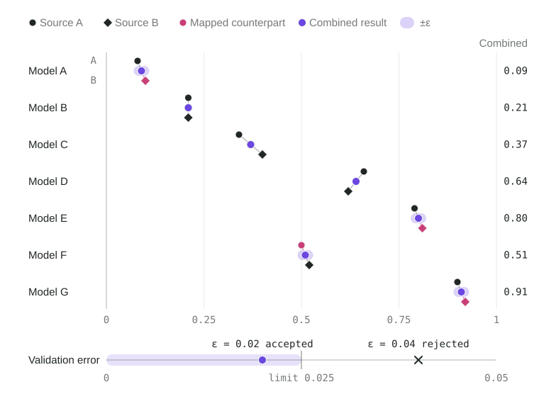
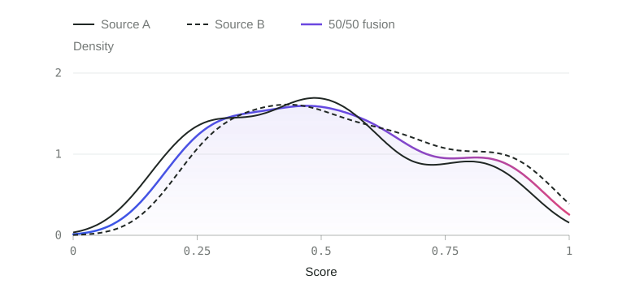
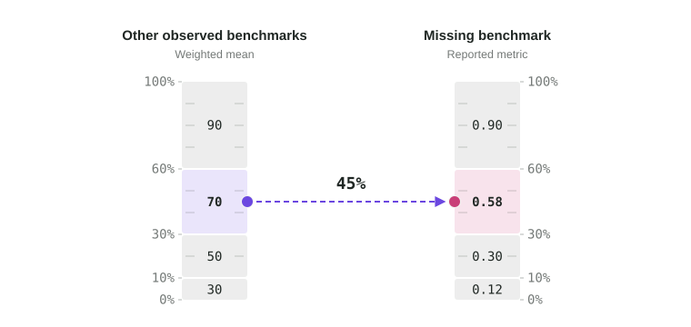
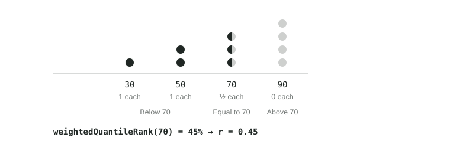
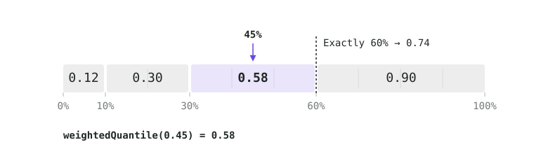
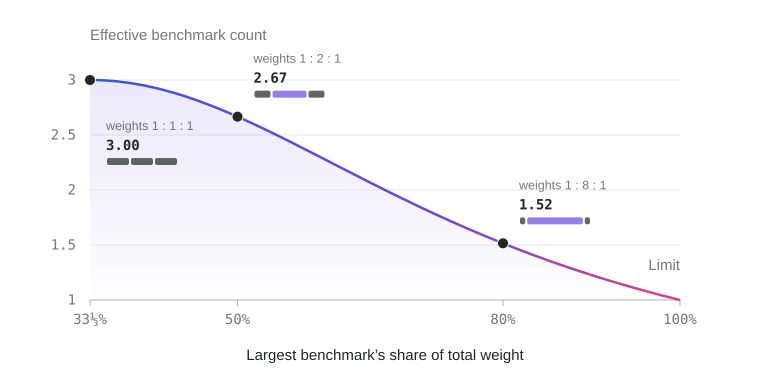
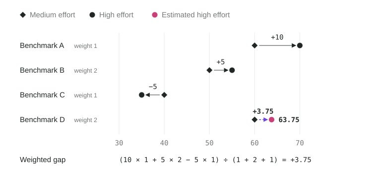
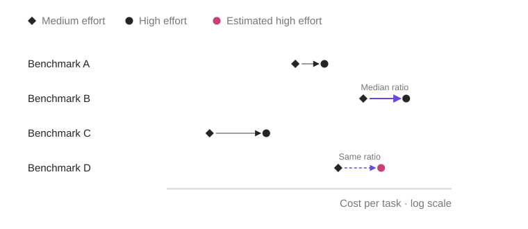
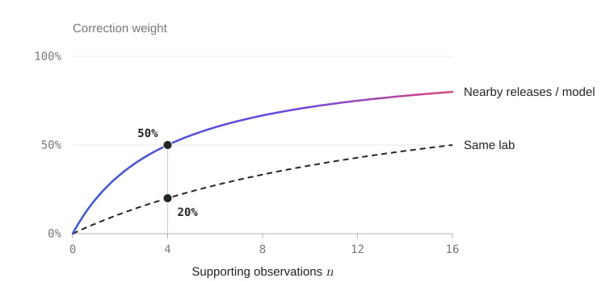

# Missing Data and Imputation

## Benchmark Results and Imputation

Benchmark and resource coverage is uneven: sources report different models, and labs publish some reasoning efforts but not others. Supported estimates help reduce the effect of those gaps, but each estimation method has a different role. Estimates never satisfy direct-evidence requirements for dashboard inclusion or resource score availability.

Validated source crosswalks are different: they put measured results from comparable sources onto one benchmark scale and produce accepted benchmark results.

| Evidence path | Role in scoring |
| --- | --- |
| Validated source crosswalk | Supplies one accepted benchmark result for normalization, scoring, pairwise comparison, and benchmark evidence support. |
| From other observed benchmarks | Supplies quality estimates for resource comparisons and discounted evidence support; does not enter the capability mean. |
| Across reasoning efforts | Fills missing benchmark contributions in the capability mean; adds no evidence support by itself. |
| Cost, time, or tokens | Supplies resource estimates with evidence discounts; does not enter the reference population. |

**Why estimates affect scores and support differently**

An estimate transferred across efforts starts from the same model's observed result on the missing benchmark, adjusted by the measured gap between efforts. It can therefore supply a benchmark contribution to the capability mean. Predictions from other benchmarks instead derive the missing value from the model's performance elsewhere. Keeping those predictions out of the mean avoids feeding that same performance back into the score as additional benchmark values.

Held-out validation of predictions from other benchmarks supplies a separate measure of how predictable the missing evidence is. The policy gives this partial credit toward evidence support and score retention, discounted for prediction error and the amount of observed evidence. Transferring a value across efforts does not itself earn that credit. Both methods reuse observations; neither creates a new measurement. Their different roles are scoring-policy choices, not a conclusion that follows from validation alone.

Crosswalk fitting and predictions from other benchmarks each require held-out validation, and predictions from other benchmarks require at least three distinct observed benchmarks. The final capability mean uses at most one contribution per benchmark, with observed results and accepted source crosswalks taking precedence over estimates from another effort. Higher effort is not assumed to perform better.

Each method's support and validation rules are described below.

### Source Crosswalks

Sources can report the same benchmark with different methodologies and model coverage. For sources selected for quality fusion, Model Atlas takes the [equally weighted mean](overview.md#weighted-mean) of their quality scores, without assuming either is better.

A **crosswalk** learns their typical score difference from shared models and maps an available source result onto the combined benchmark scale. This keeps every model on the same combined scale even when one source lacks it. The accepted combined result is benchmark evidence; the mapped counterpart is not a newly measured source observation and never trains another source crosswalk.

**Fit the offset**

Use results paired by model and reasoning effort:

| Symbol | Meaning and purpose |
| --- | --- |
| $A_i$, $B_i$ | Source A and B results for the same variant $i$. |
| $w^{\text{ref}}_i$ | Reference weight: each base model shares one unit across its paired efforts, so reporting more efforts gives it no extra influence. |
| $\delta$ | Typical difference $B-A$: positive when B scores higher, negative when A scores higher. |

$$
\delta=\operatorname{weightedMedian}_i(B_i-A_i;w^{\text{ref}}_i).
$$

The [weighted median](overview.md#weighted-median-and-quantiles) limits the influence of outliers.

**Validate on withheld models**

For each paired result $i$, fit $\delta^{\text{others}}_i$ using other models, excluding every effort of its base model. Use that offset to predict the withheld source result and compare it with the observation. This prevents a model’s own results from helping predict it.

The absolute prediction error is $|B_i-A_i-\delta^{\text{others}}_i|$. Only half the two-source mean uses the mapping, so its error is half as large before clipping. The weighted median gives validation error $e$ in the benchmark’s score units:

$$
e=\operatorname{weightedMedian}_i\left(\frac{\left|B_i-A_i-\delta^{\text{others}}_i\right|}{2};w^{\text{ref}}_i\right).
$$

**Accept the source mapping**

Accept the crosswalk only if both the paired observations and usable validation predictions cover the required number of independent models, currently six, and $e\le e_{\max}$, the configured error limit. If it fails, try imputation from other observed benchmarks; without a supported prediction, leave the combined result missing. For sources selected for quality fusion, two observed quality scores can be averaged without a crosswalk.

For an accepted crosswalk, use $\delta$ fitted from all paired observations. A hat marks a mapped counterpart:

| Available results | Missing result | Combined result |
| --- | --- | --- |
| Both sources | None | $(A+B)/2$ |
| A only | $\hat B=A+\delta$ | $(A+\hat B)/2$ |
| B only | $\hat A=B-\delta$ | $(\hat A+B)/2$ |

Apply [clamp](overview.md#linear-scaling-and-clamping) to the combined value using the benchmark’s permitted score range. Raw source results remain separate.

**Three sources**

Three sources of one benchmark combine at equal weight. Each source pair fits and accepts its own offset as above. A missing source is predicted from every observed counterpart whose pair crosswalk was accepted, using the mean of those predictions, and the combined result is the mean of the three values. Each combination of observed and missing sources is validated separately: withhold each result observed in all three sources, predict its three-source mean from that combination alone, and accept the combination only when at least six models yield predictions with model-balanced median absolute error within the limit.

**Keep result status and provenance separate**

An accepted crosswalk contributes one benchmark result with evidence factor 1. It participates in normalization, pairwise comparison, capability scoring, admission, and downstream benchmark-quality calculations. The source slots retain which results were measured, which counterparts were mapped, validation error, and extrapolation diagnostics. These diagnostics do not classify the accepted quality result as effort or missing-benchmark imputation.

Source mappings are fitted only from actual paired source measurements. Accepted combined values cannot be recycled into source-pair calibration. Resource measurements retain their own comparability and estimation rules.

**Quality and resources are assessed separately**

An accepted source crosswalk for quality does not establish comparable cost, runtime, or token use. Each resource must independently pass the [absolute resource agreement rule](speed-value.md#resource-comparability-across-sources) before the mean of its raw amounts can be calculated. Similar quality scores or a predictable score offset do not satisfy that rule.

When resource amounts are not comparable, each source is scored against its own quality observations and reference population. Each retains half of the benchmark’s resource base weight, even when the other source is missing. Quality scores can still be combined, but resources cannot be imputed across those sources. [Resource Comparability Across Sources](speed-value.md#resource-comparability-across-sources) gives the resource calculations; two sources still count as one benchmark for direct-evidence requirements.

**Source comparison diagnostics**

Compare the same observed models across sources to see how their score distributions differ and how fusion changes them. Look for a horizontal shift, suggesting an offset, or different spreads, peaks, and tails that one offset may not capture. The fusion curve shows how taking the mean reshapes the distribution.

**Jensen–Shannon divergence (JSD)** measures overall distribution difference, treating both sources equally: A–B equals B–A. Use it to compare source disagreement and how far the fused distribution sits from each source.

**Kullback–Leibler divergence (KL)** measures mismatch in a chosen direction. A → B is large when A places substantial weight in score regions where B places little; B → A checks the reverse. Unequal values reveal this asymmetry, not which source is better.

For both metrics, zero means identical distributions and smaller values mean greater similarity. Use the same models and smoothing settings when comparing values. Neither metric checks whether individual models agree; held-out prediction error still determines crosswalk acceptance.

### Imputation from Other Observed Benchmarks

Use a model’s performance on other observed benchmarks to impute a missing result: calculate its weighted mean, find its percentile among peers, then read the target benchmark’s value at that percentile. Repeat separately for Intelligence and Agentic.

**Calculate the weighted mean**

The [weighted mean](overview.md#weighted-mean) summarizes the same variant’s measured performance for comparison with peers. Each benchmark contributes according to its existing importance and allocation to Intelligence or Agentic.

Reuse the [benchmark normalization and base weights](intelligence-agentic.md#benchmark-scores-and-dimension-weights), separately for Intelligence and Agentic. Direct scoring in both capabilities uses frontier benchmarks. This prediction may also use observed baseline results to estimate a missing frontier result, subject to its validation and discounted evidence factor; the baseline result itself receives no direct capability weight. For each other observed benchmark $b$ with positive predictive weight, $z_b$ is its normalized score and $\omega_b$ its weight:

$$
\bar z=\frac{\sum_b\omega_b\,z_b}{\sum_b\omega_b}.
$$

The missing benchmark and all imputed values are excluded. At least three other observed benchmarks are required. This policy prevents one or two results from determining the prediction.

**weightedQuantileRank(): value → percentile**

Convert the weighted mean into a percentile so its relative standing can be used on a benchmark with different score units. Use peers with both an observed target result and a weighted mean calculated the same way, covering at least three distinct base models. These peers also supply the target distribution in the next step.

An ordinary rank counts every variant equally, so five eligible efforts give a model five times the influence of one. The weighted rank gives each base model equal total influence by dividing its weight of 1 across its eligible variants.

Each peer variant $j$ has weighted mean $\bar z_j$ and reference weight $w^{\text{ref}}_j>0$. Apply [weightedQuantileRank](overview.md#weighted-ranks) to this weighted reference distribution, counting half the tied weight. Divide its 0–100 result by 100 to obtain fraction $r$:

$$
r=\operatorname{weightedQuantileRank}(\bar z)/100.
$$

**weightedQuantile(): percentile → value**

Convert the percentile back into a score using the target benchmark’s observed distribution. Using the same peers and reference weights on both sides keeps the comparison population consistent.

Apply [weightedQuantile](overview.md#weighted-median-and-quantiles) to those peers’ observed target results, retaining the same reference weights. The estimate $\hat x$ is the value at fraction $r$:

$$
\hat x=\operatorname{weightedQuantile}(r).
$$

**Combine and validate**

If both capability dimensions produce predictions, take their weighted mean using the benchmark’s dimension allocations. If only one predicts, use that prediction.

The key assumption is that relative standing on other benchmarks predicts standing on the missing one. Test this by withholding every effort of one base model at a time and comparing predictions with its observed target results.

Accept the method only when at least four distinct held-out models yield valid predictions and their model-balanced median absolute error is at most 25 points on the normalized target scale. Accepted predictions remain separate from the observed capability mean; prediction error and the share of other benchmarks observed set their [evidence factor](intelligence-agentic.md#evidence-support-and-score-retention) for score retention and resource scoring.

### Imputation Across Reasoning Efforts

Fill a missing benchmark score using an observed result from another reasoning effort of the same model. The **target effort** has the missing result; the **reference effort** supplies the observed result. Their performance gap on shared benchmarks adjusts the estimate. Run the calculation separately for :score[Intelligence] and [token-adjusted :score[Agentic]](intelligence-agentic.md#agentic-token-efficiency). A missing result can be filled even when the effort already has enough evidence for full score retention.

Each benchmark’s overall score is one input, regardless of how many questions or test cases it contains. Aggregate indexes are excluded. Throughout this section, $\omega_b$ is benchmark $b$’s [base weight](intelligence-agentic.md#benchmark-scores-and-dimension-weights): importance × allocation to the capability being calculated. Gaps are measured on observed frontier results before any missing result is filled. Baseline results do not enter gap comparisons; their role in imputation from other benchmarks is described above. Only positive weights participate.

**Choose the reference effort**

For each missing benchmark, consider other efforts with an observed result for it and at least three benchmarks observed at both the target and reference efforts. Imputed results cannot establish this overlap. If several efforts qualify, choose the one with the largest **effective benchmark count** $n^{\text{eff}}$. This selects the reference for that estimate; it does not change the base weights. Ties prefer the reasoning setting closest to the target, then a stable label order. If none qualifies, leave the result missing.

Apply the shared [effective count](overview.md#effective-count) to the weights of the shared benchmarks. Equal weights give each benchmark an equal say; concentrating weight on one benchmark lowers the count:

$$
n^{\text{eff}}=\operatorname{effectiveCount}_b(\omega_b).
$$

The illustration keeps three shared benchmarks: one takes a growing share of the weight while the other two split the remainder equally. The count measures how broadly this reference effort is supported by the shared benchmarks.

**Estimate the missing score**

Measure the target’s performance relative to the chosen reference on their shared benchmarks. For each shared benchmark $b$, $z^{\text{target}}_b$ and $z^{\text{ref}}_b$ are the normalized target and reference scores. Their [weighted mean](overview.md#weighted-mean) difference is the gap $\Delta$. For the missing benchmark, add this gap to its observed reference score $z^{\text{ref}}$, then [clamp](overview.md#linear-scaling-and-clamping) the estimate $\hat z^{\text{target}}$ to 0–100:

$$
\begin{aligned}
\Delta&=\frac{\sum_b\omega_b\,(z^{\text{target}}_b-z^{\text{ref}}_b)}{\sum_b\omega_b},\\
\hat z^{\text{target}}&=\operatorname{clamp}_{0}^{100}(z^{\text{ref}}+\Delta).
\end{aligned}
$$

A positive gap raises the estimate; a negative gap lowers it. The direction follows observed performance, without assuming that higher effort performs better. The estimate assumes the measured gap transfers to the missing benchmark.

These estimates change the benchmark contribution, not its evidence support, following the [separate roles of estimates and support](#benchmark-results-and-imputation) above. Any evidence factor from separately validated predictions using other benchmarks is retained. Updated-release replacement rows are excluded from this imputation path.

## Resource Imputation Across Reasoning Efforts

Impute a missing resource amount from another effort of the same model using a ratio learned from shared benchmarks. This assumes the resource ratio between the two efforts is sufficiently stable across benchmarks. Held-out validation checks whether the available measurements support that assumption; it does not guarantee accuracy on the missing benchmark.

Cost, runtime, total tokens, and output tokens each have separate ratios. Exclude unlabelled rows representing the source’s default effort and means reported across benchmarks; benchmark-specific measurements remain eligible.

**Estimate the effort ratio**

For a resource measured on benchmark $b$ at both efforts, $R^{\text{target}}_b$ and $R^{\text{ref}}_b$ are the observed amounts at the target and reference efforts. Their log difference $\ell_b$ represents the target-to-reference ratio:

$$
\ell_b=\ln R^{\text{target}}_b-\ln R^{\text{ref}}_b.
$$

At least three benchmarks with paired measurements are required. To validate the ratio, withhold benchmark $b$ and calculate the [median](overview.md#weighted-median-and-quantiles) log difference $\hat\ell_{-b}$ from the other benchmarks; the subscript $-b$ means benchmark $b$ is excluded. Exponentiating that difference gives the ratio used to predict the withheld target amount:

$$
\hat R^{\text{target}}_b=R^{\text{ref}}_b\exp(\hat\ell_{-b}).
$$

**Check prediction and score errors**

Validation measures both the resource error and its effect on the component score. For the withheld target, $R^{\text{target}}_b$ is the observed amount and $\hat R^{\text{target}}_b$ its prediction; $S^{\text{res}}_b$ and $\hat S^{\text{res}}_b$ are their resource scores. Their median absolute errors are:

$$
e^{\text{log}}=\operatorname{median}_b\left|\ln\frac{\hat R^{\text{target}}_b}{R^{\text{target}}_b}\right|,
\qquad
e^{\text{score}}=\operatorname{median}_b\left|\hat S^{\text{res}}_b-S^{\text{res}}_b\right|.
$$

Reject the ratio if log error reaches $\ln 2$ (a factor of two), score error reaches 25 points, or fewer than three held-out score comparisons are usable. Otherwise, the evidence factor $f^{\text{res}}$ uses the lower of the two error discounts:

$$
f^{\text{res}}=\min\left(1-\frac{e^{\text{log}}}{\ln2},1-\frac{e^{\text{score}}}{25}\right).
$$

Both terms are clipped to $[0,1]$. The final ratio uses the median log difference across all benchmarks with paired measurements. If several efforts of the same model can fill the gap, the nearest effort is preferred, with validation quality breaking ties.

If target quality is also imputed, its evidence factor multiplies the resource evidence factor: $f^{\text{quality}}f^{\text{res}}$. Imputed values remain outside reference peers, reference score limits, stored observations, and direct-evidence counts.

## Resource Imputation from Broader Evidence

When paired measurements cannot support a ratio for the target model, the fallback uses other models making the same effort change on the same benchmark. It then adjusts this broader estimate using observations from the same lab, nearby releases, and the target model:

> [!FLOW]
>
> 1. **Other models**
>
>    Start with the median log resource ratio for the exact benchmark and effort transition across at least two other base models. Exclude every effort of the target model.
>
> 2. **Same lab**
>
>    Adjust for how models from this lab differ from the ratios across other models. Use their median deviations, excluding each model from the reference used to calculate its deviation.
>
> 3. **Nearby releases in that lab**
>
>    Give more weight to those deviations when release dates are closer to the target model’s. Use $\exp[-\tfrac12(\Delta t/60)^2]$, where $\Delta t$ is the release-date difference in days.
>
> 4. **Target model**
>
>    Adjust using this model’s effort ratios on other benchmarks with paired measurements, after subtracting the corresponding ratios across other models.

Date weighting and correction limits are policy choices; release proximity alone does not establish predictive accuracy.

[Release proximity](../matching.md#release-proximity-for-resource-estimation) uses dates, not product-name categories. Missing dates retain the lab correction; missing lab identity prevents both lab and release corrections.

Multiply each correction by $n/(n+n_{50})$, where $n$ is its supporting observation count or weight and $n_{50}$ is the amount needed to apply half the correction. With little evidence, the estimate stays close to the broader result; this is called shrinkage:

| Scope | Supporting observations $n$ | Half-correction threshold $n_{50}$ |
| --- | --- | --- |
| Same lab | Number of distinct other models from the lab | 16 |
| Nearby releases | Sum of the release-date weights above; correction uses the weighted median deviation | 4 |
| Target model | Number of other benchmarks measured at both efforts | 4 |

Without supporting observations, apply no correction. Parameters are fixed, not fitted per model. Only observations for the same effort transition are used, such as low to high.

Apply the ratio to the observed amount at the closest effort for which that transition can be estimated. Use the same benchmark and resource. Direct measurements and validated same-model ratios take precedence.

The evidence factor $f_b$ increases with the number of independent other models $n^{\text{models}}_b$ and decreases with disagreement $s_b$, the median absolute difference between their log ratios and the final estimated log ratio:

$$
f_b=\frac{n^{\text{models}}_b}{n^{\text{models}}_b+4}\max\left(0,1-\frac{s_b}{\ln 2}\right).
$$

This factor measures support and agreement, not the probability of an accurate prediction. A zero factor or a non-finite amount leaves the value missing.

Broader-evidence imputation affects scoring only, with the existing discount for imputed target quality. It cannot supply evidence for further imputation, overwrite measurements, or satisfy resource availability requirements.

Cost, runtime, total tokens, and output tokens each use their own observations and ratios. Aggregate-index tokens stay attached to their own index. Runtime imputation requires reported seconds paired with observed quality; cost and throughput-derived time cannot supply that evidence.

## Parameter Choices

These values are scoring-policy choices, not fitted claims about model behavior.

| Parameter | Value | Why it exists |
| --- | ---: | --- |
| Source crosswalk models | 6 | Requires paired and held-out evidence from several independent models before mapping a missing source. |
| Source crosswalk error limit | Set per benchmark in its own score units | Keeps mapped counterparts close to measured results; [Benchmarks](../benchmarks.md#benchmark-source-policies) lists each limit. |
| Other observed benchmarks required | 3 | Requires a broader basis than one or two benchmark results. |
| Held-out models for imputation from other benchmarks | 4 | Requires independent evidence beyond the minimum calibration set. |
| Maximum normalized imputation error | 25 points | Refuses predictors whose typical held-out error is too large to be useful; the evidence factor falls to zero at this boundary. |
| Quality imputation across efforts: shared benchmarks | 3 | Requires directly shared benchmarks from the same base model; indexes and estimates do not count. |
| Broader resource evidence: minimum other models | 2 base models | Requires same-benchmark effort ratios from more than one model outside the target. |
| Broader resource evidence: release width | 60 days | Gives nearby releases more influence without a hard date cutoff. |
| Broader resource evidence: lab shrinkage | 16 | Limits the influence of a noisy lab correction. |
| Broader resource evidence: release/model shrinkage | 4 | Discounts sparse corrections without per-model tuning. |
| Resource ratios across efforts: benchmarks with paired measurements | 3 | Prevents ratios from one or two benchmarks from defining an effort conversion. |
| Resource ratios across efforts: log-error ceiling | $\ln 2$ | Rejects ratios when typical held-out multiplicative error reaches a factor of two. |
| Resource ratios across efforts: score-error ceiling | 25 points | Rejects ratios with large typical errors in resource component scores. |
