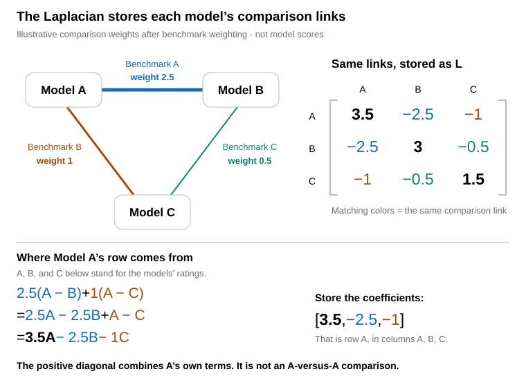

# Intelligence and Agentic

## How Intelligence and Agentic Are Calculated

Intelligence and Agentic combine benchmark results separately for each model and reasoning effort. The sections below explain normalization and weights, the observed models used for comparisons, the shared-benchmark comparison applied to Intelligence, and the token adjustment applied to Agentic benchmark scores. Missing-result estimates are explained in [Missing Data and Imputation](imputation.md). This page then covers evidence support and how individual benchmarks combine with aggregate indexes. Prices and runtimes do not affect either capability score.

### Benchmark Scores and Dimension Weights

Read results in their declared units and normalize them to 0–100. Importance and dimension allocation determine a benchmark's weight within a capability. Both capabilities score frontier benchmarks and eligible aggregate indexes. Baseline benchmark results remain visible but have no direct score weight.

**Reported scores**

| Form | Interpretation |
| --- | --- |
| Fraction | A result on a 0–1 scale. |
| Percentage or points | Use the declared units; points need not represent accuracy. |
| Elo rating | A relative rating converted using configured endpoints. |

For Elo rating $x$, $E(x)$ maps the configured range $[L,U]$ to 0–1:

$$
E(x)=\operatorname{clamp}\left(\frac{x-L}{U-L},0,1\right).
$$

The current endpoints are $L=500$ and $U=2500$. These are parameters, not universal Elo constants; clamp bounds the output to the stated range.

**Normalize benchmark results**

The lowest observed result maps to 0 and the highest to 100. Equal improvements within a benchmark's observed range produce equal changes in its normalized score. This linear rule applies to every quality benchmark in both capabilities, including aggregate indexes, Elo, rubric scores, and success rates. If all observed results are equal, each receives 100. For model configuration $m$ (including reasoning effort) and benchmark $b$, $x_{m,b}$ is the result after any declared conversion; $x_{\min,b}$ and $x_{\max,b}$ are its observed minimum and maximum. The normalized result is $z_{m,b}$:

$$
z_{m,b}=100\operatorname{clamp}\left(\frac{x_{m,b}-x_{\min,b}}{x_{\max,b}-x_{\min,b}},0,1\right).
$$

At 20%, 50%, 90%, 95%, and 99% of the observed range, the normalized scores are 20, 50, 90, 95, and 99. A score of 100 means the strongest observed benchmark result, not perfect completion. The same relative position has the same score whether a benchmark spans 1–20%, 41–60%, 45–55%, or 10–90%.

Only observed results establish the endpoints. Imputed values use that scale without changing it; later observations can change the endpoints and therefore the scores.

**Calculate the weighted mean**

| Setting | Role |
| --- | --- |
| Importance | Standard policy: 1 for individual benchmarks and aggregate indexes; represented breadth supplies the index multiplier. |
| Allocation | Intelligence/Agentic split: 100/0, 75/25, 50/50, 25/75, or 0/100. |
| Effective weight $\omega_{b,d}$ | Importance × allocation to dimension $d$, expressed as a fraction. |

For Agentic, the model's initial benchmark score $z_{m,A}$ is the weighted mean of its observed normalized results:

$$
z_{m,A}=\frac{\sum_b\omega_{b,A}z_{m,b}}{\sum_b\omega_{b,A}}.
$$

Both sums include only available frontier results with positive Agentic weight. Missing results are excluded, not counted as zeros. Agentic applies the token adjustment below to its benchmark scores before taking the mean. Intelligence calculates a weighted mean from frontier benchmarks and blends it with their shared-benchmark comparison. It requires a frontier benchmark result or supported effort estimate for a score. Eligible indexes contribute at their overlap-adjusted evidence share. The later sections specify how estimates and indexes enter each capability.

[Benchmarks](../benchmarks.md#portfolio-settings) records allocations and current importance exceptions. [Imputation across reasoning efforts](imputation.md#imputation-across-reasoning-efforts) explains how supported estimates enter the later benchmark mean.

### Balancing the Reference Population

The [collapsed row](overview.md#collapsed-and-expanded-models) selects one variant for display. Reference calculations instead use the available observed variants to estimate missing results and compare resource efficiency. Each base model receives one total reference weight, shared across its included variants, so reporting more effort settings does not give it more influence.

For base model $m$ with $n_m$ included variants, each variant $v$ receives weight $a_{m,v}=1/n_m$.

| Used for | What the weight affects |
| --- | --- |
| Resource comparisons | Expected cost, time, and token use at similar quality, plus efficiency ranks and statistical cutoffs. |
| Imputation | Reference distributions and typical prediction errors. |
| Source conversion | The typical difference between paired source results. |

Only variants with the required observations are counted in each calculation. Reference weights determine each model’s influence on comparisons; they do not divide its score or combine its variants into a collapsed score. Benchmark weights instead determine how much each benchmark contributes to a capability score.

Weighted statistics across models use these reference weights unless stated otherwise. A weighted median is the halfway point of cumulative weight in sorted order; at an exact boundary, the mean of the two adjacent values is used.

### Agentic Token Efficiency

Using fewer tokens than expected at similar benchmark quality increases a model’s Agentic contribution; using more reduces it. The multiplier ranges from 0.85 to 1.15, with smaller adjustments when comparison support is weak. Apply it to each benchmark score, then rescale using bounds that include the original 0–100 scale before combining contributions into Agentic. Intelligence and raw benchmark results stay unchanged.

**Select comparable token measurements**

Use observed quality and token counts from other base models before dashboard filtering to establish the comparison. Imputed quality cannot activate the adjustment. Imputed tokens can receive a discounted adjustment, but never enter the reference population.

Token counts must match the benchmark and effort. Use one measure supported by at least three independent models: complete input plus output counts first, reported totals next, or output-only counts separately. Aggregate-index token counts belong only to that index and use a linear quality coordinate.

**Compare actual and expected token use**

Compare the actual token count $N^{\text{tok}}_{m,b}$ with expected token use $\mu^{\text{tok}}_{m,b}$, estimated from other models at similar benchmark quality using the [expected resource calculation](speed-value.md#expected-resource-use). Both quantities are token counts. Take the natural logarithm of each so the difference measures their ratio:

$$
d^{\text{tok}}_{m,b}=\ln N^{\text{tok}}_{m,b}-\ln\mu^{\text{tok}}_{m,b}
=\ln\left(\frac{N^{\text{tok}}_{m,b}}{\mu^{\text{tok}}_{m,b}}\right).
$$

This difference, called a residual, is negative for fewer tokens than expected, zero for the expected amount, and positive for more. For example, 1,000 actual tokens against 2,000 expected tokens gives $d=\ln(0.5)\approx-0.693$.

**Measure how much token use varies**

The spread $s^{\text{tok}}_b$ supplies a scale for judging whether the log difference is small or large. Use observed token counts paired with quality results and the [model-balanced reference weights](#balancing-the-reference-population). Take the natural logarithm of each count, find their weighted median, then find the weighted median distance from it:

$$
s^{\text{tok}}_b=1.4826\operatorname{weightedMedian}\left(|\ln N^{\text{tok}}-\operatorname{weightedMedian}(\ln N^{\text{tok}})|\right).
$$

The median of those distances is called the median absolute deviation. Medians limit the influence of extreme token counts. This spread measures variation in log token counts before subtracting the peer predictions.

For a normal distribution, the median absolute deviation is approximately 0.67449 times the standard deviation. Multiplying by $1/0.67449\approx1.4826$ puts it on the same scale. This conversion does not require token counts to follow a normal distribution; 1.4826 is a statistical scaling convention, not a fitted Model Atlas parameter.

**Set the adjustment strength**

Divide $d$ by $s$ to express the difference in units of the observed spread. With full comparison support, dividing by $2s$ gives half the maximum adjustment at one spread unit above or below expected use, and the maximum at two or more. Choosing two spread units and a maximum adjustment of $\delta_{\max}=0.15$ are scoring-policy choices.

The [peer-support factor](speed-value.md#comparison-support) $p_{m,b}$ reduces the adjustment when too few other models have similar benchmark quality: 0 applies none, 0.5 applies half, and 1 applies all. Its calculation is explained in that section.

The token multiplier $M^{\text{tok}}_{m,b}$ combines the direction and size of the difference with that support. Clipping $d/(2s)$ to $[-1,1]$ enforces the limit:

$$
M^{\text{tok}}_{m,b}=1-\delta_{\max}\,p_{m,b}\operatorname{clamp}\left(\frac{d^{\text{tok}}_{m,b}}{2s^{\text{tok}}_b},-1,1\right).
$$

For example, $d=-s$ means one spread unit below expected token use. Full support gives $M=1.075$, a 7.5% increase; half support gives $M=1.0375$, a 3.75% increase. At $d=-2s$ or below, full support gives the maximum multiplier of 1.15. Higher-than-expected token use reduces the multiplier by the same rule.

**Handle missing or unsupported measurements**

The multiplier stays at 1 when tokens are neither measured nor imputable, measured token variation is zero, quality is flat, or comparison support is insufficient.

For imputed tokens, multiply the adjustment by their evidence factor $f^{\text{tok}}$: use $1+f^{\text{tok}}(M^{\text{tok}}-1)$ in place of $M^{\text{tok}}$. A factor of 0.5 halves the adjustment; zero leaves the multiplier at 1. Token imputation uses the same [validated effort ratios](imputation.md#resource-imputation-across-reasoning-efforts) and [broader-evidence fallback](imputation.md#resource-imputation-from-broader-evidence) as cost and time, separately for total and output-only tokens.

**Apply the multiplier and rescale**

Multiply the normalized benchmark score $z_{m,b}$ by $M^{\text{tok}}_{m,b}$. Then rescale the adjusted score $\widetilde z_{m,b}$ using bounds that include both 0 and 100 as well as the adjusted observed minimum and maximum:

$$
\widetilde z_{m,b}=z_{m,b}M^{\text{tok}}_{m,b},\qquad
L^A_b=\min(0,\min_j\widetilde z_{j,b}),\qquad U^A_b=\max(100,\max_j\widetilde z_{j,b}),\qquad
z^A_{m,b}=100\frac{\widetilde z_{m,b}-L^A_b}{U^A_b-L^A_b}.
$$

The adjusted $z^A$ enters the Agentic mean, index blend, and effort comparisons. The fixed 0 and 100 bounds prevent the second rescaling from changing scores unless an adjusted result falls outside that scale. Do not clip at 100 before rescaling. The ±15% limit applies to the multiplication step; it does not bound the final score change. Rescaling can also move scores whose multiplier is 1 when an adjusted result expands the bounds.

Token use changes neither evidence weights nor inclusion requirements. It can indirectly change Value through the Agentic score. Aggregate token counts do not distinguish successful completion from early termination or prove that an effort setting caused an efficiency gain.

### Shared-Benchmark Comparisons for Intelligence

Two models can earn similar ordinary scores from different frontier benchmark baskets. The pairwise calculation compares each pair on the frontier benchmarks both actually report, then fits those comparisons together into one ordering. Its mapped contribution receives 20% of the frontier score; the ordinary frontier mean receives 80%.

**Compare shared observations**

For each individual Intelligence benchmark, use its normalized Intelligence score $q_{m,b}$ defined above. Normalized scores of 90 versus 89 contribute a one-point difference; 90 versus 50 contribute forty points. Accepted quality crosswalks enter as benchmark results. Aggregate indexes and estimates from other efforts or benchmarks do not enter this comparison. Missing observations create no comparison and do not count as losses.

Compare variants from different base models only. For $M_b$ distinct base models reporting benchmark $b$, assign each comparison the weight:

$$
\lambda_{i,j,b}=\frac{\omega_{b,I}a_{i,b}a_{j,b}}{M_b-1}.
$$

Here $\omega_{b,I}$ is the benchmark's Intelligence weight, and $a_{i,b}$ is the variant's share of its base model's reference mass. Each base model shares one unit across its observed efforts. Summed over its comparisons, each base model therefore receives one benchmark weight, regardless of how many effort settings it reports. Benchmarks with fewer than two base models supply no pairwise evidence; their ordinary score contributions remain available.

For a particular model pair, keeping one edge per shared benchmark is equivalent to using their weighted mean margin and the sum of those edge weights. The graph fit uses all pairs together, so the final ordering also depends on how each model compares with other models.

**Fit the comparison graph**

Each model variant is a node; each shared frontier benchmark supplies a weighted comparison edge. Fit one rating $\theta_m$ per variant in the largest connected component by minimizing disagreement with the measured margins:

$$
\underset{\theta}{\operatorname{minimize}}\sum_{b}\sum_{i<j}\lambda_{i,j,b}\left[(\theta_i-\theta_j)-(q_{i,b}-q_{j,b})\right]^2.
$$

These comparisons need not agree perfectly: A may beat B, B may beat C, and C may beat A on different shared baskets. Least squares finds a compromise, with larger edge weights making disagreement more costly. It does not guarantee that every direct pairwise winner ranks higher globally.

The illustration shows three models from a larger normalization population; models defining each benchmark's 0 and 100 endpoints are omitted. No benchmark is shared by all three pictured models. Each link compares matching benchmark results, and their hypothetical gaps agree. With several shared benchmarks, a pair's comparison combines their weighted differences.

**What the Laplacian does**

The Laplacian is a table of coefficients for calculating weighted rating differences. Its A–A cell is not a comparison of Model A against itself. To see why the diagonal is positive and the other entries are negative, write out Model A's comparisons with B and C.

In the illustration, A's comparison with B has weight 2.5 and its comparison with C has weight 1. Using A, B, and C as shorthand for their ratings, add the two weighted differences and expand:

$$
\begin{aligned}
2.5(A-B)+1(A-C)
&=2.5A-2.5B+A-C\\
&=3.5A-2.5B-1C.
\end{aligned}
$$

The matrix stores those coefficients in columns A, B, and C: **[3.5, −2.5, −1]**. The positive 3.5 comes from combining the two own-rating terms, 2.5A and A. The negative coefficients subtract the neighbors' ratings. They do not say who won, and the positive diagonal does not mean A beat itself.

The other rows follow the same recipe:

| Model's row | Weighted comparisons | Coefficients in columns A, B, C |
| --- | --- | --- |
| A | $2.5(A-B)+1(A-C)$ | $[3.5,-2.5,-1]$ |
| B | $2.5(B-A)+0.5(B-C)$ | $[-2.5,3,-0.5]$ |
| C | $1(C-A)+0.5(C-B)$ | $[-1,-0.5,1.5]$ |

If all three ratings are equal, each weighted difference is zero. That is why each row's positive coefficient balances its negative coefficients: the calculation measures relative gaps, not the absolute rating level.

With several neighbors, each diagonal entry sums the weights touching that model and each off-diagonal entry is the negative total weight between two models. No direct comparison gives an off-diagonal zero. The weighted graph Laplacian $L$ therefore describes the comparison connections, while the observed benchmark margins enter separately through a vector $h$. The solver adjusts the ratings to bring their weighted gaps into agreement with that evidence.

Each row of the incidence matrix $B$ contains $+1$ for the left model and $-1$ for the right model of an edge. With edge weights in the diagonal matrix $W$ and observed score differences in $d$, the fitted ratings solve:

$$
L=B^\top W B,\qquad h=B^\top Wd,\qquad (L+\varepsilon I)\theta=h.
$$

The implementation applies the Laplacian directly from the edge list and solves this system with conjugate gradient, without allocating a dense model-by-model matrix. The small ridge $\varepsilon=10^{-8}$ adds a squared-rating penalty and anchors the otherwise arbitrary common offset; it is a numerical setting, not the 20% policy weight. Models outside the largest connected component retain their ordinary Intelligence score because separate components have no shared rating origin.

**Map the fitted ordering and blend**

Convert fitted ratings to model-balanced percentile ranks $p_m$ on a 0–1 scale. A percentile is not itself an Atlas score, so map it back through the weighted distribution of ordinary frontier scores for eligible fitted variants. If $Q_F$ is that distribution's weighted quantile function and $O_{m,F}$ is the ordinary frontier mean, blend:

$$
T_{m,F}=0.8O_{m,F}+0.2Q_F(p_m).
$$

The mapping expresses a percentile position in ordinary frontier score units. Observed differences influence the fitted ordering, but the mapped contribution borrows its spacing from the ordinary frontier distribution; it does not preserve latent rating distances or guarantee that the blended distribution stays unchanged. Variants outside the largest connected comparison graph retain their ordinary frontier mean. Agentic retains its existing calculation, including the token-efficiency adjustment above.

For example, an ordinary frontier score of 70 and a mapped frontier pairwise score of 80 blend to 72. Add eligible index evidence and apply coverage retention once. The pairwise weight expresses how much influence to give this second interpretation of direct benchmark evidence; it does not represent independent evidence or a statistically fitted optimum.

### Evidence Support and Quality Regularization

Evidence support shows how much of the active benchmark portfolio supports a model’s scores. Both capabilities count frontier benchmarks and eligible indexes; baseline benchmarks add no direct score support. Observed baseline results can still help a validated contextual predictor estimate missing frontier evidence. Score retention uses supported benchmark weight rather than that portfolio percentage: at or below 1.2, multiply the entire score by 0.85; increase the multiplier smoothly to 1 at 12. Eight units of direct benchmark weight reach 12 after the 1.5 multiplier. Apply retention once after combining the Intelligence frontier score and eligible indexes, or after the Agentic benchmark-and-index mean. The same rule applies to scores below 50 and to models with aggregate indexes.

**Count each result’s evidence**

For model variant $m$ and benchmark $b$, the evidence factor $f_{m,b}$ determines how much of the benchmark’s portfolio weight counts: 1 counts all of it, 0.5 counts half, and 0 counts none. Observations and accepted [source crosswalks](imputation.md#source-crosswalks) receive 1.

For imputation from other benchmarks, use the normalized validation error $e^{\text{validation}}_{m,b}$ and observed share $s^{\text{observed}}_{m,b}$ of the other benchmarks’ total weight:

$$
f_{m,b}=
\begin{cases}
1 & \text{observed or accepted source crosswalk}\\
s^{\text{observed}}_{m,b}\operatorname{clamp}(1-e^{\text{validation}}_{m,b}/25,0,1) & \begin{gathered}\text{validated imputation}\\\text{from other benchmarks}\end{gathered}\\
0 & \text{otherwise}.
\end{cases}
$$

The factor for imputation from other benchmarks decreases as validation error grows and reaches zero at 25 error points. When Intelligence and Agentic both predict, their allocation shares combine the observed shares. Imputation across reasoning efforts adds no evidence support by itself; any separately validated evidence factor is retained.

**Calculate evidence support**

Multiply each benchmark’s portfolio weight by its evidence factor, sum those amounts, and divide by the full portfolio weight. This gives coverage $c_{m,d}$, displayed as evidence support, separately for dimension $d$ (Intelligence or Agentic). Here $\mathcal{B}_d$ is the selected benchmark set and $w_{b,d}$ is benchmark $b$’s weight for that dimension. An index excluded from an effort-labelled variant contributes no supported weight:

$$
c_{m,d}=\frac{\sum_{b\in\mathcal{B}_d}w_{b,d}f_{m,b}}{\sum_{b\in\mathcal{B}_d}w_{b,d}}.
$$

The numerator is the supported benchmark weight $E_{m,d}$. The denominator includes missing benchmarks. For example, supported weight 6 out of total weight 10 gives 60% evidence support.

Intelligence and Agentic each show an evidence share. Equal shares can represent different evidence amounts because portfolio weights differ. The API calls these fields `confidence`; they are coverage measures, not confidence intervals or probabilities of a correct rank.

**Determine the score multiplier**

The score multiplier $r_{m,d}$ keeps 85% of the entire score through 1.2 supported benchmark weight and rises smoothly to 100% retention at 12. A supported direct benchmark contributes $1.5w_{b,d}f_{m,b}$; an eligible observed index contributes $w_{k,d}B_{m,k,d}f_{m,k}$, where $B_{m,k,d}$ is its represented breadth after known overlap is deducted. Here $\mathcal{K}_d$ is the selected index set for dimension $d$; ineligible indexes have zero evidence factor. Call the sum $W_{m,d}$:

$$
W_{m,d}=1.5\sum_{b\notin\mathcal{K}_d}w_{b,d}f_{m,b}+\sum_{k\in\mathcal{K}_d}w_{k,d}B_{m,k,d}f_{m,k},\qquad u_{m,d}=\operatorname{clamp}\left(\frac{W_{m,d}-1.2}{12-1.2},0,1\right),\qquad r_{m,d}=0.85+0.15u_{m,d}^2(3-2u_{m,d}).
$$

The multiplier stays between 0.85 and 1. Adding unobserved benchmarks reduces the displayed portfolio coverage share but does not change score retention unless the supported benchmark weight changes.

**Apply the score reduction**

The capability score $S_{m,d}$ uses active individual benchmarks, eligible indexes, accepted source crosswalks, and supported estimates across reasoning efforts. Intelligence applies its frontier pairwise blend before this step; Agentic uses the token-adjusted benchmark mean. Multiply the resulting score by $r_{m,d}$ to obtain the adjusted score $\widetilde S_{m,d}$:

$$
\widetilde S_{m,d}=r_{m,d}S_{m,d}.
$$

At 1.2 supported benchmark weight, a score of 80 becomes 68 and a score of 40 becomes 34. At 6.6, the multiplier is 0.925; at 12, it is 1. Full score retention does not mean the displayed portfolio coverage has reached 100%.

**Why smoothstep**

Smoothstep keeps the output at 0 before the start and at 1 after the end. Between them, it joins those flat regions without a sudden change in slope. For a polynomial $P(u)$, this requires:

| Requirement | Equation |
| --- | --- |
| Start at 0 | $P(0)=0$ |
| End at 1 | $P(1)=1$ |
| Start flat | $P'(0)=0$ |
| End flat | $P'(1)=0$ |

The simplest polynomial satisfying these requirements is $P(u)=3u^2-2u^3$. Its derivative $P'(u)=6u(1-u)$ is zero at both ends and positive between them. Clipping the input $x$ to $u\in[0,1]$ keeps the output fixed outside the transition:

$$
\operatorname{smoothstep}(x)=u^2(3-2u),\qquad u=\operatorname{clamp}(x,0,1).
$$

The coefficients follow from the four requirements; choosing those requirements is scoring policy. The same curve also sets [peer comparison strength](speed-value.md#comparison-support) and the [shared coverage multiplier for Speed and Value](speed-value.md#combining-speed-and-value-components), each using its own start and end thresholds.

### Combining Benchmarks and Aggregate Indexes

Eligible observed aggregate indexes retain their overlap-adjusted represented breadth. More represented benchmarks give an index more weight; individual benchmark contributions receive a 1.5 multiplier when calculating the relative benchmark-versus-index share. Intelligence blends its frontier benchmark score with eligible indexes; Agentic retains a unified benchmark-and-index mean.

Use the base weights $\omega_{b,d}$ defined above: importance × dimension allocation. For model $m$, $z_{m,b}$ is the normalized individual-benchmark contribution and $z_{m,k}$ is the normalized index contribution, including token adjustments for Agentic. Index $k$ has remaining represented breadth $B_{m,k,d}$ after overlap deductions for that model and dimension. Define $D_{m,d}=1.5\sum_b\omega_{b,d}$ over available frontier benchmark contributions and $K_{m,d}=\sum_k\omega_{k,d}B_{m,k,d}$ over eligible indexes. The Intelligence score uses frontier score $T_{m,F}$ from the preceding section:

$$
S_{m,I}=\frac{D_{m,I}T_{m,F}+\sum_k\omega_{k,I}B_{m,k,I}z_{m,k}}{D_{m,I}+K_{m,I}}.
$$

The index share depends on its represented breadth and the model's available frontier benchmark evidence. A model without a frontier benchmark contribution has no Intelligence score; an eligible index alone does not replace that requirement. Baseline observations have no direct contribution, direct evidence support, or direct-overlap deduction in either capability; aggregate indexes retain their own published composite values. Agentic keeps the unified mean:

$$
S_{m,A}=\frac{1.5\sum_b\omega_{b,A}z_{m,b}+\sum_k\omega_{k,A}B_{m,k,A}z_{m,k}}{D_{m,A}+K_{m,A}}.
$$

The sums include only available contributions with positive weight. Accepted source crosswalks count as individual-benchmark results, including for admission. Other-effort estimates can contribute individual-benchmark values with the same 1.5 multiplier, but do not become direct observations or satisfy admission. Estimates inferred from other benchmarks affect evidence support only; they do not enter this mean. Effort-labelled variants use only indexes reporting that effort; unlabelled variants use the ordinary index pool.

Known constituent keys are recorded for AA and CAIS. A directly observed constituent with positive active weight in the dimension removes one breadth unit from every eligible index containing it. Otherwise, a constituent shared by multiple eligible indexes contributes an equal fraction of one breadth unit to each. These deductions happen before applying index importance and dimension allocation, and remaining breadth cannot fall below zero. Unmapped constituents retain their assigned breadth because their overlap cannot be established.

These deductions reduce represented weight; they do not remove constituent results from the published index value. Overlap accounting therefore limits duplicate influence without reconstructing an index from its remaining benchmarks. The 1.5 multiplier is a policy preference for selected individual benchmarks, not a fitted optimum or a correction for selective reporting.

AA, CAIS, Surge, and Vals use their declared or edition-specific represented breadth. ECI uses the median fixed-index breadth, currently 7.5 from the counts 7, 7, 8, and 10. Index-only evidence can supply an Agentic score before [coverage regularization](#evidence-support-and-quality-regularization); Intelligence requires a frontier benchmark contribution. If no eligible observed index is present, the frontier-only score is regularized in the same way; the uniform 1.5 multiplier cancels from the Agentic mean and from Intelligence's index-share calculation. The multiplier and represented breadth do not inflate displayed evidence support. Admission uses its separate [observed-evidence rules](leaderboard-rules.md#dashboard-inclusion). No additional adjustment is applied based on reasoning effort.

## Parameter Choices

These values are scoring-policy choices, not fitted claims about model behavior.

| Parameter | Value | Why it exists |
| --- | ---: | --- |
| Quality regularization | 85% retention through 1.2 supported benchmark weight; smooth rise to 100% retention at 12 | Discounts thin evidence while allowing eight units of direct benchmark weight to earn full retention. |
| Capability benchmark group | Frontier only for Intelligence and Agentic | Focuses both scores on benchmarks selected for separation among leading models. |
| Shared-benchmark Intelligence blend | 20% pairwise, 80% ordinary frontier score | Gives shared benchmark comparisons explicit influence on the same score scale; sparse benchmarks still contribute to the ordinary score. |
| Direct benchmark multiplier | 1.5 | Gives specific benchmark evidence modestly more influence than opaque represented index breadth without restoring a separate category-level blend. |
| Aggregate-index breadth | Represented benchmark count after exact known overlap deductions | Gives broad indexes influence in proportion to their published evidence while counting known direct and cross-index overlap once. |
| ECI breadth | 7.5, the median fixed-index breadth | Avoids model-specific fitted counts changing the categorical influence of one opaque index. |
| Agentic token modifier | ±15%, capped at two robust log-token spread units | Limits how much token efficiency can alter benchmark quality before remapping; the cap is a policy choice. |
