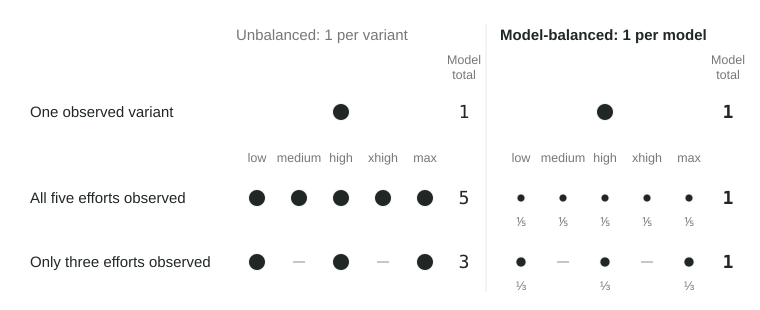
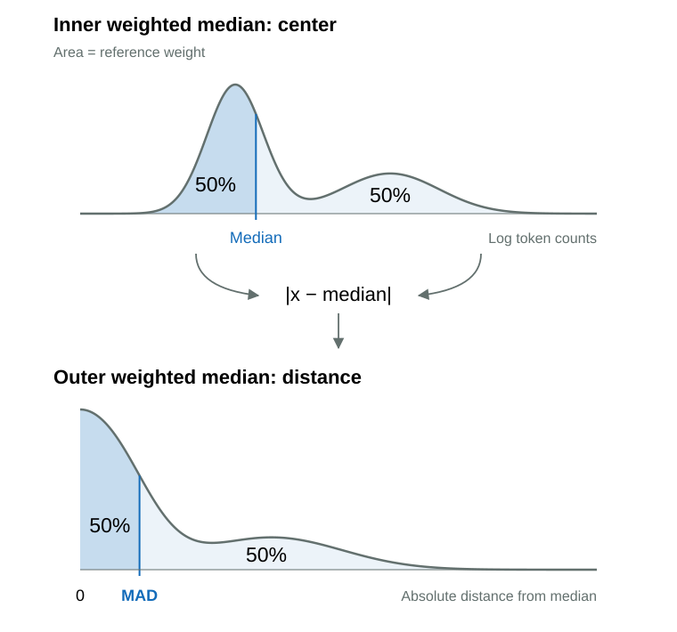
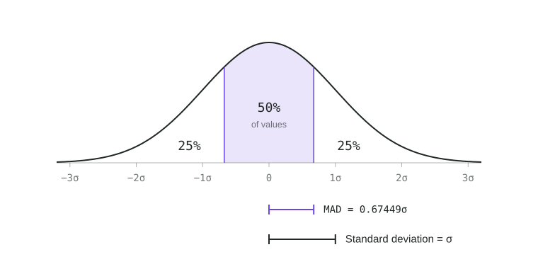
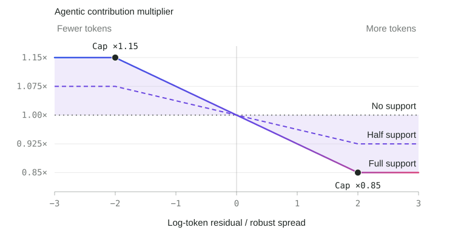
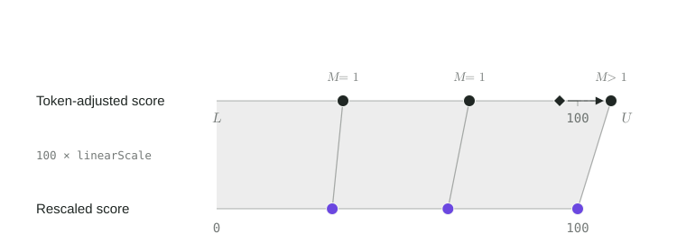
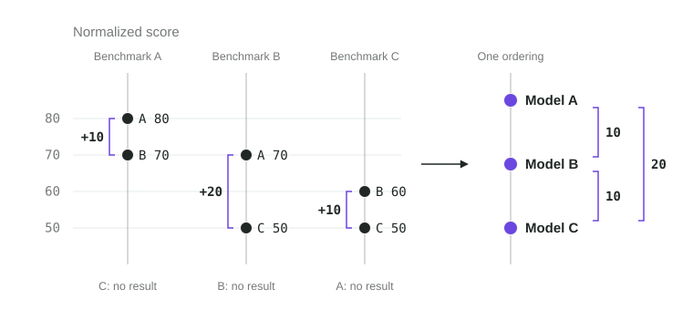
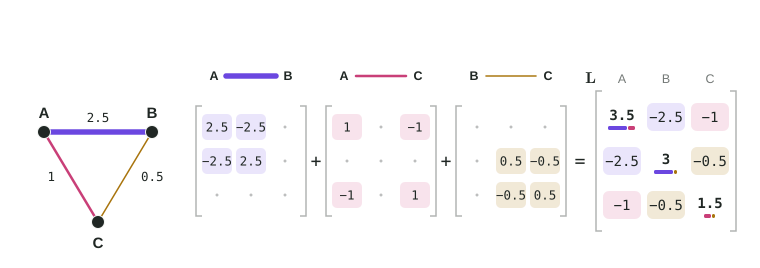
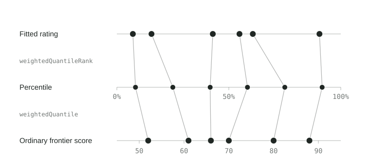
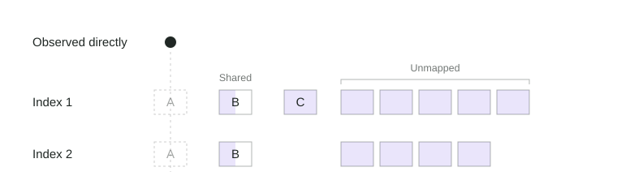
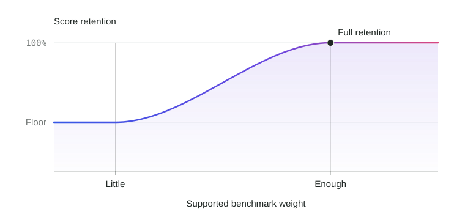

# :score[Intelligence] and :score[Agentic]

## How :score[Intelligence] and :score[Agentic] Are Calculated

:score[Intelligence] and :score[Agentic] turn benchmark results into one capability score per model variant. Each benchmark is first placed on a common 0–100 scale so results in different units can be combined, and weights decide how much each benchmark counts. :score[Agentic] then adjusts for token efficiency, :score[Intelligence] adds a comparison on shared benchmarks, and both combine with aggregate indexes and discount thin evidence. Missing results are covered in [Missing Data and Imputation](imputation.md). Prices and runtimes do not affect either score.

### Benchmark Scores and Dimension Weights

Benchmarks report results in different units and difficulty ranges, so each one is rescaled to 0–100 across the results actually observed: the weakest current result becomes 0 and the strongest 100. This keeps every benchmark spread across the full scale for current models before results are combined. Importance and dimension allocation then set each benchmark's weight within a capability; the portfolio lists the eligible benchmarks, aggregate indexes, and their weights.

**Reported scores**

| Form | Interpretation |
| --- | --- |
| Fraction | A result on a 0–1 scale. |
| Percentage or points | Use the declared units; points need not represent accuracy. |
| Elo rating | A relative rating kept in native units unless a source-specific conversion applies. |

**Normalize benchmark results**

For benchmark result $x$, $N(x)$ combines [linear scaling and clamping](overview.md#linear-scaling-and-clamping) to map the **observed minimum** $x_{\min}$ to 0 and **observed maximum** $x_{\max}$ to 100:

$$
N(x)=100\operatorname{clamp}_{0}^{1}\bigl(\operatorname{linearScale}_{x_{\min}}^{x_{\max}}(x)\bigr).
$$

If all observed results are equal, each receives 100. Imputed results use the same observed bounds, clamped to 0–100, without changing those bounds.

**Source-specific Elo conversion**

Where a source-specific conversion applies, $E(x)$ combines the same scaling and clamping for Elo rating $x$, mapping the **chosen minimum** 500 to 0 and **chosen maximum** 2500 to 1 before observed-range normalization:

$$
E(x)=\operatorname{clamp}_{0}^{1}\bigl(\operatorname{linearScale}_{500}^{2500}(x)\bigr).
$$

The chosen endpoints 500 and 2500 are adopted from Artificial Analysis as a source-specific heuristic, not universal Elo limits. They can be adjusted if the source convention or observed rating range changes. Ratings below 500 become 0; ratings above 2500 become 1. Other sources retain native rating points before observed-range normalization. See the [source policies](../benchmarks.md#benchmark-source-policies) for conversion and fallback details.

**Weighting Benchmark Scores**

| Setting | Role |
| --- | --- |
| Importance | Standard policy: 1 for individual benchmarks and aggregate indexes; represented breadth supplies the index multiplier. |
| Allocation | Intelligence/Agentic split: 100/0, 75/25, 50/50, 25/75, or 0/100. |
| Base weight $\omega_{b,d}$ | Importance × allocation to dimension $d$, expressed as a fraction. |

For :score[Agentic], the model's benchmark score $z_{m,A}$ is the [weighted mean](overview.md#weighted-mean) of its benchmark contributions $z_{m,b,A}$: the normalized results after the [token adjustment](#agentic-token-efficiency) below. Every model uses the same weights $\omega_{b,A}$, but each sums only over $\mathcal{B}_{m,A}$, the benchmarks with positive Agentic weight where it has a result:

$$
z_{m,A}=\frac{\sum_{b\in\mathcal{B}_{m,A}}\omega_{b,A}\,z_{m,b,A}}{\sum_{b\in\mathcal{B}_{m,A}}\omega_{b,A}}.
$$

A missing result drops out instead of counting as zero, and the remaining weights keep their proportions. :score[Intelligence] blends its weighted benchmark mean with the shared-benchmark comparison; it requires an eligible benchmark result or supported effort estimate. Eligible indexes contribute according to their overlap-adjusted breadth, as described later.

[Benchmark Portfolio](../benchmarks.md#scoring-roles) records eligibility, allocations, and current importance weights. [Imputation across reasoning efforts](imputation.md#imputation-across-reasoning-efforts) explains how supported estimates enter the later benchmark mean.

### Sharing Weight Across Variants

Split each model’s total reference weight of 1 equally among its variants with the required observations. With $n$ observed variants, each receives weight $1/n$; missing variants receive none. This prevents models with more reported variants from having more influence.

These weights apply to resource comparisons, imputation, and source crosswalks, not to averaging the variants’ scores.

### :score[Agentic] Token Efficiency

:score[Agentic] rewards achieving comparable benchmark quality with fewer tokens and penalizes needing more. Because tokens are an imperfect efficiency measure, the multiplier is limited to 0.85–1.15 before rescaling. This ±15% cap is an adjustable policy choice, not a statistically established optimum.

The adjustment affects benchmark contributions to :score[Agentic], not :score[Intelligence] or raw benchmark results.

**Comparable Token Measurements**

Use observed quality and token counts from other base models before dashboard filtering to establish the comparison. Imputed quality cannot activate the adjustment. Imputed tokens can receive a discounted adjustment, but never enter the reference population.

Token counts must match the benchmark and effort. Use one measure supported by at least three independent models: complete input plus output counts first, reported totals next, or output-only counts separately. Aggregate-index token counts belong only to that index and use a linear quality coordinate.

**Actual vs. Expected Token Use**

For model variant $m$ on benchmark $b$, compare actual tokens $R^{\text{tok}}_{m,b}$ with expected tokens $\mu^{\text{tok}}_{m,b}$. [Expected use](speed-value.md#expected-resource-use) is predicted in log space from a weighted local mean and, with enough support, a quality-dependent trend—not a median. The log residual $\Delta^{\text{tok}}_{m,b}$ expresses the actual-to-expected ratio:

$$
\Delta^{\text{tok}}_{m,b}=\ln\left(\frac{R^{\text{tok}}_{m,b}}{\mu^{\text{tok}}_{m,b}}\right).
$$

The residual is negative for fewer tokens, zero for the expected amount, and positive for more. Log ratios treat half and twice the expected use symmetrically.

**Token-Use Spread**

The spread $s^{\text{tok}}_b$ supplies a scale for judging whether the log residual is small or large. Calculate it from the log token counts $y_{j,b}=\ln R^{\text{tok}}_{j,b}$ of variants with observed quality results, using their [reference weights](#sharing-weight-across-variants) $w^{\text{ref}}_{j,b}$:

$$
\tilde y_b=\operatorname{weightedMedian}_j(y_{j,b};w^{\text{ref}}_{j,b}),\qquad s^{\text{tok}}_b=1.4826\operatorname{weightedMedian}_j\bigl(|y_{j,b}-\tilde y_b|;w^{\text{ref}}_{j,b}\bigr).
$$

The first [weighted median](overview.md#weighted-median-and-quantiles), $\tilde y_b$, finds the center of the log token counts; the second finds the typical absolute distance from that center, the median absolute deviation (MAD). Medians limit the effect of extreme counts. This is the spread of log token counts, not of prediction residuals.

The illustration shows the two stages: values equally far below and above the center fold onto the same absolute distance, retaining their weights. Each median splits its distribution’s weight in half. The curves are illustrative, not measured token data.

The factor 1.4826 calibrates MAD to a standard-deviation scale: for a normal distribution with standard deviation $\sigma$, half the values lie within $0.67449\sigma$ of the center, so $1/0.67449\approx1.4826$. This is a statistical convention, not a fitted Model Atlas parameter. Log token counts need not be normally distributed; for other shapes, the scaled MAD need not equal their standard deviation.

**Token Adjustment and Evidence**

The ratio $\Delta/s$ expresses the log residual $\Delta$ in units of the observed log-token spread $s$. The ratio $\Delta/(2s)$ reaches ±1 at two spread units from expected use. Clamping it to $[-1,1]$ prevents more extreme token use from increasing the adjustment further.

The token multiplier $M^{\text{tok}}_{m,b}$ is above 1 for a bonus, below 1 for a penalty, and 1 for no adjustment.

[Peer support](speed-value.md#peer-support) $p_{m,b}$ scales the adjustment by how well similar-quality models support the comparison, so a comparison against few or distant models cannot move the score much: 0 gives no adjustment and 1 gives the full adjustment.

Keep $M=1$ when tokens are neither measured nor imputable, the log-token spread $s$ is zero, benchmark quality has no observed variation, or peer support is zero. Otherwise:

$$
M^{\text{tok}}_{m,b}=1-0.15\,p_{m,b}\operatorname{clamp}_{-1}^{1}\left(\frac{\Delta^{\text{tok}}_{m,b}}{2s^{\text{tok}}_b}\right).
$$

With full peer support, token use one spread unit from expected gives half the maximum adjustment, and two or more units give all of it. The two-spread-unit threshold is a policy choice, like the cap.

For imputed tokens, reduce the multiplier’s bonus or penalty using the token evidence factor $f^{\text{tok}}$. This 0–1 factor measures support for the estimated token count, separately from peer support.

$$
M^{\text{tok}}_{m,b}\leftarrow1+f^{\text{tok}}\left(M^{\text{tok}}_{m,b}-1\right).
$$

The arrow replaces the previous multiplier with the discounted one, shrinking the bonus or penalty in proportion to the evidence factor. Measured tokens skip this step.

Token imputation and its evidence factor use the same [validated effort ratios](imputation.md#resource-imputation-across-reasoning-efforts) and [broader-evidence fallback](imputation.md#resource-imputation-from-broader-evidence) as cost and time, separately for total and output-only tokens.

**Adjusted Scores and Rescaling**

If an observed token-adjusted score $z'_{m,b}$ falls outside 0–100, rescale the benchmark’s scores rather than clipping away the excess: clipping would erase the difference between strong results pushed past 100, while rescaling keeps it. Otherwise, no further rescaling is needed. The bounds $L_{b,A}$ and $U_{b,A}$ use observed reference variants $j$, not imputed token counts:

$$
z'_{m,b}=z_{m,b}M^{\text{tok}}_{m,b},\qquad
L_{b,A}=\min(0,\min_jz'_{j,b}),\qquad U_{b,A}=\max(100,\max_jz'_{j,b}),\qquad
z_{m,b,A}=100\operatorname{linearScale}_{L_{b,A}}^{U_{b,A}}(z'_{m,b}).
$$

The resulting contribution $z_{m,b,A}$ enters the :score[Agentic] mean, index blend, and effort comparisons. The ±15% cap does not bound the final score change: rescaling can also move scores with a neutral multiplier of 1.

Evidence weights and inclusion requirements stay unchanged. :score[Value] may change indirectly through :score[Agentic]. Token counts alone cannot distinguish success from early termination or establish that an effort setting caused an efficiency gain.

### Shared-Benchmark Comparisons for :score[Intelligence]

Two models can earn similar ordinary scores from different frontier benchmark baskets. The pairwise calculation compares each pair on the frontier benchmarks both actually report, then fits those comparisons together into one ordering. Its mapped contribution receives 20% of the frontier score; the ordinary frontier mean receives 80%.

**Compare shared observations**

For each individual Intelligence benchmark, use its normalized score $z_{m,b}$ defined above, so a wide gap counts for more than a narrow one. Accepted source crosswalks enter as benchmark results. Aggregate indexes and estimates from other efforts or benchmarks do not enter this comparison. Missing observations create no comparison and do not count as losses.

Compare variants from different base models only. For $n_b$ distinct base models reporting benchmark $b$, assign each comparison the weight:

$$
\lambda_{i,j,b}=\frac{\omega_{b,I}\,w^{\text{ref}}_{i,b}\,w^{\text{ref}}_{j,b}}{n_b-1}.
$$

Here $\omega_{b,I}$ is the benchmark's Intelligence weight, and $w^{\text{ref}}_{i,b}$ is the variant's [reference weight](#sharing-weight-across-variants). Each base model shares one unit across its observed efforts. Summed over its comparisons, each base model therefore receives one benchmark weight, regardless of how many effort settings it reports. Benchmarks with fewer than two base models supply no pairwise evidence; their ordinary score contributions remain available.

For a particular model pair, keeping one edge per shared benchmark is equivalent to using their weighted mean score difference and the sum of those edge weights. The graph fit uses all pairs together, so the final ordering also depends on how each model compares with other models.

**Fit the comparison graph**

Each model variant is a node; each shared frontier benchmark supplies a weighted comparison edge. Fit one rating $\theta_m$ per variant in the largest connected component by minimizing disagreement with the measured score differences:

$$
\underset{\theta}{\operatorname{minimize}}\sum_{b}\sum_{i<j}\lambda_{i,j,b}\left[(\theta_i-\theta_j)-(z_{i,b}-z_{j,b})\right]^2.
$$

These comparisons need not agree perfectly: A may beat B, B may beat C, and C may beat A on different shared baskets. Least squares finds a compromise, with larger edge weights making disagreement more costly. It does not guarantee that every direct pairwise winner ranks higher globally.

The illustration shows three models from a larger normalization population; models defining each benchmark's 0 and 100 endpoints are omitted. No benchmark is shared by all three pictured models. Each link compares matching benchmark results, and their hypothetical gaps agree. With several shared benchmarks, a pair's comparison combines their weighted differences.

**What the Laplacian does**

The Laplacian is a table of coefficients for calculating weighted rating differences. Its A–A cell is not a comparison of Model A against itself. To see why the diagonal is positive and the other entries are negative, write out Model A's comparisons with B and C.

In the illustration, A's comparison with B has weight 2.5 and its comparison with C has weight 1. Using A, B, and C as shorthand for their ratings, add the two weighted differences and expand:

$$
\begin{aligned}
2.5(A-B)+1(A-C)
&=2.5A-2.5B+A-C\\
&=3.5A-2.5B-1C.
\end{aligned}
$$

The matrix stores those coefficients in columns A, B, and C: **[3.5, −2.5, −1]**. The positive 3.5 comes from combining the two own-rating terms, 2.5A and A. The negative coefficients subtract the neighbors' ratings. They do not say who won, and the positive diagonal does not mean A beat itself.

The other rows follow the same recipe:

| Model's row | Weighted comparisons | Coefficients in columns A, B, C |
| --- | --- | --- |
| A | $2.5(A-B)+1(A-C)$ | $[3.5,-2.5,-1]$ |
| B | $2.5(B-A)+0.5(B-C)$ | $[-2.5,3,-0.5]$ |
| C | $1(C-A)+0.5(C-B)$ | $[-1,-0.5,1.5]$ |

If all three ratings are equal, each weighted difference is zero. That is why each row's positive coefficient balances its negative coefficients: the calculation measures relative gaps, not the absolute rating level.

With several neighbors, each diagonal entry sums the weights touching that model and each off-diagonal entry is the negative total weight between two models. No direct comparison gives an off-diagonal zero. The weighted graph Laplacian $\mathbf{L}$ therefore describes the comparison connections, while the observed score differences enter separately through a vector $\mathbf{h}$. The solver adjusts the ratings to bring their weighted gaps into agreement with that evidence.

Each row of the incidence matrix $\mathbf{B}$ contains $+1$ for the left model and $-1$ for the right model of an edge. With the edge weights $\lambda$ in the diagonal matrix $\boldsymbol{\Lambda}$ and observed score differences in $\Delta\mathbf{z}$, the fitted ratings solve:

$$
\mathbf{L}=\mathbf{B}^\top\boldsymbol{\Lambda}\mathbf{B},\qquad \mathbf{h}=\mathbf{B}^\top\boldsymbol{\Lambda}\,\Delta\mathbf{z},\qquad (\mathbf{L}+10^{-8}\mathbf{I})\boldsymbol{\theta}=\mathbf{h}.
$$

The implementation applies the Laplacian directly from the edge list and solves this system with conjugate gradient, without allocating a dense model-by-model matrix. The small ridge $10^{-8}\mathbf{I}$ adds a squared-rating penalty and anchors the otherwise arbitrary common offset; it is a numerical setting, not the 20% policy weight. Models outside the largest connected component retain their ordinary :score[Intelligence] score because separate components have no shared rating origin.

**Map the fitted ordering and blend**

Convert fitted ratings to model-balanced percentile positions $r_m$ using [weightedQuantileRank](overview.md#weighted-ranks), divided by 100 to give a 0–1 scale. A percentile is not itself an Atlas score, so map it back through the weighted distribution of ordinary frontier scores for eligible fitted variants. If $Q$ applies [weightedQuantile](overview.md#weighted-median-and-quantiles) to that distribution and $O_m$ is the ordinary frontier mean, the frontier score $F_m$ blends them:

$$
F_m=0.8\,O_m+0.2\,Q(r_m).
$$

The mapping expresses a percentile position in ordinary frontier score units. Observed differences influence the fitted ordering, but the mapped contribution borrows its spacing from the ordinary frontier distribution; it does not preserve fitted rating distances or guarantee that the blended distribution stays unchanged. :score[Agentic] retains its existing calculation, including the token-efficiency adjustment above.

### Combining Benchmarks and Aggregate Indexes

Aggregate indexes add evidence from benchmarks a model may lack as standalone results. Eligible observed indexes retain their overlap-adjusted represented breadth, so more represented benchmarks give an index more weight; individual benchmark contributions receive a 1.5 multiplier when calculating the relative benchmark-versus-index share. :score[Intelligence] blends its frontier benchmark score with eligible indexes; :score[Agentic] retains a unified benchmark-and-index mean.

Use the base weights $\omega_{b,d}$ defined above: importance × dimension allocation. For model $m$, $z_{m,k}$ is the normalized index contribution; for :score[Agentic], benchmark and index contributions $z_{m,b,A}$ and $z_{m,k,A}$ include the token adjustment. Index $k$ has remaining represented breadth $n_{m,k,d}$ after overlap deductions for that model and dimension. Define $D_{m,d}=1.5\sum_b\omega_{b,d}$ over available frontier benchmark contributions and $K_{m,d}=\sum_k\omega_{k,d}n_{m,k,d}$ over eligible indexes. The :score[Intelligence] score uses the frontier score $F_m$ from the preceding section:

$$
S_{m,I}=\frac{D_{m,I}F_m+\sum_k\omega_{k,I}n_{m,k,I}z_{m,k}}{D_{m,I}+K_{m,I}}.
$$

The index share depends on its represented breadth and the model's available frontier benchmark evidence. A model without a frontier benchmark contribution has no :score[Intelligence] score; an eligible index alone does not replace that requirement. Baseline observations have no direct contribution, direct evidence support, or direct-overlap deduction in either capability; aggregate indexes retain their own published composite values. :score[Agentic] keeps the unified mean:

$$
S_{m,A}=\frac{1.5\sum_b\omega_{b,A}z_{m,b,A}+\sum_k\omega_{k,A}n_{m,k,A}z_{m,k,A}}{D_{m,A}+K_{m,A}}.
$$

The sums include only available contributions with positive weight. Accepted source crosswalks count as individual-benchmark results, including for admission. Estimates from another effort of the same model can contribute individual-benchmark values with the same 1.5 multiplier, but do not become direct observations or satisfy admission. Estimates inferred from other benchmarks affect evidence support only; they do not enter this mean. Effort-labelled variants use only indexes reporting that effort; unlabelled variants use the ordinary index pool.

The constituent benchmarks of the AA and CAIS indexes are known. A directly observed constituent with positive active weight in the dimension removes one breadth unit from every eligible index containing it. Otherwise, a constituent shared by multiple eligible indexes contributes an equal fraction of one breadth unit to each. These deductions happen before applying index importance and dimension allocation, and remaining breadth cannot fall below zero. Unmapped constituents retain their assigned breadth because their overlap cannot be established.

These deductions reduce represented weight; they do not remove constituent results from the published index value. Overlap accounting therefore limits duplicate influence without reconstructing an index from its remaining benchmarks. The 1.5 multiplier is a policy preference for selected individual benchmarks, not a fitted optimum or a correction for selective reporting.

AA, CAIS, Surge, and Vals use their declared or edition-specific represented breadth. ECI uses the median fixed-index breadth, currently 7.5 from the counts 7, 7, 8, and 10.

Index-only evidence can supply an :score[Agentic] score; :score[Intelligence] requires a frontier benchmark contribution. Without an eligible index, the 1.5 multiplier cancels out and the score is the benchmark mean alone. The multiplier and represented breadth do not inflate displayed evidence support, admission uses its separate [observed-evidence rules](leaderboard-rules.md#dashboard-inclusion), and no further adjustment depends on reasoning effort.

### Evidence Support and Score Retention

Score retention keeps 85% of a capability score when supported benchmark weight is low and rises to 100% as support grows. This discounts scores based on a narrow set of results, where missing benchmarks leave more of the model's performance unknown. The multiplier applies once, after benchmarks and indexes are combined, and lowers scores below 50 as well.

Evidence support is the displayed share of the benchmark portfolio backed by evidence. Retention uses the amount of supported weight; evidence support expresses a share of the full portfolio. A model can therefore reach full retention while still having results missing from its portfolio.

Both calculations count frontier benchmarks and eligible indexes. Baseline results add no direct support, although they can help estimate missing frontier results.

**Count each result’s evidence**

For model variant $m$ and benchmark $b$, the evidence factor $f_{m,b}$ determines how much of the benchmark’s base weight counts: 1 counts all of it, 0.5 counts half, and 0 counts none. Observations and accepted [source crosswalks](imputation.md#source-crosswalks) receive 1.

For imputation from other benchmarks, use the normalized validation error $e_{m,b}$ and the share $c^{\text{other}}_{m,b}$ of the other benchmarks’ base weight that is observed:

$$
f_{m,b}=
\begin{cases}
1 & \text{observed or accepted source crosswalk}\\
c^{\text{other}}_{m,b}\operatorname{clamp}_{0}^{1}(1-e_{m,b}/25) & \begin{gathered}\text{validated imputation}\\\text{from other benchmarks}\end{gathered}\\
0 & \text{otherwise}.
\end{cases}
$$

The factor for imputation from other benchmarks falls as validation error grows and reaches zero at 25 error points. When both the Intelligence and Agentic predictors apply, their observed shares combine according to the benchmark's allocation between the two. Imputation across reasoning efforts adds no evidence support by itself; any separately validated evidence factor is retained.

**Calculate evidence support**

Multiply each benchmark’s base weight by its evidence factor, sum those amounts, and divide by the total base weight of the portfolio. This gives evidence support $c_{m,d}$, separately for dimension $d$ (Intelligence or Agentic).

The set $\mathcal{B}_d$ includes all selected benchmarks and indexes for the dimension, including those the model has not run. Unlike the capability mean, its denominator therefore includes missing results. The weight $\omega_{b,d}$ is each benchmark's base weight for that dimension. An index excluded from an effort-labelled variant contributes no supported weight:

$$
c_{m,d}=\frac{\sum_{b\in\mathcal{B}_d}\omega_{b,d}f_{m,b}}{\sum_{b\in\mathcal{B}_d}\omega_{b,d}}.
$$

:score[Intelligence] and :score[Agentic] each show their own evidence support. Equal percentages can represent different amounts of evidence because base weights differ. The API calls these fields `confidence`; they measure how much of the portfolio is covered, not confidence intervals or probabilities of a correct rank.

**Determine score retention**

The supported weight $W_{m,d}$ determines retention, so adding benchmarks that a model has not run does not by itself increase the retention penalty. The multiplier $M^{\text{ret}}_{m,d}$ stays at 0.85 through 1.2 units of supported weight and rises along the [smoothstep curve](overview.md#smoothstep) to 1 at 12.

A supported individual benchmark contributes $1.5\omega_{b,d}f_{m,b}$. An eligible observed index contributes $\omega_{k,d}n_{m,k,d}f_{m,k}$, where $n_{m,k,d}$ is its represented breadth after known overlap is deducted. The set $\mathcal{K}_d$ contains the selected indexes for dimension $d$; ineligible indexes have zero evidence factor:

$$
W_{m,d}=1.5\sum_{b\notin\mathcal{K}_d}\omega_{b,d}f_{m,b}+\sum_{k\in\mathcal{K}_d}\omega_{k,d}n_{m,k,d}f_{m,k},\qquad M^{\text{ret}}_{m,d}=0.85+0.15\operatorname{smoothstep}\bigl(\operatorname{linearScale}_{1.2}^{12}(W_{m,d})\bigr).
$$

Eight units of fully observed individual-benchmark base weight reach the full-retention threshold of 12 after the 1.5 multiplier.

**Apply score retention**

Multiply the combined score $S_{m,d}$ from [Combining Benchmarks and Aggregate Indexes](#combining-benchmarks-and-aggregate-indexes) by $M^{\text{ret}}_{m,d}$ to obtain the retained score $S'_{m,d}$:

$$
S'_{m,d}=M^{\text{ret}}_{m,d}S_{m,d}.
$$

## Parameter Choices

These values are scoring-policy choices, not fitted claims about model behavior.

| Parameter | Value | Why it exists |
| --- | ---: | --- |
| Score retention | 85% retention through 1.2 supported benchmark weight; smooth rise to 100% retention at 12 | Discounts thin evidence while allowing eight units of direct benchmark weight to earn full retention. |
| Capability benchmark group | Frontier only for :score[Intelligence] and :score[Agentic] | Focuses both scores on benchmarks selected for separation among leading models. |
| Shared-benchmark :score[Intelligence] blend | 20% pairwise, 80% ordinary frontier score | Gives shared benchmark comparisons explicit influence on the same score scale; sparse benchmarks still contribute to the ordinary score. |
| Direct benchmark multiplier | 1.5 | Gives a specific benchmark result modestly more influence than one unit of an index's represented breadth. |
| Aggregate-index breadth | Represented benchmark count after exact known overlap deductions | Gives broad indexes influence in proportion to their published evidence while counting known direct and cross-index overlap once. |
| ECI breadth | 7.5, the median fixed-index breadth | ECI publishes no fixed benchmark basket, so it uses a typical breadth instead of a count that varies by model. |
| :score[Agentic] token multiplier | ±15%, reached at two spread units | Limits how much token efficiency can alter benchmark quality before rescaling. |
