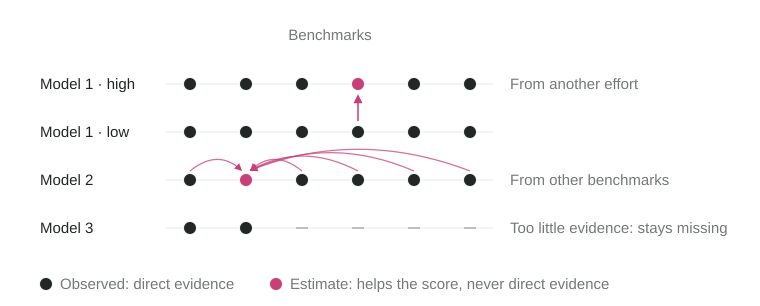
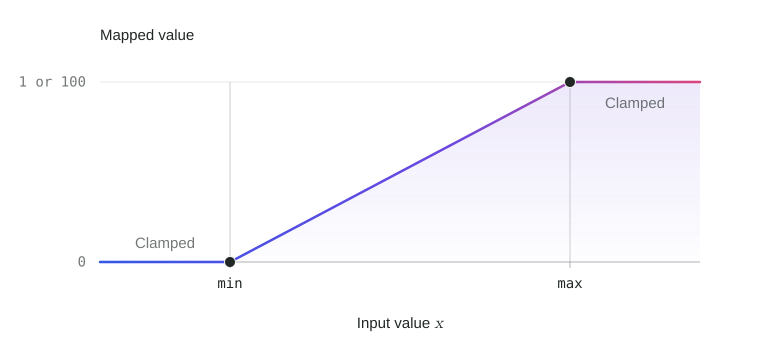

# Methodology

## What Model Atlas Measures

Model Atlas turns benchmark results, token use, prices, and runtimes into four separate 0–100 scores. :score[Intelligence] and :score[Agentic] describe capability; :score[Speed] and :score[Value] describe resource efficiency, responsiveness, and affordability.

**A benchmark** represents upstream evaluation results and the methodology used to produce them. **A task** is a unit of work within a benchmark. Resources **per task** describe the cost, time, or tokens for that unit of work, using the source’s reported task unit. An **aggregate index** combines results from multiple benchmarks.

Benchmark, reasoning-effort, and resource coverage is uneven. **Imputation** fills supported gaps using relationships across observed results. Validated [source crosswalks](imputation.md#source-crosswalks) combine comparable sources into accepted benchmark results without assuming either is better.

The detailed pages describe the current method and its equations. [Benchmarks](../benchmarks.md) records the selected inputs and their source policies, while [Standards](../standards.md) explains how those inputs earn a place. The [dashboard inclusion rules](leaderboard-rules.md#dashboard-inclusion) determine which scored models appear on the leaderboard.

| Score | What it measures |
| --- | --- |
| **:score[Intelligence]** | Solving difficult problems using knowledge, perception, understanding, abstract reasoning, and judgment. |
| **:score[Agentic]** | Reliably turning goals and specifications into working results through instruction following, planning, coding, tool use, verification, and recovery. |
| **:score[Speed]** | Completing work quickly at comparable quality, with fast token generation, low first-token latency, and short total response times. |
| **:score[Value]** | Delivering comparable-quality work at lower cost, combining cost per task with token prices assessed for affordability and efficiency at comparable capability. |

- **Capability can overlap.** Implementing a specification is primarily Agentic; deriving a difficult algorithm or scientific solution can also contribute to Intelligence.
- **Efficiency accounts for quality.** :score[Speed] and :score[Value] compare resource use at similar quality, so a cheaper but much less capable model does not automatically score well on :score[Value].
- **Resource effects are limited.** :score[Agentic] includes a bounded token-use adjustment based on measured and imputed token use. Price and latency do not affect either capability score.

## How to Read the Scores

The leaderboard uses the current benchmark population, so scores can change when that population changes. The separate [Intelligence Index](../timeline/overview.md) keeps a saved reference and connects benchmark generations through shared results. It supports historical comparison, uses provisional display units, and does not affect leaderboard scoring or inclusion.

Capability scores reflect relative benchmark performance. :score[Intelligence] and :score[Agentic] use the same [linear scaling with clamping](#shared-mathematical-operations): observed minimum and maximum results map to 0 and 100, and equal improvements within a benchmark's observed range give equal score changes. Both capabilities combine frontier benchmarks with eligible aggregate-index evidence at its overlap-adjusted share. Baseline results remain visible without direct score weight; they can inform validated estimates of missing frontier results. The final scores include evidence adjustments.

A score of 100 on one benchmark means the strongest observed result, not perfect task completion. A final capability score of 80 does not mean 80% benchmark accuracy or twice the capability of a model scoring 40.

[Relative resource amounts](speed-value.md#relative-task-resources) summarize observed cost, runtime, and total token consumption against benchmark/source medians. Lower ratios mean less resource use; they do not account for achieved quality. :score[Speed] and :score[Value] compare efficiency at similar quality and include provider speed or token prices, so their ordering can differ from the descriptive ratios.

### Collapsed and Expanded Models

Reasoning-effort labels include `none`, `low`, `medium`, `high`, `xhigh`, and `max`. An unspecified effort is stored as `null`; it is distinct from an explicit `none`. Available settings depend on the model and source.

Each reasoning-effort variant has its own scores. The collapsed leaderboard selects the variant with the **highest :score[Intelligence] score** and shows that variant's headline scores. It does not take the mean of scores across efforts or select a separate maximum for each score. Expanding a model reveals its individual variants.

Individual benchmark cells can use separate source-crosswalk or missing-cell fallback rules; they do not recalculate the representative variant's headline scores.

## Calculation Overview

The scoring order matters: benchmark quality establishes the context for resource comparisons. Dashboard inclusion filters are applied after reference scoring, so hiding a row does not change the scale used to score the others.

> [!FLOW]
>
> 1. **Observed inputs**
>
>    Match observed benchmark results and resource measurements to the correct model and reasoning-effort variant.
>
> 2. **Comparable benchmark evidence**
>
>    Normalize each quality benchmark linearly within its observed range.
>
> 3. **:score[Intelligence] and :score[Agentic]**
>
>    Combine frontier benchmarks and eligible aggregate indexes, using validated imputation for supported gaps and adjusting for evidence support.
>
> 4. **Quality-adjusted resources**
>
>    Compare cost and time at similar quality, using measured resources and supported imputation for missing cost, time, and token use.
>
> 5. **Dashboard inclusion and score availability**
>
>    Apply inclusion and direct-evidence checks after scoring, preserving the reference population.

**Imputed values help estimate scores; they never count as direct evidence.** Observations alone establish reference scales and satisfy inclusion and resource-availability requirements. [Benchmark imputation](imputation.md#benchmark-results-and-imputation) and [resource imputation](imputation.md#resource-imputation-across-reasoning-efforts) explain how estimates enter scoring and how their support is assessed.

## Read the Detailed Method

The diagram groups the main sections by page. Branches show where to find an explanation, rather than the order in which every calculation runs.

> [!MAP]
>
> [Methodology overview](overview.md)
>
> - [:score[Intelligence] and :score[Agentic]](intelligence-agentic.md)
>   - [Normalize scores and assign weights](intelligence-agentic.md#benchmark-scores-and-dimension-weights)
>   - [Share weight across variants](intelligence-agentic.md#sharing-weight-across-variants)
>   - [:score[Agentic] token efficiency](intelligence-agentic.md#agentic-token-efficiency)
>   - [Evidence support and regularization](intelligence-agentic.md#evidence-support-and-quality-regularization)
>   - [Combine benchmarks and indexes](intelligence-agentic.md#combining-benchmarks-and-aggregate-indexes)
> - [Missing Data and Imputation](imputation.md)
>   - [Source crosswalks](imputation.md#source-crosswalks)
>   - [From other observed benchmarks](imputation.md#imputation-from-other-observed-benchmarks)
>   - [Across reasoning efforts](imputation.md#imputation-across-reasoning-efforts)
>   - [Resource estimates across efforts](imputation.md#resource-imputation-across-reasoning-efforts)
>   - [Resource estimates from broader evidence](imputation.md#resource-imputation-from-broader-evidence)
> - [:score[Speed] and :score[Value]](speed-value.md)
>   - [Token prices](speed-value.md#blended-token-price)
>   - [Provider speed](speed-value.md#provider-speed)
>   - [Resources per task](speed-value.md#quality-adjusted-resources-per-task)
>   - [Resource comparability](speed-value.md#resource-comparability-across-sources)
>   - [Similar-quality peers](speed-value.md#comparable-quality-peers)
>   - [Comparison support](speed-value.md#comparison-support)
>   - [Expected resource use](speed-value.md#expected-resource-use)
>   - [Resource efficiency](speed-value.md#resource-efficiency-score)
>   - [Combine components](speed-value.md#combining-speed-and-value-components)
> - [Leaderboard Rules](leaderboard-rules.md)
>   - [Model inclusion](leaderboard-rules.md#dashboard-inclusion)
>   - [Resource-score availability](leaderboard-rules.md#resource-score-availability)
>   - [Highlighted models](leaderboard-rules.md#selecting-highlighted-models)
>   - [Reasoning-effort comparisons](leaderboard-rules.md#comparing-reasoning-effort-curves)
>   - [Updated releases](leaderboard-rules.md#evidence-for-updated-releases)

<!-- Separate the reference map from the calculation map. -->

> [!MAP]
>
> Related documentation
>
> - [Standards](../standards.md)
>   - Evidence requirements and benchmark review
> - [Benchmark Portfolio](../benchmarks.md)
>   - Selected inputs, weights, and source policies
> - [Model Matching](../matching.md)
>   - Model identity and reasoning-effort variants
> - [Timeline](../timeline/overview.md)
>   - Historical comparison on a saved scale
>   - [Index calculation](../timeline/calculation.md)

## Shared Mathematical Operations

The formulas across these pages reuse the operations below. Each calculation specifies its inputs, reference population, and weights. For linear scaling and clamping, the subscript specifies the lower bound and the superscript specifies the upper bound.

**Linear scaling**

Linear scaling maps minimum $a$ to 0 and maximum $b$ to 1. For input $x$ and $a<b$:

$$
\operatorname{linearScale}_{a}^{b}(x)=\frac{x-a}{b-a}.
$$

Scaling can produce values below 0 or above 1.

The shared code helper `linearScale` uses these 0–1 units; `linearScore` expresses the same position in 0–100 score units without clamping. Missing inputs remain missing, and equal reference bounds use the upper endpoint, preserving the all-equal score of 100.

**Clamping**

Clamping to bounds $a\le b$ keeps values inside the bounds unchanged; values below $a$ become $a$, and values above $b$ become $b$:

$$
\operatorname{clamp}_{a}^{b}(x)=\min\bigl(b,\max(a,x)\bigr).
$$

Scaling produces the straight line; clamping produces the flat ends. Multiplying the clamped 0–1 result by 100 gives a 0–100 scale. Each application specifies whether its bounds are observed values or chosen endpoints, and whether clamping is applied.

### Weighted Mean

The weighted mean gives each value influence proportional to its weight. For finite values $x_i$ with positive finite weights $w_i$:

$$
\operatorname{weightedMean}_i(x_i;w_i)=\frac{\sum_iw_ix_i}{\sum_iw_i}.
$$

Equal weights give the ordinary arithmetic mean, which divides the sum of $n$ values by their count:

$$
\operatorname{mean}_i(x_i)=\frac{\sum_i x_i}{n}.
$$

Missing values and nonpositive or invalid weights are excluded; if no usable values remain, the summary is missing rather than zero. The same input rule applies to the weighted median, quantiles, and ranks below. Ordinary means and medians use finite values with unit weights.

### Weighted Median and Quantiles

The weighted median splits the total weight in half. Sort the values and accumulate their weights: the first value whose cumulative weight passes 50% is the median. If the cumulative weight lands exactly at 50% between two distinct values, take their mean.

A weighted quantile applies the same rule at a chosen fraction $r$ of the total weight. Combine weights of equal values, then sort the distinct values as $x_1<\cdots<x_n$, retaining their weights. The cumulative weight share through value $k$ is:

$$
C_k=\frac{\sum_{i=1}^{k}w_i}{\sum_{i=1}^{n}w_i}.
$$

For $0<r<1$, find the first $k$ with $C_k\ge r$. For this weighted reference distribution:

$$
\operatorname{weightedQuantile}(r)=
\begin{cases}
\dfrac{x_k+x_{k+1}}{2}, & r=C_k\text{ and }k<n,\\[6pt]
x_k, & \text{otherwise}.
\end{cases}
$$

At $r=0$ or $r=1$, return the smallest or largest value. The weighted median is the quantile at $r=0.5$:

$$
\operatorname{weightedMedian}_i(x_i;w_i)=\operatorname{weightedQuantile}(0.5).
$$

The ordinary median uses unit weights, so an even number of values gives the mean of the two middle values:

$$
\operatorname{median}_i(x_i)=\operatorname{weightedMedian}_i(x_i;1).
$$

The adjacent-value mean is the convention used here; weighted quantile definitions can differ between implementations.

### Weighted Ranks

A weighted rank locates an input value $v$ within a weighted reference distribution. The quantile rank counts all weight below $v$ and half the weight tied at $v$, putting tied values at the midpoint of their shared percentile range:

$$
\operatorname{weightedQuantileRank}(v)=100\frac{\sum_{x_i<v}w_i+\tfrac12\sum_{x_i=v}w_i}{\sum_iw_i}.
$$

The percentile rank counts all tied weight instead:

$$
\operatorname{weightedPercentileRank}(v)=100\frac{\sum_{x_i\le v}w_i}{\sum_iw_i}.
$$

Both return 0–100. Divide by 100 when a calculation needs a fraction on 0–1. Benchmark imputation uses the half-tie quantile rank; resource-efficiency percentiles use the full-tie percentile rank. Each calculation specifies which reference values and weights participate.

### Effective Count

Effective count measures how evenly influence is distributed across positive finite weights $w_i$. For $n$ participating inputs, equal weights give a count of $n$; concentration in one input brings it toward 1:

$$
\operatorname{effectiveCount}_i(w_i)=\frac{(\sum_iw_i)^2}{\sum_iw_i^2}.
$$

Squaring the weights makes concentration reduce the count. Multiplying every weight by the same positive factor leaves it unchanged, so weights 0.25, 0.50, and 0.25 give the same count as 1, 2, and 1. Nonpositive and invalid weights are excluded; with no positive finite weights, the count is 0. This measures weight distribution, not prediction accuracy or independence between inputs.

The shared code helper is named `effectiveCount` and uses this same definition.

### Smoothstep

Smoothstep raises a value from 0 to 1 with a flat start and end. Clamping its input keeps the output fixed outside that interval:

$$
\operatorname{smoothstep}(x)=u^2(3-2u),\qquad u=\operatorname{clamp}_{0}^{1}(x).
$$

For a polynomial $P(u)$, the endpoint requirements are:

| Requirement | Equation |
| --- | --- |
| Start at 0 | $P(0)=0$ |
| End at 1 | $P(1)=1$ |
| Start flat | $P'(0)=0$ |
| End flat | $P'(1)=0$ |

The simplest polynomial satisfying these requirements is $P(u)=3u^2-2u^3$. Its derivative $P'(u)=6u(1-u)$ is zero at both ends and positive between them. The coefficients follow from those requirements; choosing a flat transition and its start and end thresholds is scoring policy.

## Parameter Choices

Scoring-policy parameters are listed with the calculations they control: [capability scores](intelligence-agentic.md#parameter-choices), [imputation](imputation.md#parameter-choices), [resource scores](speed-value.md#parameter-choices), and [leaderboard inclusion](leaderboard-rules.md#parameter-choices).
