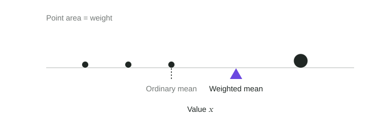
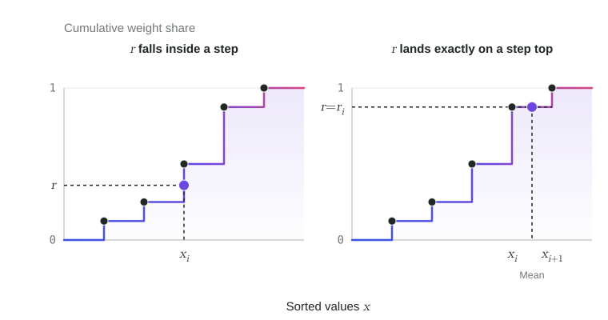
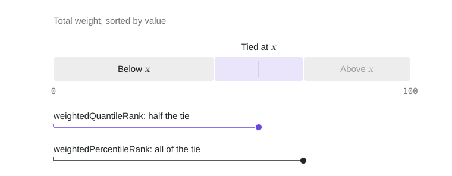
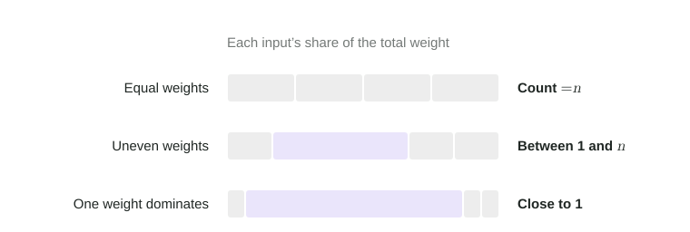
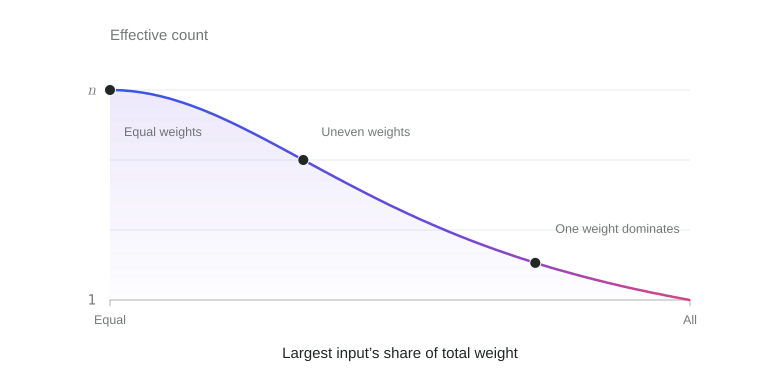
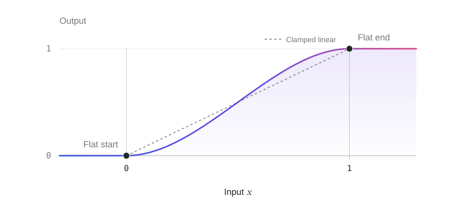

# Methodology

## What Model Atlas Measures

Model Atlas turns benchmark results, token use, prices, and runtimes into four separate 0–100 scores. :score[Intelligence] and :score[Agentic] describe capability; :score[Speed] and :score[Value] describe resource efficiency, responsiveness, and affordability.

**A benchmark** is an upstream evaluation with its own methodology and scoring rules. **A task** is one unit of work within a benchmark, and resources **per task** are the cost, time, or tokens for that unit, in the source’s reported task unit. **An aggregate index** combines results from several benchmarks into one published score.

| Score | What it measures |
| --- | --- |
| **:score[Intelligence]** | Solving difficult problems using knowledge, perception, understanding, abstract reasoning, and judgment. |
| **:score[Agentic]** | Reliably turning goals and specifications into working results through instruction following, planning, coding, tool use, verification, and recovery. |
| **:score[Speed]** | Completing work quickly at comparable quality, with fast token generation, low first-token latency, and short total response times. |
| **:score[Value]** | Delivering comparable-quality work at lower cost, combining cost per task with token prices assessed for affordability and efficiency at comparable capability. |

- **Capability can overlap.** Implementing a specification is primarily Agentic; deriving a difficult algorithm or scientific solution can also contribute to Intelligence.
- **Efficiency accounts for quality.** :score[Speed] and :score[Value] compare resource use at similar quality, so a cheaper but much less capable model does not automatically score well on :score[Value].
- **Resource effects are limited.** :score[Agentic] includes a bounded token-efficiency adjustment. Price and latency do not affect either capability score.

## How to Read the Scores

Scores are relative to the current benchmark population, so they can change when that population changes. On each benchmark, the weakest observed result maps to 0 and the strongest to 100, so equal improvements within the observed range give equal score changes. A benchmark score of 100 means the strongest observed result, not perfect task completion. A final capability score is not an accuracy percentage, and twice the score does not mean twice the capability.

Capability scores use frontier benchmarks, chosen because they separate current leading models, and eligible aggregate indexes. Baseline benchmarks stay visible in the table without direct score weight, but their results can help estimate missing frontier results. The separate [Intelligence Index](../timeline/overview.md) keeps a saved scale for historical comparison and does not affect leaderboard scores or inclusion.

[Relative resource amounts](speed-value.md#relative-task-resources) compare observed cost, runtime, and total tokens with benchmark medians. Lower ratios mean less resource use, regardless of achieved quality. :score[Speed] and :score[Value] compare resources at similar quality and add provider speed or token prices, so their ordering can differ from these ratios.

### Collapsed and Expanded Models

Reasoning-effort labels include `none`, `low`, `medium`, `high`, `xhigh`, and `max`. An unspecified effort is stored as `null`, which is distinct from an explicit `none`. Available settings depend on the model and source.

Each reasoning-effort variant has its own scores. The collapsed leaderboard shows the variant with the **highest :score[Intelligence] score** and all of that variant's headline scores; it neither takes the mean across efforts nor picks a separate maximum for each score. Expanding a model reveals every variant. In the collapsed view, a benchmark cell the shown variant lacks can display another effort's direct result; these display fills do not change the headline scores.

## Calculation Overview

The four scores follow two paths from the same observed inputs, and each path ends by discounting thin evidence. Resource comparisons use quality as their reference: benchmark results decide which models count as similar-quality peers, and final capability scores do the same for token prices. Dashboard inclusion filters are applied after scoring, so hiding a row does not change the scale used to score the others.

> [!FLOW]
>
> 1. **Observed inputs**
>
>    Match observed benchmark results and resource measurements to the correct model and reasoning-effort variant.
>
> 2. - **:score[Intelligence] and :score[Agentic]**
>
>      1. **Normalize each benchmark**
>
>         Observed minimum → 0, maximum → 100
>
>      2. **Adjust :score[Agentic] for token efficiency**
>
>         Up to ±15% before benchmark rescaling
>
>      3. **Combine benchmarks and indexes**
>
>         :score[Intelligence]: 20% pairwise within its frontier component
>
>      4. **Discount thin evidence**
>
>         Keep 85–100% by supported benchmark weight
>
>    - **:score[Speed] and :score[Value]**
>
>      1. **Find similar-quality peers**
>
>         Other models on each benchmark
>
>      2. **Compare with expected use**
>
>         Time and cost per task at that quality
>
>      3. **Score resource efficiency**
>
>         Weak peer support moves the score toward 50
>
>      4. **Combine components and apply coverage**
>
>         At full evidence: 70% per task, 30% provider speed or price
>
> 3. **Dashboard inclusion and score availability**
>
>    Apply inclusion and direct-evidence checks after scoring, preserving the reference population.

Benchmark, reasoning-effort, and resource coverage is uneven. **Imputation** fills supported gaps from relationships among observed results. **Imputed values help estimate scores; they never count as direct evidence.** Observations alone set reference scales and satisfy inclusion and resource-availability requirements. Validated [source crosswalks](imputation.md#source-crosswalks) differ: they combine comparable sources of one benchmark into an accepted benchmark result without assuming either source is better. [Benchmark imputation](imputation.md#benchmark-results-and-imputation) and [resource imputation](imputation.md#resource-imputation-across-reasoning-efforts) explain how estimates enter scoring and how their support is assessed.

## Shared Mathematical Operations

The operations below are a reference for the detailed calculations. Continue to [Intelligence and Agentic](intelligence-agentic.md) for the scoring method, and return here as needed. Each calculation states its own inputs, reference population, and weights.

### Linear Scaling and Clamping

Linear scaling places a value on a ruler from a chosen minimum to a chosen maximum: the minimum becomes 0, the maximum becomes 1, and halfway becomes 0.5. Clamping then holds values that fall outside the ruler at its nearest end. For lower bound $L$, upper bound $U>L$, and input $x$:

$$
\operatorname{linearScale}_{L}^{U}(x)=\frac{x-L}{U-L},\qquad
\operatorname{clamp}_{L}^{U}(x)=\min\bigl(U,\max(L,x)\bigr).
$$

The subscript is the lower bound and the superscript the upper bound. Scaling alone can return values below 0 or above 1; clamping to 0–1 removes them, and multiplying by 100 gives a 0–100 score. Each calculation states whether its bounds are observed values or chosen endpoints and whether it clamps. Missing inputs stay missing. When the bounds are equal, every value scales to 1, so a benchmark on which all models tie gives each of them 100.

### Weighted Mean

The weighted mean gives each value influence in proportion to its weight, so a benchmark or model counts as much as policy intends rather than as often as it appears in the data:

$$
\operatorname{weightedMean}_i(x_i;w_i)=\frac{\sum_i w_ix_i}{\sum_i w_i}.
$$

The subscript $i$ marks what the mean runs over, and the weight follows the semicolon; the operations below use the same convention. With equal weights, this is the ordinary mean: the sum of the values divided by their count.

Weighted means, medians, quantiles, and ranks use only finite values with positive finite weights. Missing values and zero, negative, or invalid weights are skipped; if nothing usable remains, these operations return missing rather than zero. Effective count has a separate empty-input rule below.

### Weighted Median and Quantiles

A weighted quantile at fraction $r$ is the value reached when the running total of weight first covers $r$ of the total weight. The weighted median is the quantile at $r=0.5$: half the weight lies at or below it. Medians resist extreme values, so they are used wherever one unusual model should not move a reference.

Merge the weights of equal values, sort the distinct values as $x_1<\cdots<x_n$, and let $r_i$ be the share of total weight held by the first $i$ values:

$$
r_i=\frac{w_1+\cdots+w_i}{w_1+\cdots+w_n}.
$$

For $0<r<1$, find the first $i$ with $r_i\ge r$. If the running total lands exactly on $r$, the boundary falls between two values, so take their mean:

$$
\operatorname{weightedQuantile}(r)=
\begin{cases}
\dfrac{x_i+x_{i+1}}{2}, & r=r_i\text{ and }i<n,\\[6pt]
x_i, & \text{otherwise}.
\end{cases}
$$

At $r=0$ or $r=1$, return the smallest or largest value. The weighted median is $\operatorname{weightedMedian}_i(x_i;w_i)=\operatorname{weightedQuantile}(0.5)$. The ordinary median $\operatorname{median}_i(x_i)$ uses equal weights, so an even number of values gives the mean of the two middle values. Taking the mean at an exact boundary is the convention used here; other weighted-quantile definitions exist.

### Weighted Ranks

A weighted rank is the reverse of a quantile: it reports what share of the weight lies below a value $x$. The two rank operations differ only in how they count weight tied at $x$. The quantile rank counts half of it, placing tied values at the middle of their shared range:

$$
\operatorname{weightedQuantileRank}(x)=100\frac{\sum_{x_i<x}w_i+\tfrac12\sum_{x_i=x}w_i}{\sum_iw_i}.
$$

The percentile rank counts all of it:

$$
\operatorname{weightedPercentileRank}(x)=100\frac{\sum_{x_i\le x}w_i}{\sum_iw_i}.
$$

Both return 0–100; divide by 100 when a calculation needs a 0–1 fraction. Benchmark imputation uses the quantile rank, and resource-efficiency scores use the percentile rank.

### Effective Count

Effective count measures how broadly influence is shared. Equal weights across $n$ inputs give $n$; as one weight dominates, the count falls toward 1. It is used where support should come from several inputs rather than one dominant one:

$$
\operatorname{effectiveCount}_i(w_i)=\frac{(\sum_iw_i)^2}{\sum_iw_i^2}.
$$

Only the proportions matter: scaling every weight by the same factor leaves the count unchanged. Invalid or nonpositive weights are excluded; with none remaining, the count is 0. Effective count describes the distribution of influence, not prediction accuracy or independence between inputs.

### Smoothstep

Smoothstep rises from 0 to 1 along an S-curve, easing in at the start and out at the end. It makes an adjustment change gradually near its thresholds, without the sharp corners of clamped linear scaling. Its input is clamped to 0–1, so the output stays at 0 below the interval and at 1 above it:

$$
\operatorname{smoothstep}(x)=u^2(3-2u),\qquad u=\operatorname{clamp}_{0}^{1}(x).
$$

It sets [score retention](intelligence-agentic.md#evidence-support-and-score-retention), [peer support](speed-value.md#peer-support), and the [shared coverage multiplier](speed-value.md#combining-speed-and-value-components), each with its own thresholds.

The coefficients are not tuned: $3u^2-2u^3$ is the simplest polynomial that starts at 0, ends at 1, and is flat at both ends, since its slope $6u(1-u)$ is zero at $u=0$ and $u=1$ and positive between them.

## Parameter Choices

Scoring-policy parameters are listed with the calculations they control: [capability scores](intelligence-agentic.md#parameter-choices), [imputation](imputation.md#parameter-choices), [resource scores](speed-value.md#parameter-choices), and [leaderboard inclusion](leaderboard-rules.md#parameter-choices).
