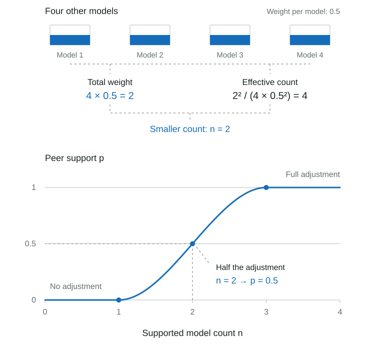

# Speed and Value

## How Speed and Value Are Calculated

Speed and Value combine resource efficiency measured on benchmarks with provider speed and token prices. First establish the available measurements, then compare resource use at similar quality, estimate supported gaps, and combine the components. Display requirements are applied separately under [Dashboard Inclusion](leaderboard-rules.md#dashboard-inclusion).

### Blended Token Price

Blended price gives equal weight to input and output prices, in USD per million tokens:

$$
\begin{aligned}
\text{blended price}&=0.50\cdot\text{effective input price}+0.50\cdot\text{effective output price}
\end{aligned}
$$

Effective input and output prices are weighted means of provider prices, using reported token volumes as weights. The blend is a comparison convention, not a workload bill estimate.

Both sides need complete provider-price and token-volume evidence; otherwise the effective blend is missing. OpenRouter's aggregate and historical price series do not determine it, and cache pricing is excluded.

Published input, output, and cache prices remain raw route metadata. Listed catalog or Artificial Analysis prices can provide the fallback described in [Model Matching](../matching.md#selected-identity).

### Provider Speed

Provider speed contributes 30% of Speed’s base weight, split equally between throughput, time to first token, and end-to-end response time. Time per task measured on benchmarks supplies the other 70%.

OpenRouter serving estimates combine endpoint history with matching positive token-volume weights. Endpoint IDs join directly to pricing data; provider-name guesses and request-count allocation are not used. Missing or unweighted endpoints leave the matched evidence usable.

If no weighted history remains, throughput falls back to the highest endpoint median (P50) and first-token latency to the lowest, following OpenRouter's model-page aggregate cards. End-to-end latency has no aggregate fallback.

The measured throughput $v_m$, first-token latency $t^{\text{first}}_m$, and total response time $t^{\text{total}}_m$ enter log-scaled min-max comparisons. The subscript “lower” reverses the scale so lower latency scores better:

$$
\begin{aligned}
S^{\text{rate}}_m&=\operatorname{MinMax}(\log v_m)\\
S^{\text{first}}_m&=\operatorname{MinMax}_{\text{lower}}(\log t^{\text{first}}_m)\\
S^{\text{total}}_m&=\operatorname{MinMax}_{\text{lower}}(\log t^{\text{total}}_m)
\end{aligned}
$$

Higher throughput and lower latency score better. Logarithms preserve proportional differences. Missing statistics reduce evidence support and receive no transferred weight from available statistics.

### Quality-Adjusted Resources per Task

Speed and Value compare resource use among independent models at similar benchmark quality. In the equations below, $A$ stands for the resource amount: $A^{\text{time}}_{m,b}$ is time per task in seconds and $A^{\text{cost}}_{m,b}$ is cost per task for model variant $m$ on benchmark $b$.

Use resources from the same benchmark and effort. If wall time is missing, output tokens divided by served throughput can estimate it; total tokens cannot substitute for output tokens. Validated effort imputation and broader-evidence fallback can fill other gaps. Source-wide means cannot replace task measurements.

Use resource amounts per task execution. Divide totals by the actual number of task executions when normalization is needed; repeated runs count as separate executions. Compare totals directly only when the executed tasks and run counts match. Retain source totals, task counts, and run counts for audit.

### Resource Comparability Across Sources

Resource fusion requires agreement in absolute per-task amounts, independently of [quality fusion and source crosswalks](imputation.md#source-crosswalks). A benchmark can combine quality scores while keeping some or all resources separate by source.

Check cost, runtime, total tokens, and output tokens independently. The mean of raw amounts can be calculated only when their accounting is compatible and matched observations agree within the tolerance below. Normalize totals by their actual task-run counts first; check task coverage, retries, caching, and timing definitions.

Pair directly observed, positive, finite amounts for the same model and reasoning effort. For pair $i$, $A_i$ and $B_i$ are the two source amounts. Each base model shares total reference weight 1 across its $n_m$ paired efforts, giving pair weight $w^{\text{pair}}_i=1/n_m$. The absolute log-ratio measures disagreement symmetrically:

$$
d_i=\left|\log\frac{B_i}{A_i}\right|.
$$

The agreement share $p_{\text{agree}}$ is the fraction of reference weight whose larger amount is no more than 1.05 times its smaller amount. The indicator $\mathbf{1}$ equals 1 when the condition holds and 0 otherwise:

$$
p_{\text{agree}}=\frac{\sum_i w^{\text{pair}}_i\,\mathbf{1}[d_i\le\log(1.05)]}{\sum_i w^{\text{pair}}_i}.
$$

Permit raw resource fusion only with compatible accounting, at least 10 distinct paired base models, and $p_{\text{agree}}\ge0.90$. The sample minimum, 5% tolerance, and 90% share are policy choices, not statistical guarantees.

Check original per-task amounts without fitting an offset or rescaling either source. Similar distribution shapes do not establish agreement; too few paired observations leave the sources separate.

When the check passes, two observed amounts combine as $(A+B)/2$. Passing the check does not validate a missing-source estimate; that still requires separately validated resource imputation.

**Separate scoring when raw amounts are not comparable**

Keep each source's resources paired with its own quality observations and score against its own reference population. Do not take the mean of raw amounts or impute resources across these sources. Unsupported source gaps remain missing; weak peer support pulls scores toward 50.

For a benchmark resource component with base weight $w_b$, allocate $w_b/2$ to each source. Source scores $S_A,S_B$ and evidence factors $f_A,f_B$ contribute a weighted score sum $S^{\text{sum}}_b$ and available weight $W^{\text{avail}}_b$. The resource mean divides the total weighted score sum by the total available weight:

$$
S^{\text{sum}}_b=\frac{w_b}{2}f_A S_A+\frac{w_b}{2}f_B S_B.
$$

$$
W^{\text{avail}}_b=\frac{w_b}{2}f_A+\frac{w_b}{2}f_B.
$$

With full evidence from both sources, the component mean is $(S_A+S_B)/2$. A missing source has an evidence factor of zero, and the available source retains its half of the benchmark's base weight. The full benchmark weight remains in the coverage denominator. Two sources still represent one benchmark for direct-evidence requirements.

Token-efficiency adjustments likewise use separate source quality and token references. Each supported source supplies half of the possible adjustment; an unsupported or missing source remains neutral. The equations above describe Speed and Value aggregation, not the Agentic token multiplier.

### Comparable-Quality Peers

Models with similar benchmark results receive more comparison weight. Every benchmark uses its reported score as a linear quality coordinate, $q_{m,b}=x_{m,b}$. Equal metric improvements therefore have equal distance, including near the endpoints. Subtracting the minimum and dividing by the range would give the same peer weights because the comparison spread scales by the same amount.

Aggregate price comparisons use the linear mean of the two public quality scores described below. Cost, time, and token amounts still use logarithms to compare resource ratios; these are not quality transformations.

Center quality on the weighted median and divide by a robust spread to obtain $Z_{m,b}$. This makes quality distances comparable across benchmarks. Each observed peer $j$ has reference weight $w^{\text{ref}}_{j,b}$: one unit per base model, shared across variants with paired quality and resource observations. $Q^{\text{weighted}}_{25}$ and $Q^{\text{weighted}}_{75}$ are the weighted 25th and 75th percentiles; $s^{\text{min}}_b$ is the minimum spread:

$$
\begin{aligned}
s^{q}_b&=\max\left(\frac{Q^{\text{weighted}}_{75}(\{q_{j,b}\})-Q^{\text{weighted}}_{25}(\{q_{j,b}\})}{1.349},s^{\text{min}}_b\right)\\
Z_{m,b}&=\frac{q_{m,b}-\operatorname{weightedMedian}_j(q_{j,b},w^{\text{ref}}_{j,b})}{s^{q}_b}
\end{aligned}
$$

The interquartile range covers the middle half of observations; 1.349 converts it to a standard-deviation-like scale. The minimum spread is $s^{\text{min}}_b=0.35(q_{\mathrm{max},b}-q_{\mathrm{min},b})$ for every benchmark. This prevents small score differences in tightly clustered results from appearing too large and keeps linear comparisons unchanged by unit conversions.

Only observed paired results set the range. The spread describes the reference distribution, not measurement uncertainty. With flat reference quality, only equal-quality rows receive support.

Gaussian weights $w^{\text{peer}}_{m,j,b}$ favor peers near the target quality, with width $\sigma=0.5$. The indicator $\mathbf{1}[\cdot]$ is 1 for a different base model and 0 for the same base model, excluding all efforts of the target model:

$$
w^{\text{peer}}_{m,j,b}=\mathbf{1}[\operatorname{model}(m)\ne\operatorname{model}(j)]w^{\text{ref}}_{j,b}\exp\left(-\frac{1}{2}\left(\frac{Z_{m,b}-Z_{j,b}}{0.5}\right)^2\right)
$$

At identical quality, the exponential term is 1, so a peer keeps its full reference weight. A standardized quality difference of 0.5 retains about 61% of that weight; a difference of 1 retains about 14%. The width 0.5 is a policy choice controlling how quickly comparison weight decreases with distance.

### Comparison Support

Peer support determines how much the comparison with other models can affect a score. Several models with similar benchmark quality allow a stronger adjustment; distant models contribute less. Calculate support separately for each benchmark and resource using observed quality paired with that resource. Count base models rather than effort variants, excluding every effort of the target model. First combine the [peer weights defined above](#comparable-quality-peers) by base model $k$:

$$
w^{\text{model}}_{m,k,b}=\sum_{j:\operatorname{model}(j)=k}w^{\text{peer}}_{m,j,b}.
$$

The effective model count uses the same formula as the [effective benchmark count](imputation.md#imputation-across-reasoning-efforts), now applied to base-model weights. It measures how evenly the comparison weight is distributed: equal weights give the actual model count, while concentration in one model brings it toward one.

Effective count alone ignores how small the weights are. Four equally distant models still have an effective count of four. The supported model count $n^{\text{supported}}_{m,b}$ therefore takes the smaller of total peer weight and effective model count, so distant comparisons cannot establish strong support merely by having equal weights:

$$
n^{\text{supported}}_{m,b}=\min\left(\sum_k w^{\text{model}}_{m,k,b},\frac{(\sum_k w^{\text{model}}_{m,k,b})^2}{\sum_k (w^{\text{model}}_{m,k,b})^2}\right)
$$

For example, four other models with weight 0.5 each have total weight 2 and effective count $2^2/(4\times0.5^2)=4$. The smaller value is 2, so their supported model count is 2. This count can be fractional; without positive peer weight, set it to zero.

Convert this count into the peer-support factor $p$ using the [smoothstep curve](intelligence-agentic.md#evidence-support-and-quality-regularization). Subtract the start threshold of 1 and divide by the interval from 1 to 3:

$$
p_{m,b}=\operatorname{smoothstep}\left(\frac{n^{\text{supported}}_{m,b}-1}{3-1}\right).
$$

| Supported model count | $p$ | Effect |
|---|---|---|
| 1 or less | 0 | Apply no token adjustment; resource efficiency receives 50. |
| 2 | 0.5 | Apply half the token adjustment; move resource efficiency halfway from 50 toward its calculated score. |
| 3 or more | 1 | Apply the full token adjustment and resource efficiency score. |

The thresholds of 1 and 3 are policy choices. Support also controls how much the local trend contributes to expected resource use below. It is separate from displayed evidence coverage and is not a probability that the comparison is correct.

### Expected Resource Use

Estimate expected resource use at the target quality. Start with a local weighted mean; with sufficient peer support, fit a local trend. Compare resources using natural logarithms so proportional cost and time differences are comparable. In this calculation, $\log$ means $\ln$.

**Calculate the local mean and trend**

For resource $r$ (cost, time, or tokens), $A^r_{j,b}$ is peer $j$’s amount on benchmark $b$. The peer weights give mean log resource use $\bar y^r_{m,b}$. Fit a line predicting log resource use from quality. Its intercept $\hat\alpha$ is the prediction at the target quality; its slope $\hat\beta$ is the change in log resource use per unit of standardized quality. Choose both to minimize the weighted squared prediction errors:

$$
\begin{aligned}
\bar y^r_{m,b}&=\frac{\sum_jw^{\text{peer}}_{m,j,b}\log A^r_{j,b}}{\sum_jw^{\text{peer}}_{m,j,b}}\\
(\hat\alpha,\hat\beta)&=\arg\min_{\alpha,\beta}\sum_jw^{\text{peer}}_{m,j,b}\left[\log A^r_{j,b}-\alpha-\beta(Z_{j,b}-Z_{m,b})\right]^2.
\end{aligned}
$$

**Bound the prediction and apply support**

Evaluate the line at $Z^*_{m,b}$, the target quality clipped to the independent observed peers’ range. Clip its prediction $\widetilde y^r_{m,b}$ to their observed log-resource range as well. Comparison support $p_{m,b}$ blends the local mean and bounded trend in log units. Exponentiate that result to obtain expected resource use $\mu^r_{m,b}$ in the original units: dollars, seconds, or tokens. This is a prediction fitted in log space, not an arithmetic mean of resource amounts:

$$
\begin{aligned}
Z^*_{m,b}&=\operatorname{clamp}(Z_{m,b},Z_{\min,b},Z_{\max,b})\\
\widetilde y^r_{m,b}&=\operatorname{clamp}\left(\hat\alpha+\hat\beta(Z^*_{m,b}-Z_{m,b}),\min_j\log A^r_{j,b},\max_j\log A^r_{j,b}\right)\\
\mu^r_{m,b}&=\exp\left(\bar y^r_{m,b}+p_{m,b}(\widetilde y^r_{m,b}-\bar y^r_{m,b})\right)
\end{aligned}
$$

Use the local mean through a supported model count of 1 and the full trend at a count of 3. Flat quality or unstable slopes retain the mean; the slope can be positive or negative. These bounds prevent extrapolation beyond observed quality and resource use. Weak support also reduces the final efficiency score toward 50.

**Compare observed and expected use**

The observed amount $A^r_{m,b}$ and expected amount $\mu^r_{m,b}$ use the same resource units. Take the natural logarithm of both to calculate their difference $d^r_{m,b}$, called a residual:

$$
d^r_{m,b}=\ln A^{r}_{m,b}-\ln\mu^r_{m,b}=\ln\left(\frac{A^r_{m,b}}{\mu^r_{m,b}}\right).
$$

A negative residual means less resource use than expected at that quality; a positive residual means more.

### Resource Efficiency Score

Take the mean of two scores: the size of the resource advantage and its percentile rank. Then pull the result toward 50 when peer support is weak.

The magnitude score measures the size of the resource advantage on a 0–100 scale. Its lower limit $L$ is the model-balanced 2.5th percentile of supported residuals; its upper limit $U$ is their maximum. Clip residuals below $L$ so exceptionally low resource use cannot stretch the scale. This clipping is called winsorization:

$$
S^{\text{mag},r}_{m,b}=100\cdot\frac{U-\operatorname{clamp}(d^r_{m,b},L,U)}{U-L}.
$$

The percentile score $S^{\text{pct},r}_{m,b}$ ranks the negative residual, so lower resource use scores higher. It counts all tied weight; benchmark imputation counts half. Both reference distributions give each base model equal total weight.

The mean $\bar S^r_{m,b}$ combines magnitude $S^{\text{mag},r}_{m,b}$ and percentile $S^{\text{pct},r}_{m,b}$ equally. Comparison support $p_{m,b}$ then pulls the component score $S^{\text{res},r}_{m,b}$ toward 50:

$$
\bar S^r_{m,b}=\frac{S^{\text{mag},r}_{m,b}+S^{\text{pct},r}_{m,b}}{2}.
$$

$$
S^{\text{res},r}_{m,b}=50+p_{m,b}(\bar S^r_{m,b}-50).
$$

If supported residuals have no meaningful spread, every observed residual receives 50. Estimated resources can be scored against the observed reference, but cannot change its reference limits.

### Combining Speed and Value Components

Combine resource efficiency measured on benchmarks with provider measurements, discount imputed inputs, then apply a model-level coverage multiplier.

Convert each component to 0–100, with higher scores indicating better performance. Provider statistics use ordinary min-max scores of $\log x$. Absolute price uses $\log_{10}(1+\text{blended price})$ with the favorable tail clipped at 2.5%. Quality-adjusted price uses the same local residual method as benchmark resource comparisons. Keeping absolute and quality-adjusted price separate retains both affordability and efficiency at comparable capability.

Price comparisons use the mean of the public Intelligence and Agentic scores as the quality value used to compare prices:

$$
q^{\text{price}}_m=\operatorname{mean}(\text{Intelligence}_m,\text{Agentic}_m).
$$

Use the final public capability scores on a linear scale. Time and cost per task use their own benchmark’s linear quality coordinates.

For transformed measurement $g(x)$, $g_{\min}$ and $g_{\max}$ are its finite reference minimum and maximum. Min–max scaling maps this range to 0–100. When higher values are better, the score is:

$$
S_{\uparrow}(x)=100\operatorname{clamp}\left(\frac{g(x)-g_{\min}}{g_{\max}-g_{\min}},0,1\right)
$$

The lower-is-better score $S_{\downarrow}(x)$ reverses the same scale:

$$
S_{\downarrow}(x)=100\operatorname{clamp}\left(\frac{g_{\max}-g(x)}{g_{\max}-g_{\min}},0,1\right)
$$

Equal-value populations follow the [benchmark normalization rule](intelligence-agentic.md#benchmark-scores-and-dimension-weights). Absolute price clips its favorable tail; quality-adjusted resource scores combine magnitude and percentile.

Ordinary Speed and Value reserve 70% of their base weight for benchmark resource measurements and 30% for provider or price measurements. Active benchmark inputs split the 70% allocation equally:

| Score | Benchmark resources: 70% | Other measurements: 30% |
| --- | --- | --- |
| Speed | Quality-adjusted time per task | Throughput, latency, and end-to-end latency: 10% each |
| Value | Quality-adjusted cost per task | Absolute and quality-adjusted price: 15% each |

The base weight $w^{\text{base}}_i$ records this policy. The evidence factor $f_{m,i}$ records how much support a row has for that component, giving the effective weight $w_{m,i}=w^{\text{base}}_if_{m,i}$. Direct evidence has a factor of 1. Estimated quality contributes its discount $f^{\text{quality}}$; estimated resources multiply it by their own evidence factor $f^r$.

The 70/30 split applies when all components have full evidence. Missing or discounted inputs can change the proportions in an individual row's available weighted mean; they also lower its displayed evidence share.

**Apply shared coverage**

All efforts of a base model share one coverage multiplier, so different observation counts alone do not create different penalties. The configuration used to set shared coverage is the unlabelled variant, or the highest reported effort if all are labelled.

For base-model group $g$ and dimension $d$ (Speed or Value), $m^{\text{default}}_g$ is that configuration and $W^{\text{total}}_d$ is the total active base weight. That configuration’s evidence share $c^{d}_{g,\text{ref}}$ determines the shared multiplier $C_g^d$:

$$
c^{d}_{g,\text{ref}}=\frac{\sum_iw^d_{m^{\text{default}}_g,i}}{W^{\text{total}}_d}.
$$

$$
C_g^d=\operatorname{smoothstep}\left(\frac{c^{d}_{g,\text{ref}}-0.1}{0.5}\right).
$$

The multiplier is zero through 10% coverage and reaches one at 60%. Each effort retains its own component mean and displayed evidence share.

For variant $m$, $g(m)$ identifies its base model. Its Speed components $s_{m,i}$ and Value components $v_{m,i}$ form weighted means, which receive the shared multiplier. The displayed evidence shares use that variant’s own effective weights:

$$
\begin{aligned}
\text{Speed}_m&=C^{\text{speed}}_{g(m)}\frac{\sum_iw^{\text{speed}}_{m,i}s_{m,i}}{\sum_iw^{\text{speed}}_{m,i}}\\
c^{\text{speed}}_m&=\frac{\sum_iw^{\text{speed}}_{m,i}}{W^{\text{total}}_{\text{speed}}}\\
\text{Value}_m&=C^{\text{value}}_{g(m)}\frac{\sum_iw^{\text{value}}_{m,i}v_{m,i}}{\sum_iw^{\text{value}}_{m,i}}\\
c^{\text{value}}_m&=\frac{\sum_iw^{\text{value}}_{m,i}}{W^{\text{total}}_{\text{value}}}.
\end{aligned}
$$

The Price vs Cost Efficiency graph compares observed cost efficiency per task on benchmarks separately from the full Value score. It also shares the same reference configuration's coverage across ordinary efforts, so different observation counts alone do not create different penalties within one model.

Peer support controls how far each resource comparison moves from 50. The shared coverage multiplier then scales the combined Speed or Value score.

## Parameter Choices

These values are scoring-policy choices, not fitted claims about model behavior.

| Parameter | Value | Why it exists |
| --- | ---: | --- |
| Favorable-tail winsorization | 2.5% | Stops one exceptionally cheap or fast model from defining the useful score range. |
| Quality comparison width | $\sigma=0.5$ | Favors comparisons with similar quality without requiring exact benchmark-score ties. |
| Minimum quality spread | 35% of the observed quality range | Prevents small gaps in clustered results from being magnified; linear comparisons remain unchanged by unit conversions. |
| Local resource trend | Full peer support and interpolation only | Accounts for nearby quality differences while avoiding sparse fits and unsupported extrapolation. |
| Full comparison support | Supported model count of 3 | Pulls weak peer comparisons toward neutral; three effective models end this adjustment without implying statistical certainty. |
