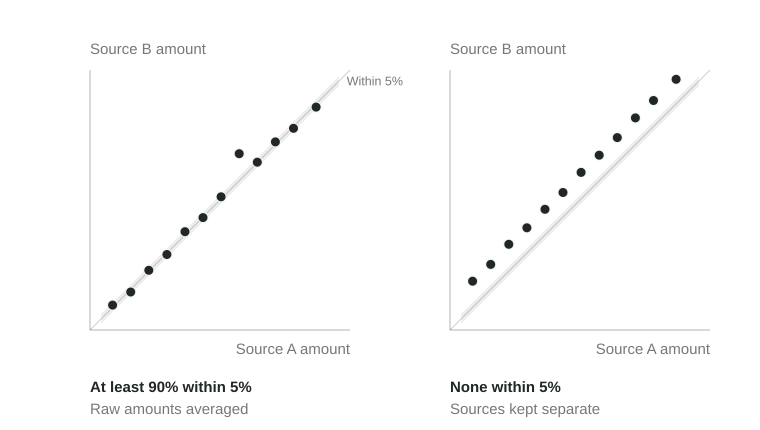
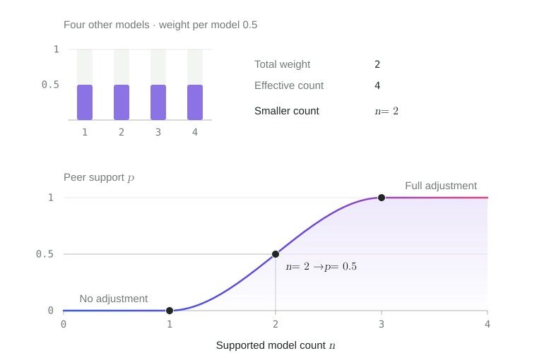
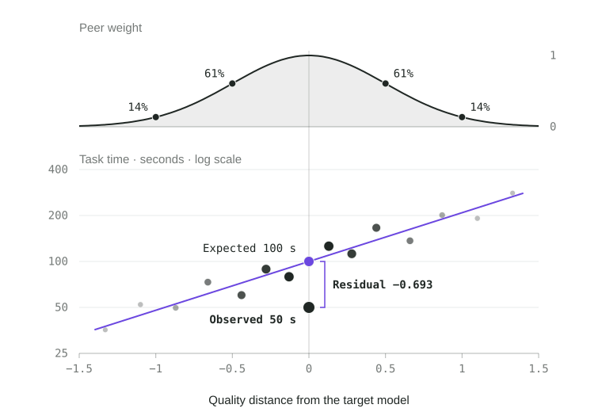
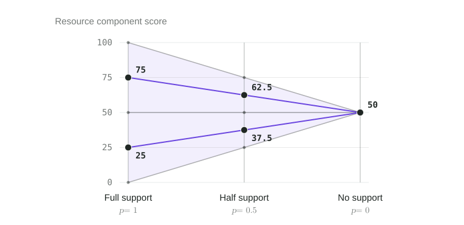
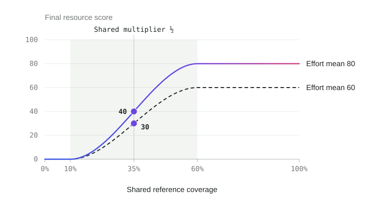

# :score[Speed] and :score[Value]

## How :score[Speed] and :score[Value] Are Calculated

:score[Speed] and :score[Value] combine resource efficiency measured on benchmarks with provider speed and token prices. First establish the available measurements, then compare resource use at similar quality, estimate supported gaps, and combine the components. Display requirements are applied separately under [Dashboard Inclusion](leaderboard-rules.md#dashboard-inclusion).

The base weights reserve 70% for benchmark resources and 30% for other measurements. Active benchmark inputs split their allocation equally:

| Score | Benchmark resources: 70% | Other measurements: 30% |
| --- | --- | --- |
| :score[Speed] | Quality-adjusted time per task | Throughput, first-token latency, and end-to-end latency: 10% each |
| :score[Value] | Quality-adjusted cost per task | Absolute and quality-adjusted price: 15% each |

These proportions hold when all components have full evidence. Missing or discounted inputs change the available weighted mean and lower evidence support. The [final calculation](#combining-speed-and-value-components) combines the supported components and applies a shared coverage multiplier.

### Blended Token Price

Blended price gives equal weight to input and output prices, in USD per million tokens:

$$
\begin{aligned}
\text{blended price}&=0.50\cdot\text{effective input price}+0.50\cdot\text{effective output price}
\end{aligned}
$$

Effective input and output prices are [weighted means](overview.md#weighted-mean) of provider prices, using reported token volumes as weights. The blend is a comparison convention, not a workload bill estimate.

Both sides need complete provider-price and token-volume evidence; otherwise the effective blend is missing. OpenRouter's aggregate and historical price series do not determine it, and cache pricing is excluded.

Published input, output, and cache prices remain raw route metadata. Listed catalog or Artificial Analysis prices can provide the fallback described in [Model Matching](../matching.md#selected-identity).

### Provider Speed

Provider speed contributes 30% of :score[Speed]’s base weight, split equally between throughput, time to first token, and end-to-end response time. Time per task measured on benchmarks supplies the other 70%.

OpenRouter serving estimates combine endpoint history with matching positive token-volume weights. Endpoint IDs join directly to pricing data; provider-name guesses and request-count allocation are not used. Missing or unweighted endpoints leave the matched evidence usable.

If no weighted history remains, throughput falls back to the highest endpoint median (P50) and first-token latency to the lowest, following OpenRouter's model-page aggregate cards. End-to-end latency has no aggregate fallback.

The measured throughput $v_m$, first-token latency $t^{\text{first}}_m$, and total response time $t^{\text{total}}_m$ use the [component scaling formulas](#combining-speed-and-value-components) on a log scale. Each statistic has its own reference bounds. The higher-is-better score $S_{\uparrow}$ favors throughput; the lower-is-better score $S_{\downarrow}$ favors lower latency:

$$
\begin{aligned}
S^{\text{rate}}_m&=S_{\uparrow}(v_m)\\
S^{\text{first}}_m&=S_{\downarrow}(t^{\text{first}}_m)\\
S^{\text{total}}_m&=S_{\downarrow}(t^{\text{total}}_m)
\end{aligned}
$$

Higher throughput and lower latency score better. Logarithms preserve proportional differences. A missing statistic contributes no score or evidence; the remaining components keep their base weights in the available weighted mean.

### Relative Task Resources

Relative cost, runtime, and token consumption answer a descriptive question: how much does a model use compared with a typical model on the same benchmarks, regardless of what it achieved? Raw amounts cannot be compared across benchmarks because tasks differ in size, so each amount is divided by its benchmark's median, which makes 1× typical everywhere. Medians keep one unusually expensive or slow model from moving that reference. :score[Speed] and :score[Value] answer a different question, resource use at similar quality, so these ratios do not feed them.

For amount $R_{m,b}$ of variant $m$ on benchmark $b$, the median amount $\tilde R_b$ (a tilde marks a median) uses positive observed amounts paired with observed quality, weighted by [reference weight](intelligence-agentic.md#sharing-weight-across-variants) $w^{\text{ref}}_{j,b}$ so each base model counts once. When a benchmark's sources stay separate, $b$ is one source. A model's ratios across benchmarks are then summarized by their weighted median $\rho_m$:

$$
\tilde R_b=\operatorname{weightedMedian}_j\left(R_{j,b};w^{\text{ref}}_{j,b}\right),\qquad \rho_{m,b}=\frac{R_{m,b}}{\tilde R_b},\qquad \rho_m=\operatorname{weightedMedian}_b(\rho_{m,b};w^{\text{agg}}_{m,b}).
$$

Cost, time, and tokens each use their own observations and medians. A benchmark observed for fewer than two base models has no median, because a model would only be compared with itself.

A value of 1× represents benchmark-median resource use; lower values cost less, take less time, or use fewer tokens. The aggregation weight $w^{\text{agg}}_{m,b}$ gives each standalone benchmark weight 1, shared across its declared source slots when measurements remain separate. Missing sources contribute no observation and do not increase the remaining source allocations. Index weights use represented breadth minus components already counted as standalone benchmarks. References use the full model population independently of the subset being compared.

Each benchmark's ratios center on 1× by construction, but a model's summarized ratio $\rho_m$ need not: models run different benchmarks, benchmarks carry different weights, and a comparison can show only part of the reference population. A typical summarized ratio above 1× is therefore consistent with every benchmark median sitting at 1×.

Cost uses observed task costs, and runtime uses reported seconds. Token consumption requires a complete input/output pair or an explicitly reported total; output-only telemetry never substitutes for total tokens. Throughput-derived runtime and imputed resources do not contribute to these ratios. Unsupported observations stay missing. Different models can have different measured baskets, so these are descriptive relative amounts rather than resource comparisons for identical work.

The ratios do not feed :score[Speed] or :score[Value] as additional components. Those scores retain their [quality-adjusted resource comparisons](#quality-adjusted-resources-per-task) and [weighted means and evidence adjustments](#combining-speed-and-value-components). Relative token consumption has no separate weight in either score; measured cost already reflects the billed token consumption. Relative reported runtime can differ from :score[Speed], which also uses provider measurements, runtime estimates, and validated imputation.

### Quality-Adjusted Resources per Task

Lower resource use alone does not establish efficiency: a model may spend less because it achieves less. :score[Speed] and :score[Value] therefore compare resource use among independent models at similar benchmark quality. In the equations below, $R$ stands for the resource amount: $R^{\text{time}}_{m,b}$ is time per task in seconds and $R^{\text{cost}}_{m,b}$ is cost per task for model variant $m$ on benchmark $b$.

Use resources from the same benchmark and effort. If wall time is missing, output tokens divided by served throughput can estimate it; total tokens cannot substitute for output tokens. Validated effort imputation and broader-evidence fallback can fill other gaps. Source-wide means cannot replace task measurements.

Use resource amounts per task execution. Divide totals by the actual number of task executions when normalization is needed; repeated runs count as separate executions. Compare totals directly only when the executed tasks and run counts match. Retain source totals, task counts, and run counts for audit.

### Resource Comparability Across Sources

Averaging two sources' amounts only makes sense when both measure the same thing, so resource fusion requires agreement in absolute per-task amounts, independently of [quality fusion and source crosswalks](imputation.md#source-crosswalks). A benchmark can combine quality scores while keeping some or all resources separate by source.

Check cost, runtime, total tokens, and output tokens independently. The mean of raw amounts can be calculated only when their accounting is compatible and matched observations agree within the tolerance below. Normalize totals by their actual task-run counts first; check task coverage, retries, caching, and timing definitions.

Pair directly observed, positive, finite amounts for the same model and reasoning effort. For pair $i$, $A_i$ and $B_i$ are the two source amounts. Each base model $g$ shares total reference weight 1 across its $n_g$ paired efforts, giving each pair reference weight $w^{\text{ref}}_i=1/n_g$. The absolute log ratio measures disagreement symmetrically:

$$
\Delta_i=\left|\ln\frac{B_i}{A_i}\right|.
$$

The agreement share $a$ is the fraction of reference weight whose larger amount is no more than 1.05 times its smaller amount. The indicator $\mathbf{1}$ equals 1 when the condition holds and 0 otherwise:

$$
a=\frac{\sum_i w^{\text{ref}}_i\,\mathbf{1}[\Delta_i\le\ln 1.05]}{\sum_i w^{\text{ref}}_i}.
$$

Permit raw resource fusion only with compatible accounting, at least 10 distinct paired base models, and $a\ge0.90$. The sample minimum, 5% tolerance, and 90% share are policy choices, not statistical guarantees.

Check original per-task amounts without fitting an offset or rescaling either source. Similar distribution shapes do not establish agreement; too few paired observations leave the sources separate.

When the check passes, two observed amounts combine as $(A+B)/2$. Passing the check does not validate a missing-source estimate; that still requires separately validated resource imputation.

**Separate scoring when raw amounts are not comparable**

Keep each source's resources paired with its own quality observations and score against its own reference population. Do not take the mean of raw amounts or impute resources across these sources. Unsupported source gaps remain missing; weak peer support pulls scores toward 50.

For a benchmark resource component with base weight $w^{\text{base}}_b$, allocate $w^{\text{base}}_b/2$ to each source. Source scores $S_A,S_B$ and evidence factors $f_A,f_B$ contribute a weighted score sum $S^{\text{sum}}_b$ and available weight $W^{\text{avail}}_b$. The resource mean divides the total weighted score sum by the total available weight:

$$
S^{\text{sum}}_b=\frac{w^{\text{base}}_b}{2}f_A S_A+\frac{w^{\text{base}}_b}{2}f_B S_B.
$$

$$
W^{\text{avail}}_b=\frac{w^{\text{base}}_b}{2}f_A+\frac{w^{\text{base}}_b}{2}f_B.
$$

With full evidence from both sources, the component mean is $(S_A+S_B)/2$. A missing source has an evidence factor of zero, and the available source retains its half of the benchmark's base weight. The full benchmark weight remains in the evidence-support denominator. Two sources still represent one benchmark for direct-evidence requirements.

Token-efficiency adjustments likewise use separate source quality and token references. Each supported source supplies half of the possible adjustment; an unsupported or missing source remains neutral. The equations above describe :score[Speed] and :score[Value] aggregation, not the :score[Agentic] token multiplier.

### Similar-Quality Peers

Models with similar benchmark results receive more comparison weight. Every benchmark uses its reported score as a linear quality coordinate, $q_{m,b}=x_{m,b}$. Equal metric improvements therefore have equal distance, including near the endpoints. Subtracting the minimum and dividing by the range would give the same peer weights because the comparison spread scales by the same amount.

Price comparisons use the mean of the :score[Intelligence] and :score[Agentic] scores, described below. Cost, time, and token amounts still use logarithms to compare resource ratios; these are not quality transformations.

Center quality on the [weighted median](overview.md#weighted-median-and-quantiles) and divide by a robust spread to obtain $Z_{m,b}$. This makes quality distances comparable across benchmarks. Each observed peer $j$ has reference weight $w^{\text{ref}}_{j,b}$: one unit per base model, shared across variants with paired quality and resource observations. $Q_{0.25}$ and $Q_{0.75}$ apply [weightedQuantile](overview.md#weighted-median-and-quantiles) to this distribution at fractions 0.25 and 0.75; $s^q_{\min,b}$ is the minimum spread:

$$
\begin{aligned}
s^{q}_b&=\max\left(\frac{Q_{0.75}-Q_{0.25}}{1.349},s^q_{\min,b}\right)\\
Z_{m,b}&=\frac{q_{m,b}-\operatorname{weightedMedian}_j(q_{j,b};w^{\text{ref}}_{j,b})}{s^{q}_b}
\end{aligned}
$$

The interquartile range covers the middle half of observations; 1.349 converts it to a standard-deviation-like scale. The minimum spread is $s^q_{\min,b}=0.35(q_{\max,b}-q_{\min,b})$ for every benchmark. This prevents small score differences in tightly clustered results from appearing too large and keeps linear comparisons unchanged by unit conversions.

Only observed paired results set the range. The spread describes the reference distribution, not measurement uncertainty. With flat reference quality, only variants with equal quality receive support.

Gaussian weights $w^{\text{peer}}_{m,j,b}$ favor peers near the target quality, with width 0.5. The indicator $\mathbf{1}[\cdot]$ is 1 for a different base model and 0 for the same base model, excluding all efforts of the target model so a model is never compared with itself:

$$
w^{\text{peer}}_{m,j,b}=\mathbf{1}[g(m)\ne g(j)]\,w^{\text{ref}}_{j,b}\exp\left(-\frac{1}{2}\left(\frac{Z_{m,b}-Z_{j,b}}{0.5}\right)^2\right)
$$

At identical quality, the exponential term is 1, so a peer keeps its full reference weight. A standardized quality difference of 0.5 retains about 61% of that weight; a difference of 1 retains about 14%. The width 0.5 is a policy choice controlling how quickly comparison weight decreases with distance.

### Peer Support

Peer support determines how much the comparison with other models can affect a score. Several models with similar benchmark quality allow a stronger adjustment; distant models contribute less. Calculate support separately for each benchmark and resource using observed quality paired with that resource. Count base models rather than effort variants, excluding every effort of the target model. First combine the [peer weights defined above](#similar-quality-peers) by base model $g$:

$$
w^{\text{model}}_{m,g,b}=\sum_{j:\,g(j)=g}w^{\text{peer}}_{m,j,b}.
$$

Apply the shared [effective count](overview.md#effective-count) to these base-model weights. Equal weights give the actual model count, while concentration in one model brings it toward one.

Effective count alone ignores how small the weights are. Four equally distant models still have an effective count of four. The supported model count $n^{\text{supported}}_{m,b}$ therefore takes the smaller of total peer weight and effective model count, so distant comparisons cannot establish strong support merely by having equal weights:

$$
n^{\text{supported}}_{m,b}=\min\left(\sum_g w^{\text{model}}_{m,g,b},\operatorname{effectiveCount}_g(w^{\text{model}}_{m,g,b})\right)
$$

This count can be fractional; without positive peer weight, it is zero.

Convert this count into peer support $p$ by [linearly scaling](overview.md#linear-scaling-and-clamping) the interval from 1 to 3, then applying the [smoothstep curve](overview.md#smoothstep). Smoothstep clamps the scaled input to 0–1:

$$
p_{m,b}=\operatorname{smoothstep}\bigl(\operatorname{linearScale}_{1}^{3}(n^{\text{supported}}_{m,b})\bigr).
$$

| Supported model count | $p$ | Effect |
|---|---|---|
| 1 or less | 0 | Apply no token adjustment; resource efficiency receives 50. |
| 2 | 0.5 | Apply half the token adjustment; move resource efficiency halfway from 50 toward its calculated score. |
| 3 or more | 1 | Apply the full token adjustment and resource efficiency score. |

The thresholds of 1 and 3 are policy choices. Support also controls how much the local trend contributes to expected resource use below. It is separate from displayed evidence support and is not a probability that the comparison is correct.

### Expected Resource Use

Estimate expected resource use at the target quality. Start with a local [weighted mean](overview.md#weighted-mean); with sufficient peer support, fit a local trend. Compare resources using natural logarithms so proportional cost and time differences are comparable.

**Calculate the local mean and trend**

Each resource (cost, time, or tokens) is handled separately: $R_{j,b}$ is peer $j$’s amount of that resource on benchmark $b$, and $y_{j,b}=\ln R_{j,b}$ is its log. The peer weights give mean log resource use $\bar y_{m,b}$. Fit a line predicting log resource use from quality. Its intercept $\hat\alpha$ is the prediction at the target quality; its slope $\hat\beta$ is the change in log resource use per unit of standardized quality. Choose both to minimize the weighted squared prediction errors:

$$
\begin{aligned}
\bar y_{m,b}&=\frac{\sum_j w^{\text{peer}}_{m,j,b}\,y_{j,b}}{\sum_j w^{\text{peer}}_{m,j,b}}\\
(\hat\alpha,\hat\beta)&=\arg\min_{\alpha,\beta}\sum_jw^{\text{peer}}_{m,j,b}\left[y_{j,b}-\alpha-\beta(Z_{j,b}-Z_{m,b})\right]^2.
\end{aligned}
$$

**Bound the prediction and apply support**

Evaluate the line at $Z'_{m,b}$, the target quality clipped to the independent observed peers’ range. Clip its prediction $y'_{m,b}$ to their observed log-resource range as well. Peer support $p_{m,b}$ blends the local mean and bounded trend in log units. Exponentiate that result to obtain expected resource use $\mu_{m,b}$ in the original units: dollars, seconds, or tokens. This is a prediction fitted in log space, not an arithmetic mean of resource amounts:

$$
\begin{aligned}
Z'_{m,b}&=\operatorname{clamp}_{Z_{\min,b}}^{Z_{\max,b}}(Z_{m,b})\\
y'_{m,b}&=\operatorname{clamp}_{\min_jy_{j,b}}^{\max_jy_{j,b}}\left(\hat\alpha+\hat\beta(Z'_{m,b}-Z_{m,b})\right)\\
\mu_{m,b}&=\exp\left(\bar y_{m,b}+p_{m,b}(y'_{m,b}-\bar y_{m,b})\right)
\end{aligned}
$$

Use the local mean through a supported model count of 1 and the full trend at a count of 3. Flat quality or unstable slopes retain the mean; the slope can be positive or negative. These bounds prevent extrapolation beyond observed quality and resource use. Weak support also reduces the final efficiency score toward 50.

**Compare observed and expected use**

The observed amount $R_{m,b}$ and expected amount $\mu_{m,b}$ use the same resource units. Take the natural logarithm of both to calculate their difference $\Delta_{m,b}$, called a residual:

$$
\Delta_{m,b}=\ln R_{m,b}-\ln\mu_{m,b}=\ln\left(\frac{R_{m,b}}{\mu_{m,b}}\right).
$$

A negative residual means less resource use than expected at that quality; a positive residual means more.

Dividing every observed and expected amount within a source by the same positive reference median $\tilde R_b$ leaves this residual unchanged:

$$
\ln\left(\frac{R_{m,b}/\tilde R_b}{\mu_{m,b}/\tilde R_b}\right)=\ln\left(\frac{R_{m,b}}{\mu_{m,b}}\right)=\Delta_{m,b}.
$$

Median normalization therefore changes the descriptive resource units without changing the quality-adjusted comparison when the observations and peer weights stay the same. Aggregating these comparisons into :score[Speed] and :score[Value] still uses weighted means, so resource efficiency across the contributing benchmarks affects the score rather than only the middle result.

### Resource Efficiency Score

Take the mean of two scores: the size of the resource advantage and its percentile rank. The size keeps a large advantage worth more than a small one; the rank keeps one extreme result from compressing everyone else into a narrow band. Then pull the result toward 50 when peer support is weak, so a comparison against few similar-quality models cannot produce an extreme score.

The magnitude score measures the size of the resource advantage on a 0–100 scale. Its lower limit $L$ is the model-balanced 2.5th percentile of supported residuals; its upper limit $U$ is their maximum. Clip residuals below $L$ so exceptionally low resource use cannot stretch the scale. This clipping is called winsorization:

$$
S^{\text{mag}}_{m,b}=100\left[1-\operatorname{linearScale}_{L}^{U}\bigl(\operatorname{clamp}_{L}^{U}(\Delta_{m,b})\bigr)\right].
$$

The percentile score $S^{\text{pct}}_{m,b}$ uses [weightedPercentileRank](overview.md#weighted-ranks) on the negative residual, so lower resource use scores higher. It counts all tied weight; benchmark imputation counts half. Both reference distributions give each base model equal total weight.

The mean $\bar S_{m,b}$ combines magnitude $S^{\text{mag}}_{m,b}$ and percentile $S^{\text{pct}}_{m,b}$ equally. Peer support $p_{m,b}$ then pulls the component score $S^{\text{res}}_{m,b}$ toward 50:

$$
\bar S_{m,b}=\frac{S^{\text{mag}}_{m,b}+S^{\text{pct}}_{m,b}}{2}.
$$

$$
S^{\text{res}}_{m,b}=50+p_{m,b}(\bar S_{m,b}-50).
$$

If supported residuals have no meaningful spread, every observed residual receives 50. Estimated resources can be scored against the observed reference, but cannot change its reference limits.

### Combining :score[Speed] and :score[Value] Components

Combine resource efficiency measured on benchmarks with provider measurements, discount imputed inputs, then apply the shared coverage multiplier.

Convert each component to 0–100, with higher scores indicating better performance. Provider statistics use linear scaling with clamping on $\ln x$. Absolute price uses $\ln(\text{blended price})$ with the favorable tail clipped at 2.5%, so equal price ratios count equally at every price level. Quality-adjusted price applies the same local residual method as benchmark resource comparisons to $\ln(\text{blended price})$. A free model is treated as costing 0.001 USD per million tokens, below every listed price, so its logarithm stays finite. Keeping absolute and quality-adjusted price separate retains both affordability and efficiency at comparable capability.

Price comparisons use the [mean](overview.md#weighted-mean) of the final :score[Intelligence] and :score[Agentic] scores as their quality value:

$$
q^{\text{price}}_m=\frac{\text{Intelligence}_m+\text{Agentic}_m}{2}.
$$

Use the final capability scores on a linear scale. If only one capability score is available, it alone sets the quality value. Time and cost per task use their own benchmark’s linear quality coordinates.

For measurement $x$, $x_{\min}$ and $x_{\max}$ are its finite reference minimum and maximum, compared on a log scale. The [linearScale operation](overview.md#linear-scaling-and-clamping) maps this range to 0–1; clamping and multiplication by 100 produce the component score. When higher values are better:

$$
S_{\uparrow}(x)=100\operatorname{clamp}_{0}^{1}\bigl(\operatorname{linearScale}_{\ln x_{\min}}^{\ln x_{\max}}(\ln x)\bigr)
$$

The lower-is-better score $S_{\downarrow}(x)$ reverses the same scale:

$$
S_{\downarrow}(x)=100\operatorname{clamp}_{0}^{1}\bigl(1-\operatorname{linearScale}_{\ln x_{\min}}^{\ln x_{\max}}(\ln x)\bigr)
$$

If every reference value is equal, each component receives 100, as in [benchmark normalization](intelligence-agentic.md#benchmark-scores-and-dimension-weights).

The base weight $w^{\text{base}}_i$ follows the [70/30 allocation above](#how-speed-and-value-are-calculated). The evidence factor $f_{m,i}$ records how much support a variant has for that component, giving the effective weight $w_{m,i,d}=w^{\text{base}}_if_{m,i}$ in score $d$. Direct evidence has a factor of 1. Estimated quality contributes its discount $f^{\text{quality}}$; estimated resources multiply it by their own evidence factor $f^{\text{res}}$.

**Apply the shared coverage multiplier**

The shared coverage multiplier reduces scores backed by little resource evidence. All efforts of a base model share it, so efforts measured on different numbers of benchmarks do not receive different penalties for that reason alone. Whether a score can be displayed is a separate [resource-availability check](leaderboard-rules.md#resource-score-availability).

The reference variant that sets the multiplier is the unlabelled variant, or the highest reported effort if all are labelled.

For base model $g$ and dimension $d$ (:score[Speed] or :score[Value]), $m^{\text{ref}}_g$ is that reference variant and $W^{\text{total}}_d$ is the total active base weight. That variant’s evidence support $c_{g,d}$ determines the shared multiplier $C_{g,d}$:

$$
c_{g,d}=\frac{\sum_iw_{m^{\text{ref}}_g,i,d}}{W^{\text{total}}_d}.
$$

$$
C_{g,d}=\operatorname{smoothstep}\bigl(\operatorname{linearScale}_{0.1}^{0.6}(c_{g,d})\bigr).
$$

The multiplier is zero through 10% evidence support and reaches one at 60%. Each effort keeps its own component mean and evidence support.

For variant $m$, $g(m)$ identifies its base model. Its component scores $S_{m,i}$ form a [weighted mean](overview.md#weighted-mean) for each of :score[Speed] and :score[Value], which receives the shared multiplier. Evidence support uses that variant’s own effective weights:

$$
\begin{aligned}
\text{Speed}_m&=C_{g(m),\text{speed}}\frac{\sum_iw_{m,i,\text{speed}}S_{m,i}}{\sum_iw_{m,i,\text{speed}}}\\
c_{m,\text{speed}}&=\frac{\sum_iw_{m,i,\text{speed}}}{W^{\text{total}}_{\text{speed}}}\\
\text{Value}_m&=C_{g(m),\text{value}}\frac{\sum_iw_{m,i,\text{value}}S_{m,i}}{\sum_iw_{m,i,\text{value}}}\\
c_{m,\text{value}}&=\frac{\sum_iw_{m,i,\text{value}}}{W^{\text{total}}_{\text{value}}}.
\end{aligned}
$$

The Price vs Cost Efficiency graph compares observed cost efficiency per task on benchmarks separately from the full :score[Value] score. It also shares the reference variant's coverage multiplier across ordinary efforts, so different observation counts alone do not create different penalties within one model.

Peer support controls how far each resource comparison moves from 50. The shared coverage multiplier then scales the combined :score[Speed] or :score[Value] score.

## Parameter Choices

These values are scoring-policy choices, not fitted claims about model behavior.

| Parameter | Value | Why it exists |
| --- | ---: | --- |
| Benchmark versus other measurements | 70% / 30% of base weight | Keeps measured resources per task as the main evidence while retaining provider speed and token prices. |
| Provider speed statistics | 10% each for throughput, first-token latency, and end-to-end latency | Treats generation rate, response start, and response completion as equal parts of provider speed. |
| Price components | 15% each for absolute and quality-adjusted price | Retains both affordability and price efficiency at comparable capability. |
| Shared coverage multiplier | 0 through 10% evidence support; smooth rise to 1 at 60% | Withholds most of the score from base models with little resource evidence without requiring every component. |
| Raw resource agreement | 10 paired base models; 90% within a factor of 1.05 | Allows raw amounts from different sources to be averaged only when nearly all paired models agree. |
| Favorable-tail winsorization | 2.5% | Stops one exceptionally cheap or fast model from defining the useful score range. |
| Quality comparison width | 0.5 | Favors comparisons with similar quality without requiring exact benchmark-score ties. |
| Minimum quality spread | 35% of the observed quality range | Prevents small gaps in clustered results from being magnified; linear comparisons remain unchanged by unit conversions. |
| Local resource trend | Full peer support and interpolation only | Accounts for nearby quality differences while avoiding sparse fits and unsupported extrapolation. |
| Peer support | None at a supported model count of 1; full at 3 | Pulls weak peer comparisons toward neutral; three effective models end this adjustment without implying statistical certainty. |
