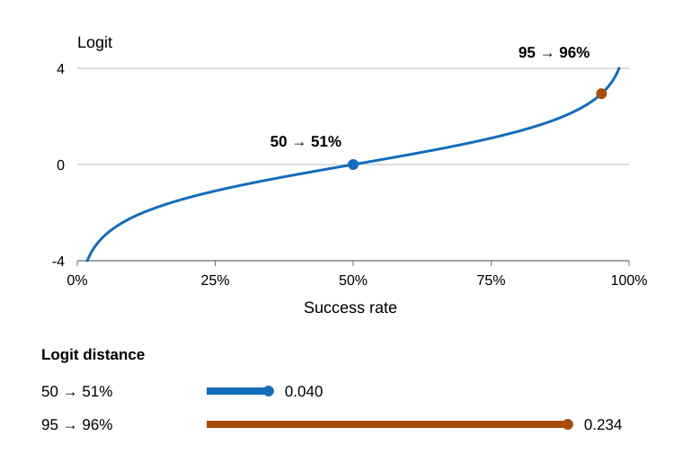
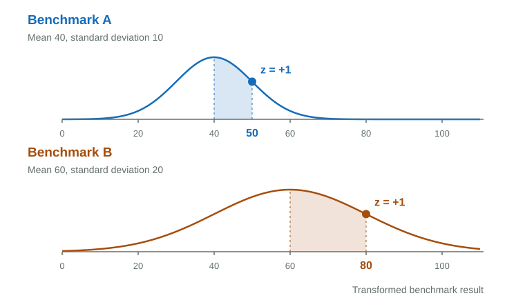
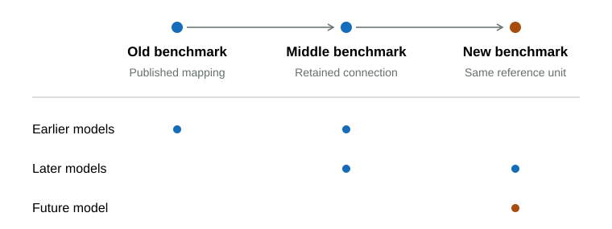
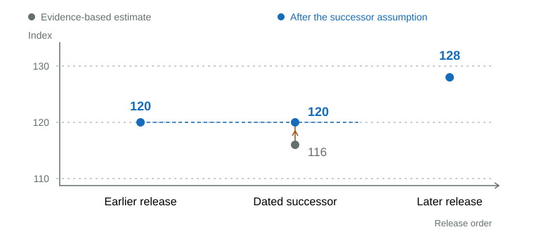
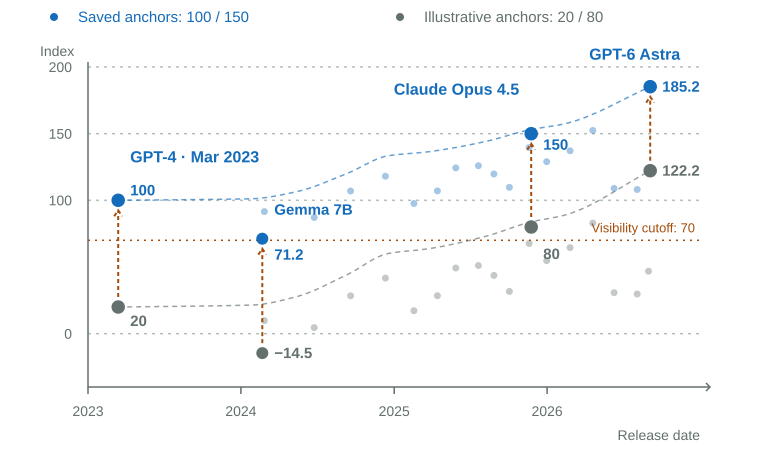

# Timeline Calculation

The Intelligence Index connects benchmark generations to a saved scale, combines the available evidence, and converts the result into fixed display units. See the [Timeline overview](overview.md) for chart interpretation and limitations.

## Freeze the Initial Reference

Relative scores can move as models and benchmarks change. The Intelligence Index therefore establishes its reference once, using saved Model Atlas scores with at least 60% evidence support. Later leaderboard updates do not replace these reference values; older and future models connect through benchmark evidence instead. Less-supported starting scores retain their published positions but do not define the reference. Benchmark identities describe measurements and editions; refresh timestamps and portfolio weights do not create new identities. Retired benchmarks leave the active scoring portfolio while their evidence remains available for calibration.

## Connect Benchmark Generations

Models measured on shared benchmarks connect different benchmark generations, even when their units and difficulty levels differ.

Before the logit transformation, scoring clips probability results to fixed 2–98% bounds, applying the winsorization principle to limit extreme values and keep the transformed results finite. When fitting benchmark connections, results at or beyond these bounds are excluded instead because they distinguish models poorly. The bounds are fixed, not percentile cutoffs recalculated from the model population.

The prepared probability results then use the logit transformation; linear index scores keep their native units. For model configuration $m$ on benchmark edition $b$, the prepared fraction $p_{m,b}$ becomes the logit $x_{m,b}$:

$$
x_{m,b}=\operatorname{logit}(p_{m,b})=\log\frac{p_{m,b}}{1-p_{m,b}}.
$$

The logit transformation gives a larger change for 95% to 96% than for 50% to 51%, reflecting the larger proportional reduction in remaining errors near the ceiling. Its scale does not depend on leaderboard ranks or extremes.

The mapping sets the standard score (z-score) on benchmark A equal to the standard score on benchmark B. Given $x_B$, it finds the corresponding $x_A$, or vice versa, by matching how many standard deviations each result lies above or below its benchmark's mean. If A is already connected to the reference scale, this lets results from B use the same ruler:

$$
\frac{x_A-\mu_A}{\sigma_A}=\frac{x_B-\mu_B}{\sigma_B}.
$$

Here, $\mu_A,\mu_B$ are the means and $\sigma_A,\sigma_B$ the standard deviations of transformed results from models tested on both benchmarks. Each base model contributes one unit of weight across its reasoning configurations, so extra configurations do not give it extra influence. The translated value estimates a corresponding position on the other scale; it is not an observed benchmark result.

### Validate the Benchmark Connection

Matching means and standard deviations produces a linear conversion between transformed results; individual model results need not lie on that line. Leave-one-family-out cross-validation checks whether the approximation predicts accurately enough: leave out one family, fit on the others, then compare its predicted result with its actual result. All reasoning configurations of the withheld family stay together, so related variants cannot supply the answer indirectly.

A connection needs at least four independent model families, positive correlation and nonzero spread. Validation repeats the holdout for every family and tests both directions, A → B and B → A. Each absolute prediction error is divided by the training results' range on the predicted benchmark and multiplied by 100. This makes errors comparable across benchmark units. The errors are summarized by a median for each direction, with equal total weight per family; they are normalized error points, not final index points.

The translation must be accurate enough and better than a simple guess. The baseline always predicts the median result of the training models. The larger of the two translation errors must be no more than 25 normalized error points and smaller than both baseline errors. For example, translation errors of 10 and 15 pass against baseline errors of 20 and 30, because 15 is below the 25-point limit and both baselines.

### Extend the Shared Scale

Accepted connections make comparison across eras possible. Suppose benchmark A already has a conversion to the fixed reference scale, and a new benchmark B shares tested models with A. A result from B can be translated to A's scale, then to the reference scale. If a later benchmark C overlaps B, the same chain connects C to the original ruler—even if no model was tested on both A and C. This works for older benchmarks too.

The accepted connections determine a saved conversion from each benchmark's own units to the shared reference units. Here, $x$ is a transformed benchmark result and $q$ is its position on the shared reference scale, before results are combined and the final index anchors are applied. For model $m$, benchmark $b$ and capability dimension $d$, the conversion multiplies $x_{m,b}$ by a scale factor $a_{b,d}$ and adds an offset $c_{b,d}$:

$$
q_{m,b,d}=a_{b,d}x_{m,b}+c_{b,d},\qquad a_{b,d}>0.
$$

Once saved, this conversion lets any model with a usable result on that benchmark reach the shared scale. Established conversions remain fixed as new benchmarks are added, preventing later generations from resetting the ruler. If no supported chain reaches the reference, the model remains unplaced; its release date cannot supply the missing evidence.

New scale factors and offsets are fitted jointly across the connected network using weighted least squares, while saved conversions stay fixed. Each connection is weighted by its independent model count multiplied by squared correlation, giving greater weight to broader, more closely related overlaps. Multiple routes constrain one saved conversion; they are not separate scoring votes. Disagreement between routes contributes to its diagnostic error.

## Weight the Evidence by Coverage

Individual benchmarks in the selected portfolio provide direct task evidence; published indexes summarize broader benchmark results. The estimate combines both, giving tasks more weight as their coverage grows. This lets a small task sample contribute without outweighing the indexes, while broadly measured tasks lead the estimate. The same rule applies to older and newer models: evidence coverage, not age, determines the weights.

The curve gives the task group's weight $\alpha$; indexes receive the remaining $1-\alpha$. Applying these weights to the task mean $Q_{\mathrm{tasks}}$ and index mean $Q_{\mathrm{indexes}}$, both on the shared reference scale, gives the model's capability estimate:

$$
q_{m,d}=\alpha Q_{\mathrm{tasks}}+(1-\alpha)Q_{\mathrm{indexes}}.
$$

Within the task group, benchmark importance and relevance to the capability dimension determine each result's weight. Within the index group, dimension relevance and represented benchmark count determine the weights. ECI supplies a model-specific count, with a fallback of four when unavailable; Artificial Analysis (AA) uses the component count for its index edition. The group weight $\alpha$ applies to the task average, not to each task individually.

Each task or index series contributes only its latest usable observed edition. A replacement must have both an observed result and a saved conversion before the older task is dropped. To avoid double counting, directly observed CAIS components reduce the index's weight to zero when all components are represented. Other sources follow their declared overlap policies; matching names alone do not establish duplicate evidence.

Task weight depends on the usable observed task count $n$ and weighted portfolio coverage $c$. With the full-task endpoint $F=7.5$, coverage caps the effective count at $cF$, preventing a narrow task sample from receiving maximum weight:

$$
n_{\mathrm{eff}}=\min(n,cF).
$$

When tasks and indexes are available, task weight stays at 20% through an effective count of one, then rises smoothly to 80% at $F$:

$$
u=\operatorname{clip}\left(\frac{n_{\mathrm{eff}}-1}{F-1},0,1\right),\qquad
\alpha=0.2+0.6(3u^2-2u^3).
$$

The constant $0.2$ sets the starting task weight at 20%; $0.6=0.8-0.2$ is the increase needed to reach 80%. The progress $u$ runs from zero to one as the effective count rises from one to $F$, with $\operatorname{clip}$ keeping it within those bounds. The cubic smoothstep expression $3u^2-2u^3$ turns that progress into a gradual transition with a flat slope at both ends. In words: task weight equals 20% plus 60% times smooth progress.

The 20% and 80% endpoints are policy choices, not values derived from benchmark data. They give sparse task evidence a minimum contribution while retaining some index weight even at full task coverage.

With no usable tasks, indexes supply the entire estimate. Without a usable index, at least three distinct mapped task series are required; otherwise the model remains unplaced. Imputed results do not satisfy these requirements. As the retained portfolio grows, coverage and weights can change even without new results for a model. These changes affect new estimates and diagnostics; existing published positions remain fixed.

## Apply the Dated-Successor Assumption

Older model releases often have sparse or uneven benchmark records, which can make a later version appear weaker simply because different evidence is available. To limit these apparent regressions when reconstructing historical scores, a dated successor is kept at least level with its highest-scoring predecessor in the same model and reasoning-effort series. Supported reference scores remain unchanged.

This is a historical reconstruction assumption, not evidence that every newer release improves. The rule applies to explicitly dated versions of the same canonical model family, provider and reasoning effort; it has no age cutoff. It can conceal a real decline, but never forces a positive improvement: a successor can tie its predecessor.

Undated names do not establish succession, and releases within the same month are not ordered. Missing estimates stay unplaced and supported reference values remain fixed. Any adjustment is recorded separately from the evidence-based estimate and included in its diagnostic error budget.

## Set Index Units with Fixed Anchors

The anchor values 100 and 150 are chosen for readability. Keeping them and their saved capability positions fixed preserves the same index unit as new models arrive. This final conversion changes the displayed numbers without changing model order or adding evidence.

The saved positions $q_{L,d}$ for GPT-4 (March 2023) and $q_{H,d}$ for Claude Opus 4.5 map to index scores of 100 and 150. The model's relative position between the anchors is the same on both scales:

$$
\frac{s_{m,d}-100}{150-100}=\frac{q_{m,d}-q_{L,d}}{q_{H,d}-q_{L,d}}.
$$

Here, $q_{m,d}$ is the capability estimate and $s_{m,d}$ is the displayed index score. The scale extends beyond the anchors without an upper limit; its values are not percentages or ratios of capability.

The saved anchor positions remain fixed; updating them would rescale every model. Positive linear rescaling preserves ordering and ratios of score differences. The stored capability coordinate is independent of the provisional display units. Anchors set the published units; they do not add evidence or refit benchmark connections.
